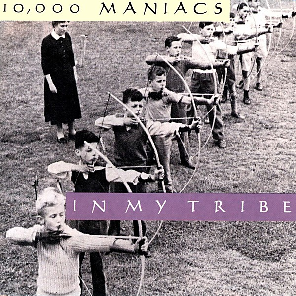

# In My Tribe

By **10,000 Maniacs**

## Album Data

- **Catalog:** Beets
- **Format:** Digital, Album
- **Album:** In My Tribe
- **Artist:** 10,000 Maniacs
- **Albumartist:** 10,000 Maniacs
- **Genre:** Soft Rock
- **MusicBrainz Album Artist ID:** [b9a06530-1241-4162-836f-7b8e79deaa58](https://musicbrainz.org/artist/b9a06530-1241-4162-836f-7b8e79deaa58)
- **MusicBrainz Album ID:** [371475ce-191b-46a1-99fe-df538fc56d75](https://musicbrainz.org/release/371475ce-191b-46a1-99fe-df538fc56d75)
- **MusicBrainz Release Group ID:** [94d44c63-7dee-3921-aa6e-b28b27753cfa](https://musicbrainz.org/release-group/94d44c63-7dee-3921-aa6e-b28b27753cfa)
- **Year:** 1987
- **Catalog #:** 60738-2
- **Label:** Elektra
- **Total Tracks:** 12

## Album Tracks

### Track 01 - What’s the Matter Here?

- **Artist:** 10,000 Maniacs
- **Format:** ALAC
- **Genre:** Soft Rock
- **Length:** 4:51
- **MusicBrainz Track ID:** [89b52121-6961-4a26-8bcd-be97579afc47](https://musicbrainz.org/recording/89b52121-6961-4a26-8bcd-be97579afc47)
- **Title:** What’s the Matter Here?
- **Track:** 01
- **Year:** 1987

### Track 02 - Hey Jack Kerouac

- **Artist:** 10,000 Maniacs
- **Format:** ALAC
- **Genre:** Pop Rock
- **Length:** 3:26
- **MusicBrainz Track ID:** [1a8b4a96-40f6-43ce-890c-45c82a337c2a](https://musicbrainz.org/recording/1a8b4a96-40f6-43ce-890c-45c82a337c2a)
- **Title:** Hey Jack Kerouac
- **Track:** 02
- **Year:** 1987

### Track 03 - Like the Weather

- **Artist:** 10,000 Maniacs
- **Format:** ALAC
- **Genre:** Rock
- **Length:** 3:56
- **MusicBrainz Track ID:** [3a1afb10-beb4-4636-bd24-0ab0d1855c62](https://musicbrainz.org/recording/3a1afb10-beb4-4636-bd24-0ab0d1855c62)
- **Title:** Like the Weather
- **Track:** 03
- **Year:** 1987

### Track 04 - Cherry Tree

- **Artist:** 10,000 Maniacs
- **Format:** ALAC
- **Genre:** Indie Rock
- **Length:** 3:13
- **MusicBrainz Track ID:** [4b75ff7c-72b0-4dbe-aa70-2051bd3e9ea8](https://musicbrainz.org/recording/4b75ff7c-72b0-4dbe-aa70-2051bd3e9ea8)
- **Title:** Cherry Tree
- **Track:** 04
- **Year:** 1987

### Track 05 - The Painted Desert

- **Artist:** 10,000 Maniacs
- **Format:** ALAC
- **Genre:** Soft Rock
- **Length:** 3:39
- **MusicBrainz Track ID:** [a5a90f8b-b330-4354-a45e-63672c58cf91](https://musicbrainz.org/recording/a5a90f8b-b330-4354-a45e-63672c58cf91)
- **Title:** The Painted Desert
- **Track:** 05
- **Year:** 1987

### Track 06 - Don’t Talk

- **Artist:** 10,000 Maniacs
- **Format:** ALAC
- **Genre:** Soft Rock
- **Length:** 5:04
- **MusicBrainz Track ID:** [b78af8d1-1882-43f5-b332-2c9e0de71bc2](https://musicbrainz.org/recording/b78af8d1-1882-43f5-b332-2c9e0de71bc2)
- **Title:** Don’t Talk
- **Track:** 06
- **Year:** 1987

### Track 07 - Peace Train

- **Artist:** 10,000 Maniacs
- **Format:** ALAC
- **Genre:** Soft Rock
- **Length:** 3:26
- **MusicBrainz Track ID:** [b75b23ad-fa89-4006-88e4-3253ad9fd6e2](https://musicbrainz.org/recording/b75b23ad-fa89-4006-88e4-3253ad9fd6e2)
- **Title:** Peace Train
- **Track:** 07
- **Year:** 1987

### Track 08 - Gun Shy

- **Artist:** 10,000 Maniacs
- **Format:** ALAC
- **Genre:** Indie Pop
- **Length:** 4:11
- **MusicBrainz Track ID:** [e4b5bca2-1738-456b-9a67-6ec8a40810d8](https://musicbrainz.org/recording/e4b5bca2-1738-456b-9a67-6ec8a40810d8)
- **Title:** Gun Shy
- **Track:** 08
- **Year:** 1987

### Track 09 - My Sister Rose

- **Artist:** 10,000 Maniacs
- **Format:** ALAC
- **Genre:** Indie Pop
- **Length:** 3:12
- **MusicBrainz Track ID:** [5277d644-6e47-48c8-942a-0f61f99936e9](https://musicbrainz.org/recording/5277d644-6e47-48c8-942a-0f61f99936e9)
- **Title:** My Sister Rose
- **Track:** 09
- **Year:** 1987

### Track 10 - A Campfire Song

- **Artist:** 10,000 Maniacs
- **Format:** ALAC
- **Genre:** Soft Rock
- **Length:** 3:15
- **MusicBrainz Track ID:** [61dc1936-d75a-488a-9e06-2d012661f88a](https://musicbrainz.org/recording/61dc1936-d75a-488a-9e06-2d012661f88a)
- **Title:** A Campfire Song
- **Track:** 10
- **Year:** 1987

### Track 11 - City of Angels

- **Artist:** 10,000 Maniacs
- **Format:** ALAC
- **Genre:** Soft Rock
- **Length:** 4:17
- **MusicBrainz Track ID:** [54c55527-5d7e-466b-ac73-b5d855f3f210](https://musicbrainz.org/recording/54c55527-5d7e-466b-ac73-b5d855f3f210)
- **Title:** City of Angels
- **Track:** 11
- **Year:** 1987

### Track 12 - Verdi Cries

- **Artist:** 10,000 Maniacs
- **Format:** ALAC
- **Genre:** Rock
- **Length:** 4:21
- **MusicBrainz Track ID:** [ca612c28-1514-4751-a25b-e713fb186955](https://musicbrainz.org/recording/ca612c28-1514-4751-a25b-e713fb186955)
- **Title:** Verdi Cries
- **Track:** 12
- **Year:** 1987

## See also

- [Roon: In My Tribe](../../Roon/10_000_Maniacs/In_My_Tribe.md)
