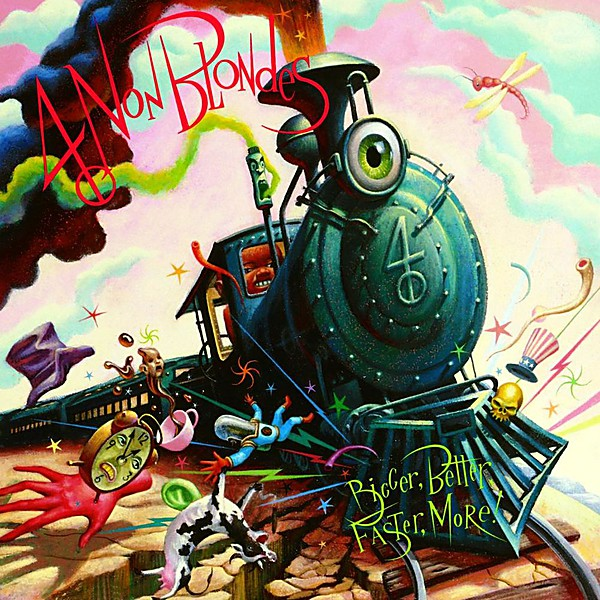

# Bigger, Better, Faster, More!

By **4 Non Blondes**

## Album Data

- **Catalog:** Beets
- **Format:** Digital, Album
- **Album:** Bigger, Better, Faster, More!
- **Artist:** 4 Non Blondes
- **Albumartist:** 4 Non Blondes
- **Genre:** Emo
- **MusicBrainz Album Artist ID:** [efef848b-63e4-4323-8ef7-69a48fbdd51d](https://musicbrainz.org/artist/efef848b-63e4-4323-8ef7-69a48fbdd51d)
- **MusicBrainz Album ID:** [5708a868-558b-4a8a-9593-558a638e1993](https://musicbrainz.org/release/5708a868-558b-4a8a-9593-558a638e1993)
- **MusicBrainz Release Group ID:** [0d26ee11-05f3-3a02-ba40-1414fa325554](https://musicbrainz.org/release-group/0d26ee11-05f3-3a02-ba40-1414fa325554)
- **Year:** 1992
- **Catalog #:** 7 92112-2
- **Label:** Interscope Records
- **Total Tracks:** 11

## Album Tracks

### Track 01 - Train

- **Artist:** 4 Non Blondes
- **Format:** MP3
- **Genre:** Grunge
- **Length:** 3:42
- **MusicBrainz Track ID:** [524a2cff-add2-459e-a355-6f4912536b38](https://musicbrainz.org/recording/524a2cff-add2-459e-a355-6f4912536b38)
- **Title:** Train
- **Track:** 01
- **Year:** 1992

### Track 02 - Superfly

- **Artist:** 4 Non Blondes
- **Format:** MP3
- **Genre:** Grunge
- **Length:** 4:37
- **MusicBrainz Track ID:** [dfa56e68-123a-461f-a59d-5d0ae4e7d5de](https://musicbrainz.org/recording/dfa56e68-123a-461f-a59d-5d0ae4e7d5de)
- **Title:** Superfly
- **Track:** 02
- **Year:** 1992

### Track 03 - What’s Up

- **Artist:** 4 Non Blondes
- **Format:** MP3
- **Genre:** Rock
- **Length:** 4:55
- **MusicBrainz Track ID:** [bc23c596-e68a-4ac3-ad45-a29ce0d678d1](https://musicbrainz.org/recording/bc23c596-e68a-4ac3-ad45-a29ce0d678d1)
- **Title:** What’s Up
- **Track:** 03
- **Year:** 1992

### Track 04 - Pleasantly Blue

- **Artist:** 4 Non Blondes
- **Format:** MP3
- **Genre:** Grunge
- **Length:** 2:28
- **MusicBrainz Track ID:** [5d3caa77-1d30-4781-8d5a-2a269244bb52](https://musicbrainz.org/recording/5d3caa77-1d30-4781-8d5a-2a269244bb52)
- **Title:** Pleasantly Blue
- **Track:** 04
- **Year:** 1992

### Track 05 - Morphine & Chocolate

- **Artist:** 4 Non Blondes
- **Format:** MP3
- **Genre:** Indie Rock
- **Length:** 4:43
- **MusicBrainz Track ID:** [70a1b671-b14c-436e-af2e-a7f2cc670be2](https://musicbrainz.org/recording/70a1b671-b14c-436e-af2e-a7f2cc670be2)
- **Title:** Morphine & Chocolate
- **Track:** 05
- **Year:** 1992

### Track 06 - Spaceman

- **Artist:** 4 Non Blondes
- **Format:** MP3
- **Genre:** Alternative Rock
- **Length:** 3:39
- **MusicBrainz Track ID:** [b5d4026d-df69-4b02-8a92-935aa7c1fc96](https://musicbrainz.org/recording/b5d4026d-df69-4b02-8a92-935aa7c1fc96)
- **Title:** Spaceman
- **Track:** 06
- **Year:** 1992

### Track 07 - Old Mr. Heffer

- **Artist:** 4 Non Blondes
- **Format:** MP3
- **Genre:** Grunge
- **Length:** 2:16
- **MusicBrainz Track ID:** [91719821-c56d-4633-aa88-48d7f0b114b2](https://musicbrainz.org/recording/91719821-c56d-4633-aa88-48d7f0b114b2)
- **Title:** Old Mr. Heffer
- **Track:** 07
- **Year:** 1992

### Track 08 - Calling All the People

- **Artist:** 4 Non Blondes
- **Format:** MP3
- **Genre:** Indie Rock
- **Length:** 3:17
- **MusicBrainz Track ID:** [67a16dad-eaa5-43ab-afac-45ea8579f86c](https://musicbrainz.org/recording/67a16dad-eaa5-43ab-afac-45ea8579f86c)
- **Title:** Calling All the People
- **Track:** 08
- **Year:** 1992

### Track 09 - Dear Mr. President

- **Artist:** 4 Non Blondes
- **Format:** MP3
- **Genre:** Alternative Rock
- **Length:** 4:43
- **MusicBrainz Track ID:** [a049832e-e605-4f21-a9e0-94291cdc4f1a](https://musicbrainz.org/recording/a049832e-e605-4f21-a9e0-94291cdc4f1a)
- **Title:** Dear Mr. President
- **Track:** 09
- **Year:** 1992

### Track 10 - Drifting

- **Artist:** 4 Non Blondes
- **Format:** MP3
- **Genre:** Grunge
- **Length:** 3:30
- **MusicBrainz Track ID:** [c7848a1e-b50a-43a8-a66a-4a7ac3ce8405](https://musicbrainz.org/recording/c7848a1e-b50a-43a8-a66a-4a7ac3ce8405)
- **Title:** Drifting
- **Track:** 10
- **Year:** 1992

### Track 11 - No Place Like Home

- **Artist:** 4 Non Blondes
- **Format:** MP3
- **Genre:** Noise Rock
- **Length:** 3:08
- **MusicBrainz Track ID:** [ca139d8c-debc-4061-b62b-de7a80ee15e6](https://musicbrainz.org/recording/ca139d8c-debc-4061-b62b-de7a80ee15e6)
- **Title:** No Place Like Home
- **Track:** 11
- **Year:** 1992

## See also

- [Roon: Bigger, Better, Faster, More!](../../Roon/4_Non_Blondes/Bigger__Better__Faster__More!.md)
