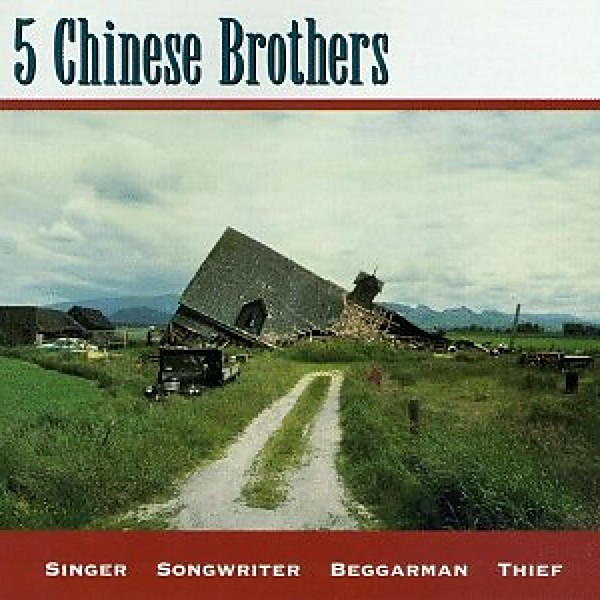

# Singer Songwriter Beggarman Thief

By **5 Chinese Brothers**

## Album Data

- **Catalog:** Beets
- **Format:** Digital, Album
- **Album:** Singer Songwriter Beggarman Thief
- **Artist:** 5 Chinese Brothers
- **Albumartist:** 5 Chinese Brothers
- **Genre:** Americana
- **MusicBrainz Album Artist ID:** [ebb70f27-ef24-47dc-a6d0-ccfde1f9e948](https://musicbrainz.org/artist/ebb70f27-ef24-47dc-a6d0-ccfde1f9e948)
- **MusicBrainz Album ID:** [debe0bcc-e284-4e07-b3bb-133af0dc4e2d](https://musicbrainz.org/release/debe0bcc-e284-4e07-b3bb-133af0dc4e2d)
- **MusicBrainz Release Group ID:** [5734fb27-6690-34a7-aee4-88ab836797ac](https://musicbrainz.org/release-group/5734fb27-6690-34a7-aee4-88ab836797ac)
- **Year:** 1993
- **Catalog #:** PCD002
- **Label:** 1-800-Prime-CD
- **Total Tracks:** 15

## Album Tracks

### Track 01 - If I Ain't Falling

- **Artist:** 5 Chinese Brothers
- **Format:** ALAC
- **Genre:** Americana
- **Length:** 3:38
- **MusicBrainz Track ID:** [c82d5e83-017d-484a-89f8-390bd247c3d7](https://musicbrainz.org/recording/c82d5e83-017d-484a-89f8-390bd247c3d7)
- **Title:** If I Ain't Falling
- **Track:** 01
- **Year:** 1993

### Track 02 - Baltimore

- **Artist:** 5 Chinese Brothers
- **Format:** ALAC
- **Genre:** Americana
- **Length:** 3:09
- **MusicBrainz Track ID:** [e6fbe5b5-a881-4d45-8747-dcc82e7a6ccb](https://musicbrainz.org/recording/e6fbe5b5-a881-4d45-8747-dcc82e7a6ccb)
- **Title:** Baltimore
- **Track:** 02
- **Year:** 1993

### Track 03 - She's a Waitress (And I'm in Love)

- **Artist:** 5 Chinese Brothers
- **Format:** ALAC
- **Genre:** Americana
- **Length:** 3:49
- **MusicBrainz Track ID:** [8d79d2da-f72f-4946-acc9-05b4316bd2ab](https://musicbrainz.org/recording/8d79d2da-f72f-4946-acc9-05b4316bd2ab)
- **Title:** She's a Waitress (And I'm in Love)
- **Track:** 03
- **Year:** 1993

### Track 04 - Stop Talking

- **Artist:** 5 Chinese Brothers
- **Format:** ALAC
- **Genre:** Americana
- **Length:** 3:14
- **MusicBrainz Track ID:** [60a4b10b-adb7-4fa9-8cb1-c3d1e4d879b4](https://musicbrainz.org/recording/60a4b10b-adb7-4fa9-8cb1-c3d1e4d879b4)
- **Title:** Stop Talking
- **Track:** 04
- **Year:** 1993

### Track 05 - My Dad's Face

- **Artist:** 5 Chinese Brothers
- **Format:** ALAC
- **Genre:** Americana
- **Length:** 3:46
- **MusicBrainz Track ID:** [bc5fb5df-cd37-4d8e-ab0c-9696a82cdb05](https://musicbrainz.org/recording/bc5fb5df-cd37-4d8e-ab0c-9696a82cdb05)
- **Title:** My Dad's Face
- **Track:** 05
- **Year:** 1993

### Track 06 - These Dreams

- **Artist:** 5 Chinese Brothers
- **Format:** ALAC
- **Genre:** Americana
- **Length:** 3:29
- **MusicBrainz Track ID:** [c31679cd-169e-4ab6-9a3e-7bc0d3c644fe](https://musicbrainz.org/recording/c31679cd-169e-4ab6-9a3e-7bc0d3c644fe)
- **Title:** These Dreams
- **Track:** 06
- **Year:** 1993

### Track 07 - Alone Together

- **Artist:** 5 Chinese Brothers
- **Format:** ALAC
- **Genre:** Americana
- **Length:** 3:30
- **MusicBrainz Track ID:** [5b46edfe-dff9-43a9-9c63-b7f6a42287f7](https://musicbrainz.org/recording/5b46edfe-dff9-43a9-9c63-b7f6a42287f7)
- **Title:** Alone Together
- **Track:** 07
- **Year:** 1993

### Track 08 - Paul Cezanne

- **Artist:** 5 Chinese Brothers
- **Format:** ALAC
- **Genre:** Americana
- **Length:** 2:50
- **MusicBrainz Track ID:** [e2f3a3d3-66be-435e-b04e-0083100e09a6](https://musicbrainz.org/recording/e2f3a3d3-66be-435e-b04e-0083100e09a6)
- **Title:** Paul Cezanne
- **Track:** 08
- **Year:** 1993

### Track 09 - Claudine

- **Artist:** 5 Chinese Brothers
- **Format:** ALAC
- **Genre:** Americana
- **Length:** 3:09
- **MusicBrainz Track ID:** [ff1f6c7a-a734-439f-9d0d-af228bb0f012](https://musicbrainz.org/recording/ff1f6c7a-a734-439f-9d0d-af228bb0f012)
- **Title:** Claudine
- **Track:** 09
- **Year:** 1993

### Track 10 - Don't Regret

- **Artist:** 5 Chinese Brothers
- **Format:** ALAC
- **Genre:** Americana
- **Length:** 3:52
- **MusicBrainz Track ID:** [f59ff50d-9a47-4a07-a3eb-03984bdb51f3](https://musicbrainz.org/recording/f59ff50d-9a47-4a07-a3eb-03984bdb51f3)
- **Title:** Don't Regret
- **Track:** 10
- **Year:** 1993

### Track 11 - The Real Fast Car

- **Artist:** 5 Chinese Brothers
- **Format:** ALAC
- **Genre:** Americana
- **Length:** 2:41
- **MusicBrainz Track ID:** [0f45ff58-0484-42b0-a4a1-51ce15a757d4](https://musicbrainz.org/recording/0f45ff58-0484-42b0-a4a1-51ce15a757d4)
- **Title:** The Real Fast Car
- **Track:** 11
- **Year:** 1993

### Track 12 - All I Need

- **Artist:** 5 Chinese Brothers
- **Format:** ALAC
- **Genre:** Americana
- **Length:** 3:23
- **MusicBrainz Track ID:** [b7f113e2-a478-4908-a03b-47d645dcd4a2](https://musicbrainz.org/recording/b7f113e2-a478-4908-a03b-47d645dcd4a2)
- **Title:** All I Need
- **Track:** 12
- **Year:** 1993

### Track 13 - I Always Knew

- **Artist:** 5 Chinese Brothers
- **Format:** ALAC
- **Genre:** Americana
- **Length:** 3:15
- **MusicBrainz Track ID:** [33a82779-c155-4981-aead-628ded52d0a0](https://musicbrainz.org/recording/33a82779-c155-4981-aead-628ded52d0a0)
- **Title:** I Always Knew
- **Track:** 13
- **Year:** 1993

### Track 14 - Williamsburg

- **Artist:** 5 Chinese Brothers
- **Format:** ALAC
- **Genre:** Americana
- **Length:** 3:11
- **MusicBrainz Track ID:** [6b961882-38d8-4261-b0c1-ea03122a7865](https://musicbrainz.org/recording/6b961882-38d8-4261-b0c1-ea03122a7865)
- **Title:** Williamsburg
- **Track:** 14
- **Year:** 1993

### Track 15 - Jack Worships Janey

- **Artist:** 5 Chinese Brothers
- **Format:** ALAC
- **Genre:** Americana
- **Length:** 3:50
- **MusicBrainz Track ID:** [ef829600-ff6c-46ac-b436-26799704d13f](https://musicbrainz.org/recording/ef829600-ff6c-46ac-b436-26799704d13f)
- **Title:** Jack Worships Janey
- **Track:** 15
- **Year:** 1993

