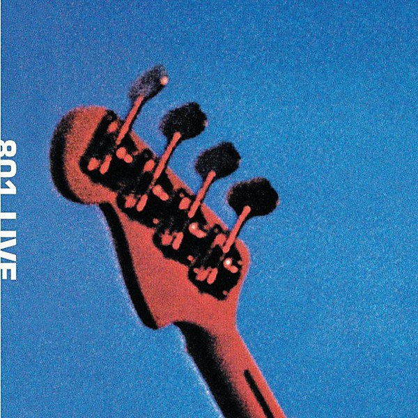

# 801 Live

By **801**

## Album Data

- **Catalog:** Beets
- **Format:** Digital, Album
- **Album:** 801 Live
- **Artist:** 801
- **Albumartist:** 801
- **Genre:** Progressive Rock
- **MusicBrainz Album Artist ID:** [c65492b4-28af-4d63-b9f5-1db325fd5976](https://musicbrainz.org/artist/c65492b4-28af-4d63-b9f5-1db325fd5976)
- **MusicBrainz Album ID:** [13de6259-a575-4552-a5f0-7b8efc4b1e06](https://musicbrainz.org/release/13de6259-a575-4552-a5f0-7b8efc4b1e06)
- **MusicBrainz Release Group ID:** [112fabb2-7092-3b1e-bb01-e1923c108a5a](https://musicbrainz.org/release-group/112fabb2-7092-3b1e-bb01-e1923c108a5a)
- **Year:** 1976
- **Catalog #:** 
- **Label:** E’G
- **Total Tracks:** 10

## Album Tracks

### Track 01 - Lagrima

- **Artist:** 801
- **Format:** MP3
- **Genre:** Rock
- **Length:** 2:36
- **MusicBrainz Track ID:** [bbdd630c-fcad-4ed4-8f18-34c3d3b9eb45](https://musicbrainz.org/recording/bbdd630c-fcad-4ed4-8f18-34c3d3b9eb45)
- **Title:** Lagrima
- **Track:** 01
- **Year:** 1976

### Track 02 - T.N.K. (Tomorrow Never Knows)

- **Artist:** 801
- **Format:** MP3
- **Genre:** Psychedelic Rock
- **Length:** 6:16
- **MusicBrainz Track ID:** [f4c30010-ed36-4fa4-878d-c584f54996b1](https://musicbrainz.org/recording/f4c30010-ed36-4fa4-878d-c584f54996b1)
- **Title:** T.N.K. (Tomorrow Never Knows)
- **Track:** 02
- **Year:** 1976

### Track 03 - East of Asteroid

- **Artist:** 801
- **Format:** MP3
- **Genre:** Progressive Rock
- **Length:** 5:00
- **MusicBrainz Track ID:** [de623339-7bb3-4a73-9ecd-82e11e2d5aaf](https://musicbrainz.org/recording/de623339-7bb3-4a73-9ecd-82e11e2d5aaf)
- **Title:** East of Asteroid
- **Track:** 03
- **Year:** 1976

### Track 04 - Rongwrong

- **Artist:** 801
- **Format:** MP3
- **Genre:** Progressive Rock
- **Length:** 5:12
- **MusicBrainz Track ID:** [48e4df8d-5656-4a0e-ac24-422d946273ab](https://musicbrainz.org/recording/48e4df8d-5656-4a0e-ac24-422d946273ab)
- **Title:** Rongwrong
- **Track:** 04
- **Year:** 1976

### Track 05 - Sombre Reptiles

- **Artist:** 801
- **Format:** MP3
- **Genre:** Progressive Rock
- **Length:** 3:16
- **MusicBrainz Track ID:** [8d44cbb6-d754-4147-a6b6-db6ae6963f97](https://musicbrainz.org/recording/8d44cbb6-d754-4147-a6b6-db6ae6963f97)
- **Title:** Sombre Reptiles
- **Track:** 05
- **Year:** 1976

### Track 06 - Baby’s on Fire

- **Artist:** 801
- **Format:** MP3
- **Genre:** Progressive Rock
- **Length:** 5:04
- **MusicBrainz Track ID:** [fc7ff4b7-6ef7-4797-b13a-c20879705e37](https://musicbrainz.org/recording/fc7ff4b7-6ef7-4797-b13a-c20879705e37)
- **Title:** Baby’s on Fire
- **Track:** 06
- **Year:** 1976

### Track 07 - Diamond Head

- **Artist:** 801
- **Format:** MP3
- **Genre:** Progressive Rock
- **Length:** 6:23
- **MusicBrainz Track ID:** [56412710-aa0f-4619-92db-6dffd66d779f](https://musicbrainz.org/recording/56412710-aa0f-4619-92db-6dffd66d779f)
- **Title:** Diamond Head
- **Track:** 07
- **Year:** 1976

### Track 08 - Miss Shapiro

- **Artist:** 801
- **Format:** MP3
- **Genre:** Progressive Rock
- **Length:** 4:22
- **MusicBrainz Track ID:** [ecef3754-a992-4fb7-ba0a-97999ceaa4f9](https://musicbrainz.org/recording/ecef3754-a992-4fb7-ba0a-97999ceaa4f9)
- **Title:** Miss Shapiro
- **Track:** 08
- **Year:** 1976

### Track 09 - You Really Got Me

- **Artist:** 801
- **Format:** MP3
- **Genre:** Art Rock
- **Length:** 3:25
- **MusicBrainz Track ID:** [9063d3ae-65d2-438a-8e8a-48472ab0030f](https://musicbrainz.org/recording/9063d3ae-65d2-438a-8e8a-48472ab0030f)
- **Title:** You Really Got Me
- **Track:** 09
- **Year:** 1976

### Track 10 - Third Uncle

- **Artist:** 801
- **Format:** MP3
- **Genre:** Progressive Rock
- **Length:** 5:14
- **MusicBrainz Track ID:** [6282e3a2-d7e0-44e5-80ba-bf1e776f800a](https://musicbrainz.org/recording/6282e3a2-d7e0-44e5-80ba-bf1e776f800a)
- **Title:** Third Uncle
- **Track:** 10
- **Year:** 1976

## See also

- [Roon: 801 Live](../../Roon/801/801_Live.md)
