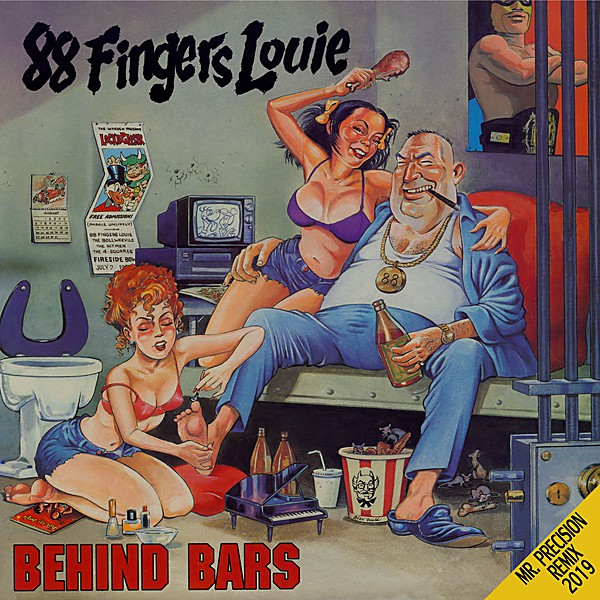

# Behind Bars

By **88 Fingers Louie**

## Album Data

- **Catalog:** Beets
- **Format:** Digital, Album
- **Album:** Behind Bars
- **Artist:** 88 Fingers Louie
- **Albumartist:** 88 Fingers Louie
- **Genre:** Skate Punk
- **MusicBrainz Album Artist ID:** 
- **MusicBrainz Album ID:** 
- **MusicBrainz Release Group ID:** 
- **Year:** 1995
- **Catalog #:** 
- **Label:** 
- **Total Tracks:** 00

## Album Tracks

### Track 01 - Pent up

- **Artist:** 88 Fingers Louie
- **Format:** AAC
- **Genre:** Hardcore Punk
- **Length:** 3:27
- **MusicBrainz Track ID:** 
- **Title:** Pent up
- **Track:** 01
- **Year:** 1995

### Track 02 - Explanation

- **Artist:** 88 Fingers Louie
- **Format:** AAC
- **Genre:** Skate Punk
- **Length:** 1:41
- **MusicBrainz Track ID:** 
- **Title:** Explanation
- **Track:** 02
- **Year:** 1995

### Track 03 - Outright Lies

- **Artist:** 88 Fingers Louie
- **Format:** MP3
- **Genre:** Skate Punk
- **Length:** 2:47
- **MusicBrainz Track ID:** 
- **Title:** Outright Lies
- **Track:** 03
- **Year:** 1995

### Track 06 - Holding Back

- **Artist:** 88 Fingers Louie
- **Format:** AAC
- **Genre:** Hardcore Punk
- **Length:** 1:37
- **MusicBrainz Track ID:** 
- **Title:** Holding Back
- **Track:** 06
- **Year:** 1995

### Track 12 - I Hate Myself

- **Artist:** 88 Fingers Louie
- **Format:** AAC
- **Genre:** Hardcore Punk
- **Length:** 2:05
- **MusicBrainz Track ID:** 
- **Title:** I Hate Myself
- **Track:** 12
- **Year:** 1995

