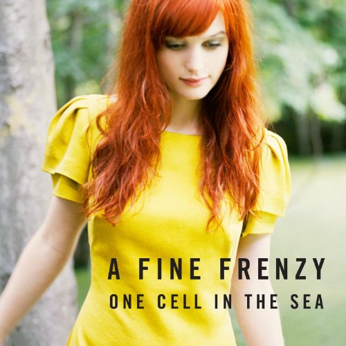

# One Cell in the Sea

By **A Fine Frenzy**

## Album Data

- **Catalog:** Beets
- **Format:** Digital, Album
- **Album:** One Cell in the Sea
- **Artist:** A Fine Frenzy
- **Albumartist:** A Fine Frenzy
- **Genre:** Pop
- **MusicBrainz Album Artist ID:** [ccd4426f-aef3-48e3-b04e-2e1de3d1f8d6](https://musicbrainz.org/artist/ccd4426f-aef3-48e3-b04e-2e1de3d1f8d6)
- **MusicBrainz Album ID:** [2baec7d6-ac9f-42ac-b20a-9cd0b6c1b7d7](https://musicbrainz.org/release/2baec7d6-ac9f-42ac-b20a-9cd0b6c1b7d7)
- **MusicBrainz Release Group ID:** [d2817b56-a9fd-3554-94ae-3c92e65431ad](https://musicbrainz.org/release-group/d2817b56-a9fd-3554-94ae-3c92e65431ad)
- **Year:** 2008
- **Catalog #:** 
- **Label:** Virgin Records America, Inc.
- **Total Tracks:** 15

## Album Tracks

### Track 01 - Come On, Come Out

- **Artist:** A Fine Frenzy
- **Format:** AAC
- **Genre:** Indie Pop
- **Length:** 3:35
- **MusicBrainz Track ID:** [1981bd58-6779-4556-a417-53d7b6f7739a](https://musicbrainz.org/recording/1981bd58-6779-4556-a417-53d7b6f7739a)
- **Title:** Come On, Come Out
- **Track:** 01
- **Year:** 2008

### Track 02 - The Minnow & the Trout

- **Artist:** A Fine Frenzy
- **Format:** AAC
- **Genre:** Indie Pop
- **Length:** 4:28
- **MusicBrainz Track ID:** [8cebfe22-4242-4456-a64f-ee0deb5279d7](https://musicbrainz.org/recording/8cebfe22-4242-4456-a64f-ee0deb5279d7)
- **Title:** The Minnow & the Trout
- **Track:** 02
- **Year:** 2008

### Track 03 - Whisper

- **Artist:** A Fine Frenzy
- **Format:** AAC
- **Genre:** Pop
- **Length:** 4:56
- **MusicBrainz Track ID:** [7a675d5a-1c0f-4790-a41a-94741dae02b1](https://musicbrainz.org/recording/7a675d5a-1c0f-4790-a41a-94741dae02b1)
- **Title:** Whisper
- **Track:** 03
- **Year:** 2008

### Track 04 - You Picked Me

- **Artist:** A Fine Frenzy
- **Format:** AAC
- **Genre:** Indie Pop
- **Length:** 4:23
- **MusicBrainz Track ID:** [25b2e350-37c5-4c8b-a3b2-d0d57259610e](https://musicbrainz.org/recording/25b2e350-37c5-4c8b-a3b2-d0d57259610e)
- **Title:** You Picked Me
- **Track:** 04
- **Year:** 2008

### Track 05 - Rangers

- **Artist:** A Fine Frenzy
- **Format:** AAC
- **Genre:** Indie Pop
- **Length:** 4:33
- **MusicBrainz Track ID:** [10acf0c5-cb2c-462b-8846-e4a75c7b6bc6](https://musicbrainz.org/recording/10acf0c5-cb2c-462b-8846-e4a75c7b6bc6)
- **Title:** Rangers
- **Track:** 05
- **Year:** 2008

### Track 06 - Almost Lover

- **Artist:** A Fine Frenzy
- **Format:** AAC
- **Genre:** Pop
- **Length:** 4:30
- **MusicBrainz Track ID:** [845c5f41-1f9c-4146-9852-418babbafc9d](https://musicbrainz.org/recording/845c5f41-1f9c-4146-9852-418babbafc9d)
- **Title:** Almost Lover
- **Track:** 06
- **Year:** 2008

### Track 07 - Think of You

- **Artist:** A Fine Frenzy
- **Format:** AAC
- **Genre:** Indie Pop
- **Length:** 4:06
- **MusicBrainz Track ID:** [d24d64a1-72e2-4a30-8092-793f4ef74458](https://musicbrainz.org/recording/d24d64a1-72e2-4a30-8092-793f4ef74458)
- **Title:** Think of You
- **Track:** 07
- **Year:** 2008

### Track 08 - Ashes and Wine

- **Artist:** A Fine Frenzy
- **Format:** AAC
- **Genre:** Pop
- **Length:** 4:20
- **MusicBrainz Track ID:** [0def64ec-d8e7-4dbc-91db-958fc81ef9a9](https://musicbrainz.org/recording/0def64ec-d8e7-4dbc-91db-958fc81ef9a9)
- **Title:** Ashes and Wine
- **Track:** 08
- **Year:** 2008

### Track 09 - Liar, Liar

- **Artist:** A Fine Frenzy
- **Format:** AAC
- **Genre:** Pop
- **Length:** 5:55
- **MusicBrainz Track ID:** [03ffbf42-eeea-483c-876d-d61ad880f0c3](https://musicbrainz.org/recording/03ffbf42-eeea-483c-876d-d61ad880f0c3)
- **Title:** Liar, Liar
- **Track:** 09
- **Year:** 2008

### Track 10 - Last of Days

- **Artist:** A Fine Frenzy
- **Format:** AAC
- **Genre:** Pop
- **Length:** 4:12
- **MusicBrainz Track ID:** [a470830c-9cab-43ea-a4e7-51293e81b18b](https://musicbrainz.org/recording/a470830c-9cab-43ea-a4e7-51293e81b18b)
- **Title:** Last of Days
- **Track:** 10
- **Year:** 2008

### Track 11 - Lifesize

- **Artist:** A Fine Frenzy
- **Format:** AAC
- **Genre:** Pop
- **Length:** 3:44
- **MusicBrainz Track ID:** [f3b047fa-6463-4b59-99a6-058b80eebb04](https://musicbrainz.org/recording/f3b047fa-6463-4b59-99a6-058b80eebb04)
- **Title:** Lifesize
- **Track:** 11
- **Year:** 2008

### Track 12 - Near to You

- **Artist:** A Fine Frenzy
- **Format:** AAC
- **Genre:** Pop
- **Length:** 4:35
- **MusicBrainz Track ID:** [2739df17-f06f-4054-a935-cb9505d25356](https://musicbrainz.org/recording/2739df17-f06f-4054-a935-cb9505d25356)
- **Title:** Near to You
- **Track:** 12
- **Year:** 2008

### Track 13 - Hope for the Hopeless

- **Artist:** A Fine Frenzy
- **Format:** AAC
- **Genre:** Pop
- **Length:** 4:17
- **MusicBrainz Track ID:** [8ccfdc43-2bf0-41a2-a092-fa1033ed29cc](https://musicbrainz.org/recording/8ccfdc43-2bf0-41a2-a092-fa1033ed29cc)
- **Title:** Hope for the Hopeless
- **Track:** 13
- **Year:** 2008

### Track 14 - Borrowed Time

- **Artist:** A Fine Frenzy
- **Format:** AAC
- **Genre:** Indie Rock
- **Length:** 4:13
- **MusicBrainz Track ID:** [99c2a673-14be-4203-a6fb-a75f8c9c256b](https://musicbrainz.org/recording/99c2a673-14be-4203-a6fb-a75f8c9c256b)
- **Title:** Borrowed Time
- **Track:** 14
- **Year:** 2008

### Track 15 - Almost Lover (Remix Edit)

- **Artist:** A Fine Frenzy
- **Format:** AAC
- **Genre:** Rock
- **Length:** 3:38
- **MusicBrainz Track ID:** [fc652021-9bca-4ab9-8adf-f952a1523aa5](https://musicbrainz.org/recording/fc652021-9bca-4ab9-8adf-f952a1523aa5)
- **Title:** Almost Lover (Remix Edit)
- **Track:** 15
- **Year:** 2008

## See also

- [Bomb in a Birdcage](Bomb_in_a_Birdcage.md)
- [Roon: Bomb In A Birdcage](../../Roon/A_Fine_Frenzy/Bomb_In_A_Birdcage.md)
