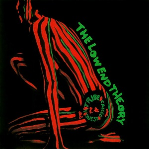

# The Low End Theory

By **A Tribe Called Quest**

## Album Data

- **Catalog:** Beets
- **Format:** Digital, Album
- **Album:** The Low End Theory
- **Artist:** A Tribe Called Quest
- **Albumartist:** A Tribe Called Quest
- **Genre:** Jazz Rap
- **MusicBrainz Album Artist ID:** 
- **MusicBrainz Album ID:** 
- **MusicBrainz Release Group ID:** 
- **Year:** 2000
- **Catalog #:** 
- **Label:** 
- **Total Tracks:** 00

## Album Tracks

### Track 05 - Verses From The Abstract

- **Artist:** A Tribe Called Quest
- **Format:** AAC
- **Genre:** Old School Hip Hop
- **Length:** 3:58
- **MusicBrainz Track ID:** 
- **Title:** Verses From The Abstract
- **Track:** 05
- **Year:** 2000

### Track 06 - Show Business

- **Artist:** A Tribe Called Quest
- **Format:** AAC
- **Genre:** Jazz Rap
- **Length:** 3:53
- **MusicBrainz Track ID:** 
- **Title:** Show Business
- **Track:** 06
- **Year:** 2000

### Track 07 - Vibes And Stuff

- **Artist:** A Tribe Called Quest
- **Format:** AAC
- **Genre:** Jazz Rap
- **Length:** 4:17
- **MusicBrainz Track ID:** 
- **Title:** Vibes And Stuff
- **Track:** 07
- **Year:** 2000

### Track 09 - Check The Rhime

- **Artist:** A Tribe Called Quest
- **Format:** AAC
- **Genre:** Old School Hip Hop
- **Length:** 3:39
- **MusicBrainz Track ID:** 
- **Title:** Check The Rhime
- **Track:** 09
- **Year:** 2000

### Track 11 - Jazz (We've Got)

- **Artist:** A Tribe Called Quest
- **Format:** AAC
- **Genre:** Jazz Rap
- **Length:** 4:10
- **MusicBrainz Track ID:** 
- **Title:** Jazz (We've Got)
- **Track:** 11
- **Year:** 2000

### Track 14 - Scenario

- **Artist:** A Tribe Called Quest
- **Format:** AAC
- **Genre:** Hip Hop
- **Length:** 4:10
- **MusicBrainz Track ID:** 
- **Title:** Scenario
- **Track:** 14
- **Year:** 2000

