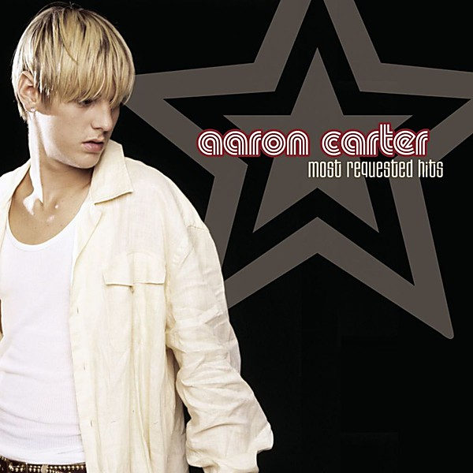

# Most Requested Hits

By **Aaron Carter**

## Album Data

- **Catalog:** Beets
- **Format:** Digital, Album
- **Album:** Most Requested Hits
- **Artist:** Aaron Carter
- **Albumartist:** Aaron Carter
- **Genre:** Teen Pop
- **MusicBrainz Album Artist ID:** [4c0bb5bc-95ad-47de-99e3-fbb4fbc5f393](https://musicbrainz.org/artist/4c0bb5bc-95ad-47de-99e3-fbb4fbc5f393)
- **MusicBrainz Album ID:** [0e7fb564-a866-496f-abdd-333ccdca1699](https://musicbrainz.org/release/0e7fb564-a866-496f-abdd-333ccdca1699)
- **MusicBrainz Release Group ID:** [b8abd40b-5f30-3fe6-a5bf-0e4e1a683cb1](https://musicbrainz.org/release-group/b8abd40b-5f30-3fe6-a5bf-0e4e1a683cb1)
- **Year:** 2003
- **Catalog #:** 82876-55570-2
- **Label:** Jive
- **Total Tracks:** 16

## Album Tracks

### Track 01 - Aaron's Party (Come Get It)

- **Artist:** Aaron Carter
- **Format:** ALAC
- **Genre:** Pop Rap
- **Length:** 3:25
- **MusicBrainz Track ID:** [c9c2aa11-f9f0-4caf-b413-e0e89019efeb](https://musicbrainz.org/recording/c9c2aa11-f9f0-4caf-b413-e0e89019efeb)
- **Title:** Aaron's Party (Come Get It)
- **Track:** 01
- **Year:** 2003

### Track 02 - I Want Candy

- **Artist:** Aaron Carter
- **Format:** ALAC
- **Genre:** Pop
- **Length:** 3:14
- **MusicBrainz Track ID:** [6f78a4c2-6a15-4264-8eed-aa518e61a5c1](https://musicbrainz.org/recording/6f78a4c2-6a15-4264-8eed-aa518e61a5c1)
- **Title:** I Want Candy
- **Track:** 02
- **Year:** 2003

### Track 03 - That's How I Beat Shaq

- **Artist:** Aaron Carter
- **Format:** ALAC
- **Genre:** Pop Rap
- **Length:** 3:25
- **MusicBrainz Track ID:** [fb734d14-c2b4-4deb-81b9-1fe34344f2a2](https://musicbrainz.org/recording/fb734d14-c2b4-4deb-81b9-1fe34344f2a2)
- **Title:** That's How I Beat Shaq
- **Track:** 03
- **Year:** 2003

### Track 05 - Not Too Young, Not Too Old

- **Artist:** Aaron Carter
- **Format:** ALAC
- **Genre:** Teen Pop
- **Length:** 3:08
- **MusicBrainz Track ID:** [51b51e7d-fc03-4025-af4f-0d07c4168534](https://musicbrainz.org/recording/51b51e7d-fc03-4025-af4f-0d07c4168534)
- **Title:** Not Too Young, Not Too Old
- **Track:** 05
- **Year:** 2003

### Track 06 - I'm All About You

- **Artist:** Aaron Carter
- **Format:** ALAC
- **Genre:** Pop
- **Length:** 3:41
- **MusicBrainz Track ID:** [23d6f292-a58b-4b18-a92d-518003ac146b](https://musicbrainz.org/recording/23d6f292-a58b-4b18-a92d-518003ac146b)
- **Title:** I'm All About You
- **Track:** 06
- **Year:** 2003

### Track 07 - Leave It Up to Me

- **Artist:** Aaron Carter
- **Format:** ALAC
- **Genre:** Teen Pop
- **Length:** 2:59
- **MusicBrainz Track ID:** [ed80cd2b-d445-4d6f-a6f7-1cca760daed2](https://musicbrainz.org/recording/ed80cd2b-d445-4d6f-a6f7-1cca760daed2)
- **Title:** Leave It Up to Me
- **Track:** 07
- **Year:** 2003

### Track 08 - Another Earthquake!

- **Artist:** Aaron Carter
- **Format:** ALAC
- **Genre:** Dance-Pop
- **Length:** 2:51
- **MusicBrainz Track ID:** [b8fead81-46cb-4098-9b73-bfb0db7c227d](https://musicbrainz.org/recording/b8fead81-46cb-4098-9b73-bfb0db7c227d)
- **Title:** Another Earthquake!
- **Track:** 08
- **Year:** 2003

### Track 09 - To All the Girls

- **Artist:** Aaron Carter
- **Format:** ALAC
- **Genre:** Pop
- **Length:** 3:26
- **MusicBrainz Track ID:** [7530252b-52f1-499e-847f-621d1ef314bc](https://musicbrainz.org/recording/7530252b-52f1-499e-847f-621d1ef314bc)
- **Title:** To All the Girls
- **Track:** 09
- **Year:** 2003

### Track 11 - Do You Remember

- **Artist:** Aaron Carter
- **Format:** ALAC
- **Genre:** Pop
- **Length:** 3:58
- **MusicBrainz Track ID:** [8bcc2d15-b8a9-4115-bef8-544df2ae56b1](https://musicbrainz.org/recording/8bcc2d15-b8a9-4115-bef8-544df2ae56b1)
- **Title:** Do You Remember
- **Track:** 11
- **Year:** 2003

### Track 12 - America A O

- **Artist:** Aaron Carter
- **Format:** ALAC
- **Genre:** Dance-Pop
- **Length:** 3:30
- **MusicBrainz Track ID:** [02b719e1-935e-4100-83a7-ed43d17ad649](https://musicbrainz.org/recording/02b719e1-935e-4100-83a7-ed43d17ad649)
- **Title:** America A O
- **Track:** 12
- **Year:** 2003

### Track 14 - One Better

- **Artist:** Aaron Carter
- **Format:** ALAC
- **Genre:** Pop
- **Length:** 3:29
- **MusicBrainz Track ID:** [c83425f5-ed38-4469-af3f-565592e570a8](https://musicbrainz.org/recording/c83425f5-ed38-4469-af3f-565592e570a8)
- **Title:** One Better
- **Track:** 14
- **Year:** 2003

### Track 15 - My Shorty

- **Artist:** Aaron Carter
- **Format:** ALAC
- **Genre:** Teen Pop
- **Length:** 3:41
- **MusicBrainz Track ID:** [5c5b679c-d7dc-4633-a2b5-50dab6257f11](https://musicbrainz.org/recording/5c5b679c-d7dc-4633-a2b5-50dab6257f11)
- **Title:** My Shorty
- **Track:** 15
- **Year:** 2003

### Track 16 - One Better (remix)

- **Artist:** Aaron Carter
- **Format:** ALAC
- **Genre:** Pop
- **Length:** 3:19
- **MusicBrainz Track ID:** [845cc3a1-ba1c-4570-adfe-da1c5adea1e8](https://musicbrainz.org/recording/845cc3a1-ba1c-4570-adfe-da1c5adea1e8)
- **Title:** One Better (remix)
- **Track:** 16
- **Year:** 2003

### Track 10 - Summertime

- **Artist:** Aaron Carter feat. Baha Men
- **Format:** ALAC
- **Genre:** Teen Pop
- **Length:** 3:50
- **MusicBrainz Track ID:** [8057cd69-416d-4028-af72-5143d19114c1](https://musicbrainz.org/recording/8057cd69-416d-4028-af72-5143d19114c1)
- **Title:** Summertime
- **Track:** 10
- **Year:** 2003

### Track 13 - She Wants Me

- **Artist:** Aaron Carter feat. Nick Carter
- **Format:** ALAC
- **Genre:** Teen Pop
- **Length:** 3:43
- **MusicBrainz Track ID:** [86c509e1-711b-4fa3-a4e5-48723c1cfcf6](https://musicbrainz.org/recording/86c509e1-711b-4fa3-a4e5-48723c1cfcf6)
- **Title:** She Wants Me
- **Track:** 13
- **Year:** 2003

### Track 04 - Oh Aaron

- **Artist:** Aaron Carter feat. No Secrets
- **Format:** ALAC
- **Genre:** Teen Pop
- **Length:** 3:17
- **MusicBrainz Track ID:** [d0ee8d1e-75a9-423f-9c7e-687c3a5727c1](https://musicbrainz.org/recording/d0ee8d1e-75a9-423f-9c7e-687c3a5727c1)
- **Title:** Oh Aaron
- **Track:** 04
- **Year:** 2003

