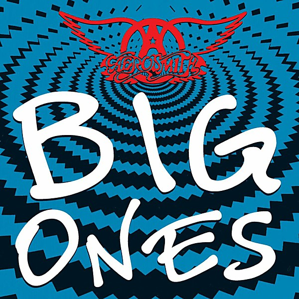

# Big Ones

By **Aerosmith**

## Album Data

- **Catalog:** Beets
- **Format:** Digital, Album
- **Album:** Big Ones
- **Artist:** Aerosmith
- **Albumartist:** Aerosmith
- **Genre:** Hard Rock
- **MusicBrainz Album Artist ID:** [3d2b98e5-556f-4451-a3ff-c50ea18d57cb](https://musicbrainz.org/artist/3d2b98e5-556f-4451-a3ff-c50ea18d57cb)
- **MusicBrainz Album ID:** [690abd6c-8e1b-4042-b786-a027eae6afb2](https://musicbrainz.org/release/690abd6c-8e1b-4042-b786-a027eae6afb2)
- **MusicBrainz Release Group ID:** [e3dfcdbd-9c0d-3d9d-a025-3fe261b2ca0f](https://musicbrainz.org/release-group/e3dfcdbd-9c0d-3d9d-a025-3fe261b2ca0f)
- **Year:** 1994
- **Catalog #:** D106271
- **Label:** BMG Direct Marketing, Inc.
- **Total Tracks:** 15

## Album Tracks

### Track 01 - Walk on Water

- **Artist:** Aerosmith
- **Format:** MP3
- **Genre:** Hard Rock
- **Length:** 4:55
- **MusicBrainz Track ID:** [7db71349-023d-46c8-9b24-8ca7c2162327](https://musicbrainz.org/recording/7db71349-023d-46c8-9b24-8ca7c2162327)
- **Title:** Walk on Water
- **Track:** 01
- **Year:** 1994

### Track 02 - Love in an Elevator

- **Artist:** Aerosmith
- **Format:** MP3
- **Genre:** Hard Rock
- **Length:** 5:21
- **MusicBrainz Track ID:** [46a9b2de-ebcb-41f2-b440-2e1ac1ffa83a](https://musicbrainz.org/recording/46a9b2de-ebcb-41f2-b440-2e1ac1ffa83a)
- **Title:** Love in an Elevator
- **Track:** 02
- **Year:** 1994

### Track 03 - Rag Doll

- **Artist:** Aerosmith
- **Format:** MP3
- **Genre:** Hard Rock
- **Length:** 4:24
- **MusicBrainz Track ID:** [c8e048e8-f419-4a24-b7b2-2a0aa63ee7e3](https://musicbrainz.org/recording/c8e048e8-f419-4a24-b7b2-2a0aa63ee7e3)
- **Title:** Rag Doll
- **Track:** 03
- **Year:** 1994

### Track 04 - What It Takes

- **Artist:** Aerosmith
- **Format:** MP3
- **Genre:** Hard Rock
- **Length:** 5:10
- **MusicBrainz Track ID:** [4f854565-46f3-4e78-b03a-458481148e94](https://musicbrainz.org/recording/4f854565-46f3-4e78-b03a-458481148e94)
- **Title:** What It Takes
- **Track:** 04
- **Year:** 1994

### Track 05 - Dude (Looks Like a Lady)

- **Artist:** Aerosmith
- **Format:** MP3
- **Genre:** Hard Rock
- **Length:** 4:24
- **MusicBrainz Track ID:** [b62424dd-1498-4642-874a-7bea46e5a51d](https://musicbrainz.org/recording/b62424dd-1498-4642-874a-7bea46e5a51d)
- **Title:** Dude (Looks Like a Lady)
- **Track:** 05
- **Year:** 1994

### Track 06 - Janie’s Got a Gun

- **Artist:** Aerosmith
- **Format:** MP3
- **Genre:** Hard Rock
- **Length:** 5:30
- **MusicBrainz Track ID:** [3a2c5485-69c7-418d-a704-100a2ca999f3](https://musicbrainz.org/recording/3a2c5485-69c7-418d-a704-100a2ca999f3)
- **Title:** Janie’s Got a Gun
- **Track:** 06
- **Year:** 1994

### Track 07 - Cryin’

- **Artist:** Aerosmith
- **Format:** MP3
- **Genre:** Hard Rock
- **Length:** 5:08
- **MusicBrainz Track ID:** [c59758a1-940c-409d-9a0d-bde97048d5ad](https://musicbrainz.org/recording/c59758a1-940c-409d-9a0d-bde97048d5ad)
- **Title:** Cryin’
- **Track:** 07
- **Year:** 1994

### Track 08 - Amazing

- **Artist:** Aerosmith
- **Format:** MP3
- **Genre:** Hard Rock
- **Length:** 5:56
- **MusicBrainz Track ID:** [f27a903c-f5cc-465f-91c4-5c67d8b3d6d6](https://musicbrainz.org/recording/f27a903c-f5cc-465f-91c4-5c67d8b3d6d6)
- **Title:** Amazing
- **Track:** 08
- **Year:** 1994

### Track 09 - Blind Man

- **Artist:** Aerosmith
- **Format:** MP3
- **Genre:** Hard Rock
- **Length:** 4:00
- **MusicBrainz Track ID:** [5c630ea3-83c9-4291-a6c8-da5dcfb9a540](https://musicbrainz.org/recording/5c630ea3-83c9-4291-a6c8-da5dcfb9a540)
- **Title:** Blind Man
- **Track:** 09
- **Year:** 1994

### Track 10 - Deuces Are Wild

- **Artist:** Aerosmith
- **Format:** MP3
- **Genre:** Hard Rock
- **Length:** 3:35
- **MusicBrainz Track ID:** [a8fe9aea-dbd2-4a26-8fc5-37b53e419cc7](https://musicbrainz.org/recording/a8fe9aea-dbd2-4a26-8fc5-37b53e419cc7)
- **Title:** Deuces Are Wild
- **Track:** 10
- **Year:** 1994

### Track 11 - The Other Side

- **Artist:** Aerosmith
- **Format:** MP3
- **Genre:** Hard Rock
- **Length:** 4:04
- **MusicBrainz Track ID:** [0b08fd58-680f-4e08-9ecc-dce859430dd7](https://musicbrainz.org/recording/0b08fd58-680f-4e08-9ecc-dce859430dd7)
- **Title:** The Other Side
- **Track:** 11
- **Year:** 1994

### Track 12 - Crazy

- **Artist:** Aerosmith
- **Format:** MP3
- **Genre:** Hard Rock
- **Length:** 5:16
- **MusicBrainz Track ID:** [48ade205-8866-49ab-aeee-1de90b25e688](https://musicbrainz.org/recording/48ade205-8866-49ab-aeee-1de90b25e688)
- **Title:** Crazy
- **Track:** 12
- **Year:** 1994

### Track 13 - Eat the Rich

- **Artist:** Aerosmith
- **Format:** MP3
- **Genre:** Hard Rock
- **Length:** 4:10
- **MusicBrainz Track ID:** [8a81c6be-4094-440c-a160-e830775040bc](https://musicbrainz.org/recording/8a81c6be-4094-440c-a160-e830775040bc)
- **Title:** Eat the Rich
- **Track:** 13
- **Year:** 1994

### Track 14 - Angel

- **Artist:** Aerosmith
- **Format:** MP3
- **Genre:** Hard Rock
- **Length:** 5:07
- **MusicBrainz Track ID:** [8e491242-cd73-41fa-9d95-ba54527b9854](https://musicbrainz.org/recording/8e491242-cd73-41fa-9d95-ba54527b9854)
- **Title:** Angel
- **Track:** 14
- **Year:** 1994

### Track 15 - Livin’ on the Edge

- **Artist:** Aerosmith
- **Format:** MP3
- **Genre:** Hard Rock
- **Length:** 6:19
- **MusicBrainz Track ID:** [99a63604-5bdd-4355-8079-642638beee3f](https://musicbrainz.org/recording/99a63604-5bdd-4355-8079-642638beee3f)
- **Title:** Livin’ on the Edge
- **Track:** 15
- **Year:** 1994

## See also

- [Roon: Toys In The Attic](../../Roon/Aerosmith/Toys_In_The_Attic.md)
- [Vinyl: ](../../Vinyl/Aerosmith/Aerosmith.md)
- [Vinyl: Draw The Line](../../Vinyl/Aerosmith/Draw_The_Line.md)
- [Vinyl: The Other Side](../../Vinyl/Aerosmith/The_Other_Side.md)
