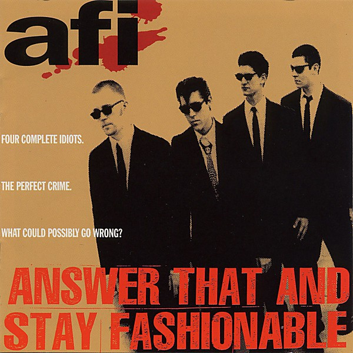

# Answer That and Stay Fashionable

By **AFI**

## Album Data

- **Catalog:** Beets
- **Format:** Digital, Album
- **Album:** Answer That and Stay Fashionable
- **Artist:** Afi
- **Albumartist:** AFI
- **Genre:** Hardcore Punk
- **MusicBrainz Album Artist ID:** [1c3919b2-43ca-4a4a-935d-9d50135ec0ef](https://musicbrainz.org/artist/1c3919b2-43ca-4a4a-935d-9d50135ec0ef)
- **MusicBrainz Album ID:** [95cab0a0-ca88-46d3-b6e6-f1a49d283f30](https://musicbrainz.org/release/95cab0a0-ca88-46d3-b6e6-f1a49d283f30)
- **MusicBrainz Release Group ID:** [85c861b1-82eb-324f-870d-93eb7f4afeed](https://musicbrainz.org/release-group/85c861b1-82eb-324f-870d-93eb7f4afeed)
- **Year:** 2014
- **Catalog #:** 
- **Label:** Nitro Records
- **Total Tracks:** 12

## Album Tracks

### Track 01 - Strength Through Wounding

- **Artist:** AFI
- **Format:** AAC
- **Genre:** Hardcore Punk
- **Length:** 1:33
- **MusicBrainz Track ID:** [908a5b97-e052-4a72-b1d9-7dee3e61843b](https://musicbrainz.org/recording/908a5b97-e052-4a72-b1d9-7dee3e61843b)
- **Title:** Strength Through Wounding
- **Track:** 01
- **Year:** 2014

### Track 02 - Porphyria Cutanea Tarda

- **Artist:** AFI
- **Format:** AAC
- **Genre:** Horror Punk
- **Length:** 2:07
- **MusicBrainz Track ID:** [81f7a4bc-4298-43b1-ae15-c86ef9aa1382](https://musicbrainz.org/recording/81f7a4bc-4298-43b1-ae15-c86ef9aa1382)
- **Title:** Porphyria Cutanea Tarda
- **Track:** 02
- **Year:** 2014

### Track 03 - Exsanguination

- **Artist:** AFI
- **Format:** AAC
- **Genre:** Emo
- **Length:** 2:48
- **MusicBrainz Track ID:** [2b10cb47-efe2-4560-80e2-bdb8feb4f5ea](https://musicbrainz.org/recording/2b10cb47-efe2-4560-80e2-bdb8feb4f5ea)
- **Title:** Exsanguination
- **Track:** 03
- **Year:** 2014

### Track 04 - Malleus Maleficarum

- **Artist:** AFI
- **Format:** AAC
- **Genre:** Emo
- **Length:** 4:01
- **MusicBrainz Track ID:** [8b1e31da-aa40-499c-b9f3-c3d8142b10ed](https://musicbrainz.org/recording/8b1e31da-aa40-499c-b9f3-c3d8142b10ed)
- **Title:** Malleus Maleficarum
- **Track:** 04
- **Year:** 2014

### Track 05 - Narrative of Soul Against Soul

- **Artist:** AFI
- **Format:** AAC
- **Genre:** Emo
- **Length:** 2:29
- **MusicBrainz Track ID:** [740311b8-770e-4f45-86cd-3e2b0d444a8b](https://musicbrainz.org/recording/740311b8-770e-4f45-86cd-3e2b0d444a8b)
- **Title:** Narrative of Soul Against Soul
- **Track:** 05
- **Year:** 2014

### Track 06 - Clove Smoke Catharsis

- **Artist:** AFI
- **Format:** AAC
- **Genre:** Emo
- **Length:** 4:38
- **MusicBrainz Track ID:** [7be5ac77-ec3e-4045-b7f8-7a69ed66a39f](https://musicbrainz.org/recording/7be5ac77-ec3e-4045-b7f8-7a69ed66a39f)
- **Title:** Clove Smoke Catharsis
- **Track:** 06
- **Year:** 2014

### Track 07 - The Prayer Position

- **Artist:** AFI
- **Format:** MP3
- **Genre:** Emo
- **Length:** 3:27
- **MusicBrainz Track ID:** [b400c4e0-861a-46b0-b3a9-9f9645c83715](https://musicbrainz.org/recording/b400c4e0-861a-46b0-b3a9-9f9645c83715)
- **Title:** The Prayer Position
- **Track:** 07
- **Year:** 2014

### Track 08 - No Poetic Device

- **Artist:** AFI
- **Format:** AAC
- **Genre:** Hardcore Punk
- **Length:** 2:16
- **MusicBrainz Track ID:** [fdc90d6b-ea5e-453a-ab8c-a015a40e1d29](https://musicbrainz.org/recording/fdc90d6b-ea5e-453a-ab8c-a015a40e1d29)
- **Title:** No Poetic Device
- **Track:** 08
- **Year:** 2014

### Track 09 - The Last Kiss

- **Artist:** AFI
- **Format:** MP3
- **Genre:** Emo
- **Length:** 3:04
- **MusicBrainz Track ID:** [5b357108-7ce1-426c-b11a-9f7833f317cb](https://musicbrainz.org/recording/5b357108-7ce1-426c-b11a-9f7833f317cb)
- **Title:** The Last Kiss
- **Track:** 09
- **Year:** 2014

### Track 10 - Weathered Tome

- **Artist:** AFI
- **Format:** AAC
- **Genre:** Emo
- **Length:** 2:13
- **MusicBrainz Track ID:** [eb329378-cade-4157-8369-775f7fbd5fd9](https://musicbrainz.org/recording/eb329378-cade-4157-8369-775f7fbd5fd9)
- **Title:** Weathered Tome
- **Track:** 10
- **Year:** 2014

### Track 11 - At a Glance

- **Artist:** AFI
- **Format:** AAC
- **Genre:** Punk Rock
- **Length:** 4:00
- **MusicBrainz Track ID:** [37735be4-bbb1-45f5-96df-fd1ec8a85fcf](https://musicbrainz.org/recording/37735be4-bbb1-45f5-96df-fd1ec8a85fcf)
- **Title:** At a Glance
- **Track:** 11
- **Year:** 2014

## See also

- [Black Sails in the Sunset](Black_Sails_in_the_Sunset.md)
- [DECEMBERUNDERGROUND](DECEMBERUNDERGROUND.md)
- [Shut Your Mouth and Open Your Eyes](Shut_Your_Mouth_and_Open_Your_Eyes.md)
- [Very Proud Of Ya](Very_Proud_Of_Ya.md)
