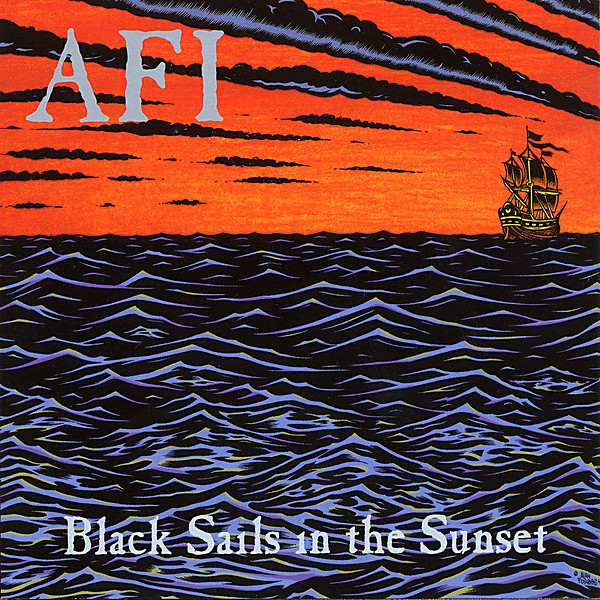

# Black Sails in the Sunset

By **AFI**

## Album Data

- **Catalog:** Beets
- **Format:** Digital, Album
- **Album:** Black Sails in the Sunset
- **Artist:** Afi
- **Albumartist:** AFI
- **Genre:** Emo
- **MusicBrainz Album Artist ID:** [1c3919b2-43ca-4a4a-935d-9d50135ec0ef](https://musicbrainz.org/artist/1c3919b2-43ca-4a4a-935d-9d50135ec0ef)
- **MusicBrainz Album ID:** [76191de6-7558-4018-8adb-1735e4a03c99](https://musicbrainz.org/release/76191de6-7558-4018-8adb-1735e4a03c99)
- **MusicBrainz Release Group ID:** [ff293ba8-2ecc-39c2-8333-b730e53cd148](https://musicbrainz.org/release-group/ff293ba8-2ecc-39c2-8333-b730e53cd148)
- **Year:** 2014
- **Catalog #:** 9858643
- **Label:** Interscope Records
- **Total Tracks:** 14

## Album Tracks

### Track 01 - Prelude 12/21

- **Artist:** AFI
- **Format:** AAC
- **Genre:** Emo
- **Length:** 1:34
- **MusicBrainz Track ID:** [2909837c-5320-4aef-a71f-3e673f72377f](https://musicbrainz.org/recording/2909837c-5320-4aef-a71f-3e673f72377f)
- **Title:** Prelude 12/21
- **Track:** 01
- **Year:** 2006

### Track 02 - Kill Caustic

- **Artist:** AFI
- **Format:** AAC
- **Genre:** Screamo
- **Length:** 2:39
- **MusicBrainz Track ID:** [490d073e-c09e-46c7-86a8-fdf677c2a1ff](https://musicbrainz.org/recording/490d073e-c09e-46c7-86a8-fdf677c2a1ff)
- **Title:** Kill Caustic
- **Track:** 02
- **Year:** 2006

### Track 03 - Miss Murder

- **Artist:** AFI
- **Format:** AAC
- **Genre:** Emo
- **Length:** 3:26
- **MusicBrainz Track ID:** [320ab068-f72c-4b6b-9bff-c6efc34657d4](https://musicbrainz.org/recording/320ab068-f72c-4b6b-9bff-c6efc34657d4)
- **Title:** Miss Murder
- **Track:** 03
- **Year:** 2006

### Track 04 - Summer Shudder

- **Artist:** AFI
- **Format:** AAC
- **Genre:** Emo
- **Length:** 3:07
- **MusicBrainz Track ID:** [12949b8c-f08a-4939-8641-2af067b92db5](https://musicbrainz.org/recording/12949b8c-f08a-4939-8641-2af067b92db5)
- **Title:** Summer Shudder
- **Track:** 04
- **Year:** 2006

### Track 05 - The Interview

- **Artist:** AFI
- **Format:** AAC
- **Genre:** Emo
- **Length:** 4:16
- **MusicBrainz Track ID:** [c6c9958f-72a1-4a10-8d09-888fdab25fac](https://musicbrainz.org/recording/c6c9958f-72a1-4a10-8d09-888fdab25fac)
- **Title:** The Interview
- **Track:** 05
- **Year:** 2006

### Track 06 - Love Like Winter

- **Artist:** AFI
- **Format:** AAC
- **Genre:** Emo
- **Length:** 2:45
- **MusicBrainz Track ID:** [cb067c08-1f3f-43b8-a80a-b0781c6a7435](https://musicbrainz.org/recording/cb067c08-1f3f-43b8-a80a-b0781c6a7435)
- **Title:** Love Like Winter
- **Track:** 06
- **Year:** 2006

### Track 07 - Affliction

- **Artist:** AFI
- **Format:** AAC
- **Genre:** Screamo
- **Length:** 5:28
- **MusicBrainz Track ID:** [57504f76-e648-4ff5-a8c2-ca246c20773f](https://musicbrainz.org/recording/57504f76-e648-4ff5-a8c2-ca246c20773f)
- **Title:** Affliction
- **Track:** 07
- **Year:** 2006

### Track 08 - The Missing Frame

- **Artist:** AFI
- **Format:** AAC
- **Genre:** Emo
- **Length:** 4:40
- **MusicBrainz Track ID:** [90e008b1-cfb9-4542-9e61-42b4ef575cc8](https://musicbrainz.org/recording/90e008b1-cfb9-4542-9e61-42b4ef575cc8)
- **Title:** The Missing Frame
- **Track:** 08
- **Year:** 2006

### Track 09 - Kiss and Control

- **Artist:** AFI
- **Format:** AAC
- **Genre:** Screamo
- **Length:** 4:18
- **MusicBrainz Track ID:** [fa3f6d89-d72a-4448-b076-cfc36715778d](https://musicbrainz.org/recording/fa3f6d89-d72a-4448-b076-cfc36715778d)
- **Title:** Kiss and Control
- **Track:** 09
- **Year:** 2006

### Track 10 - The Killing Lights

- **Artist:** AFI
- **Format:** AAC
- **Genre:** Emo
- **Length:** 4:03
- **MusicBrainz Track ID:** [f454c8b3-3f24-4564-82ee-62b650ea35c8](https://musicbrainz.org/recording/f454c8b3-3f24-4564-82ee-62b650ea35c8)
- **Title:** The Killing Lights
- **Track:** 10
- **Year:** 2006

### Track 11 - 37mm

- **Artist:** AFI
- **Format:** AAC
- **Genre:** Emo
- **Length:** 3:52
- **MusicBrainz Track ID:** [d5e0d15e-32d3-47a1-9cf3-e46f5fc8cd12](https://musicbrainz.org/recording/d5e0d15e-32d3-47a1-9cf3-e46f5fc8cd12)
- **Title:** 37mm
- **Track:** 11
- **Year:** 2006

### Track 12 - Endlessly, She Said

- **Artist:** AFI
- **Format:** AAC
- **Genre:** Emo
- **Length:** 4:26
- **MusicBrainz Track ID:** [6f71016e-8be0-4f9c-b72a-f88cc8347d3c](https://musicbrainz.org/recording/6f71016e-8be0-4f9c-b72a-f88cc8347d3c)
- **Title:** Endlessly, She Said
- **Track:** 12
- **Year:** 2006

### Track 13 - Rabbits Are Roadkill on Rt. 37

- **Artist:** AFI
- **Format:** AAC
- **Genre:** Pop Punk
- **Length:** 3:50
- **MusicBrainz Track ID:** [4cbf7bf2-7c45-411a-a7ec-2a0267cddeef](https://musicbrainz.org/recording/4cbf7bf2-7c45-411a-a7ec-2a0267cddeef)
- **Title:** Rabbits Are Roadkill on Rt. 37
- **Track:** 13
- **Year:** 2006

### Track 14 - Head Like a Hole

- **Artist:** AFI
- **Format:** AAC
- **Genre:** Punk Rock
- **Length:** 4:43
- **MusicBrainz Track ID:** [24e9b3aa-ec45-4fff-bbf1-90b673a69920](https://musicbrainz.org/recording/24e9b3aa-ec45-4fff-bbf1-90b673a69920)
- **Title:** Head Like a Hole
- **Track:** 14
- **Year:** 2006

## See also

- [Answer That and Stay Fashionable](Answer_That_and_Stay_Fashionable.md)
- [DECEMBERUNDERGROUND](DECEMBERUNDERGROUND.md)
- [Shut Your Mouth and Open Your Eyes](Shut_Your_Mouth_and_Open_Your_Eyes.md)
- [Very Proud Of Ya](Very_Proud_Of_Ya.md)
