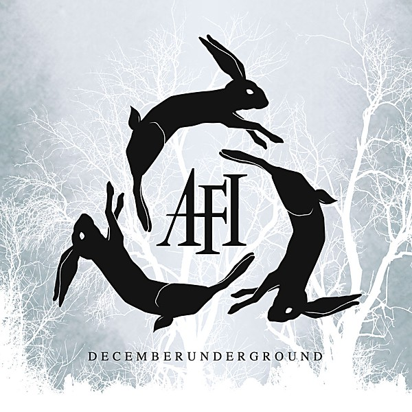

# DECEMBERUNDERGROUND

By **AFI**

## Album Data

- **Catalog:** Beets
- **Format:** Digital, Album
- **Album:** DECEMBERUNDERGROUND
- **Artist:** Afi
- **Albumartist:** AFI
- **Genre:** Emo
- **MusicBrainz Album Artist ID:** [1c3919b2-43ca-4a4a-935d-9d50135ec0ef](https://musicbrainz.org/artist/1c3919b2-43ca-4a4a-935d-9d50135ec0ef)
- **MusicBrainz Album ID:** [f6da64a3-028b-4295-857d-bcd8ade0b695](https://musicbrainz.org/release/f6da64a3-028b-4295-857d-bcd8ade0b695)
- **MusicBrainz Release Group ID:** [92c0b371-b4e0-33bb-89ae-dfbdc6fa252e](https://musicbrainz.org/release-group/92c0b371-b4e0-33bb-89ae-dfbdc6fa252e)
- **Year:** 2006
- **Catalog #:** NT-15815-2
- **Label:** Nitro Records
- **Total Tracks:** 14

## Album Tracks

### Track 01 - Keeping Out of Direct Sunlight (An Introduction)

- **Artist:** AFI
- **Format:** AAC
- **Genre:** Punk Rock
- **Length:** 0:58
- **MusicBrainz Track ID:** [c6a22a0e-faef-4fa2-a219-cdf9536e2efe](https://musicbrainz.org/recording/c6a22a0e-faef-4fa2-a219-cdf9536e2efe)
- **Title:** Keeping Out of Direct Sunlight (An Introduction)
- **Track:** 01
- **Year:** 1997

### Track 02 - Three Reasons

- **Artist:** AFI
- **Format:** AAC
- **Genre:** Punk Rock
- **Length:** 1:33
- **MusicBrainz Track ID:** [f74676a8-745d-4902-b167-983e3daf440d](https://musicbrainz.org/recording/f74676a8-745d-4902-b167-983e3daf440d)
- **Title:** Three Reasons
- **Track:** 02
- **Year:** 1997

### Track 03 - A Single Second

- **Artist:** AFI
- **Format:** AAC
- **Genre:** Hardcore Punk
- **Length:** 2:12
- **MusicBrainz Track ID:** [e458ab6e-3241-416d-b65d-c23fd0a43e03](https://musicbrainz.org/recording/e458ab6e-3241-416d-b65d-c23fd0a43e03)
- **Title:** A Single Second
- **Track:** 03
- **Year:** 1997

### Track 04 - pH Low

- **Artist:** AFI
- **Format:** AAC
- **Genre:** Emo
- **Length:** 1:42
- **MusicBrainz Track ID:** [7cb36783-9a6d-4339-bd8d-3cc42b3bcb71](https://musicbrainz.org/recording/7cb36783-9a6d-4339-bd8d-3cc42b3bcb71)
- **Title:** pH Low
- **Track:** 04
- **Year:** 1997

### Track 05 - Let It Be Broke

- **Artist:** AFI
- **Format:** AAC
- **Genre:** Hardcore Punk
- **Length:** 2:06
- **MusicBrainz Track ID:** [6b93da72-2ca8-4f06-b79b-33b4a3e089be](https://musicbrainz.org/recording/6b93da72-2ca8-4f06-b79b-33b4a3e089be)
- **Title:** Let It Be Broke
- **Track:** 05
- **Year:** 1997

### Track 06 - Third Season

- **Artist:** AFI
- **Format:** AAC
- **Genre:** Punk Rock
- **Length:** 2:49
- **MusicBrainz Track ID:** [7b469254-4bfb-4359-9544-b202d222180a](https://musicbrainz.org/recording/7b469254-4bfb-4359-9544-b202d222180a)
- **Title:** Third Season
- **Track:** 06
- **Year:** 1997

### Track 07 - Lower Your Head and Take It in the Body

- **Artist:** AFI
- **Format:** AAC
- **Genre:** Punk Rock
- **Length:** 1:46
- **MusicBrainz Track ID:** [c7b1fb47-5260-4376-9fc9-1d0f213b08b1](https://musicbrainz.org/recording/c7b1fb47-5260-4376-9fc9-1d0f213b08b1)
- **Title:** Lower Your Head and Take It in the Body
- **Track:** 07
- **Year:** 1997

### Track 08 - Coin Return

- **Artist:** AFI
- **Format:** AAC
- **Genre:** Hardcore Punk
- **Length:** 2:33
- **MusicBrainz Track ID:** [cf41aabc-d8af-404b-831b-4b9dc52704e4](https://musicbrainz.org/recording/cf41aabc-d8af-404b-831b-4b9dc52704e4)
- **Title:** Coin Return
- **Track:** 08
- **Year:** 1997

### Track 09 - The New Patron Saints and Angels

- **Artist:** AFI
- **Format:** AAC
- **Genre:** Hardcore Punk
- **Length:** 2:17
- **MusicBrainz Track ID:** [2764d15c-b0b3-425c-b0f0-5458cc966533](https://musicbrainz.org/recording/2764d15c-b0b3-425c-b0f0-5458cc966533)
- **Title:** The New Patron Saints and Angels
- **Track:** 09
- **Year:** 1997

### Track 10 - Three Seconds Notice

- **Artist:** AFI
- **Format:** AAC
- **Genre:** Punk Rock
- **Length:** 1:35
- **MusicBrainz Track ID:** [d5507414-688b-4be2-a4d4-b76bb303d333](https://musicbrainz.org/recording/d5507414-688b-4be2-a4d4-b76bb303d333)
- **Title:** Three Seconds Notice
- **Track:** 10
- **Year:** 1997

### Track 11 - Salt for Your Wounds

- **Artist:** AFI
- **Format:** AAC
- **Genre:** Punk Rock
- **Length:** 2:24
- **MusicBrainz Track ID:** [59c5f8ec-7c01-45d7-be57-373d1ac817ba](https://musicbrainz.org/recording/59c5f8ec-7c01-45d7-be57-373d1ac817ba)
- **Title:** Salt for Your Wounds
- **Track:** 11
- **Year:** 1997

### Track 12 - Today’s Lesson

- **Artist:** AFI
- **Format:** AAC
- **Genre:** Hardcore Punk
- **Length:** 2:14
- **MusicBrainz Track ID:** [17e32062-39e8-40b2-a1d2-8b7fc9e4d16d](https://musicbrainz.org/recording/17e32062-39e8-40b2-a1d2-8b7fc9e4d16d)
- **Title:** Today’s Lesson
- **Track:** 12
- **Year:** 1997

### Track 13 - The Devil Loves You

- **Artist:** AFI
- **Format:** AAC
- **Genre:** Punk Rock
- **Length:** 1:30
- **MusicBrainz Track ID:** [dc00bcfd-46a3-4d7c-b82d-4ce8a463dbc9](https://musicbrainz.org/recording/dc00bcfd-46a3-4d7c-b82d-4ce8a463dbc9)
- **Title:** The Devil Loves You
- **Track:** 13
- **Year:** 1997

### Track 14 - Triple Zero

- **Artist:** AFI
- **Format:** AAC
- **Genre:** Punk Rock
- **Length:** 2:50
- **MusicBrainz Track ID:** [884055d5-28fa-4940-94e3-9cbd9314abdc](https://musicbrainz.org/recording/884055d5-28fa-4940-94e3-9cbd9314abdc)
- **Title:** Triple Zero
- **Track:** 14
- **Year:** 1997

## See also

- [Answer That and Stay Fashionable](Answer_That_and_Stay_Fashionable.md)
- [Black Sails in the Sunset](Black_Sails_in_the_Sunset.md)
- [Shut Your Mouth and Open Your Eyes](Shut_Your_Mouth_and_Open_Your_Eyes.md)
- [Very Proud Of Ya](Very_Proud_Of_Ya.md)
