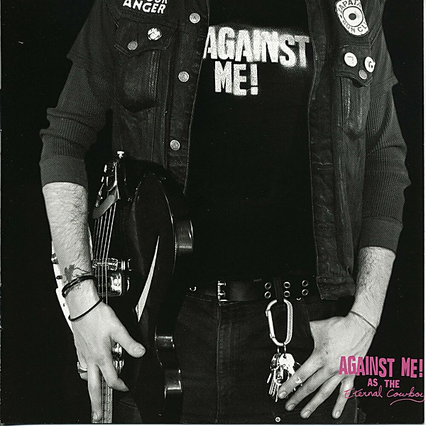

# As the Eternal Cowboy

By **Against Me!**

## Album Data

- **Catalog:** Beets
- **Format:** Digital, Album
- **Album:** As the Eternal Cowboy
- **Artist:** Against Me!
- **Albumartist:** Against Me!
- **Genre:** Hardcore Punk
- **MusicBrainz Album Artist ID:** 
- **MusicBrainz Album ID:** 
- **MusicBrainz Release Group ID:** 
- **Year:** 2003
- **Catalog #:** 
- **Label:** Sabot Productions
- **Total Tracks:** 06

## Album Tracks

### Track 01 - I Still Love You Julie

- **Artist:** Against Me!
- **Format:** AAC
- **Genre:** Folk Punk
- **Length:** 3:08
- **MusicBrainz Track ID:** [c269f59d-516b-467c-aac4-b85f2c72d9da](https://musicbrainz.org/recording/c269f59d-516b-467c-aac4-b85f2c72d9da)
- **Title:** I Still Love You Julie
- **Track:** 01
- **Year:** 2005

### Track 02 - What We Worked For

- **Artist:** Against Me!
- **Format:** AAC
- **Genre:** Emo
- **Length:** 3:08
- **MusicBrainz Track ID:** [9c62355d-77cf-4755-bf87-454cc847e22e](https://musicbrainz.org/recording/9c62355d-77cf-4755-bf87-454cc847e22e)
- **Title:** What We Worked For
- **Track:** 02
- **Year:** 2005

### Track 03 - Y’all Don’t Wanna Step to Dis

- **Artist:** Against Me!
- **Format:** AAC
- **Genre:** Folk Punk
- **Length:** 3:06
- **MusicBrainz Track ID:** [a9e7b4b5-de54-4e4f-8559-4c3659a3cfec](https://musicbrainz.org/recording/a9e7b4b5-de54-4e4f-8559-4c3659a3cfec)
- **Title:** Y’all Don’t Wanna Step to Dis
- **Track:** 03
- **Year:** 2005

### Track 04 - Walking Is Still Honest

- **Artist:** Against Me!
- **Format:** AAC
- **Genre:** Folk Punk
- **Length:** 3:13
- **MusicBrainz Track ID:** [d2c10415-c543-495d-b148-3475ffdbfcb0](https://musicbrainz.org/recording/d2c10415-c543-495d-b148-3475ffdbfcb0)
- **Title:** Walking Is Still Honest
- **Track:** 04
- **Year:** 2005

### Track 05 - Impact

- **Artist:** Against Me!
- **Format:** MP3
- **Genre:** Indie Rock
- **Length:** 2:26
- **MusicBrainz Track ID:** [467f0174-a8f6-450e-adb9-e2eaeea02fbf](https://musicbrainz.org/recording/467f0174-a8f6-450e-adb9-e2eaeea02fbf)
- **Title:** Impact
- **Track:** 05
- **Year:** 2005

### Track 06 - Burn

- **Artist:** Against Me!
- **Format:** MP3
- **Genre:** Folk Punk
- **Length:** 3:08
- **MusicBrainz Track ID:** [46a10d36-57f3-427b-9644-ce33da9fc830](https://musicbrainz.org/recording/46a10d36-57f3-427b-9644-ce33da9fc830)
- **Title:** Burn
- **Track:** 06
- **Year:** 2005

## See also

- [Crime as Forgiven By](Crime_as_Forgiven_By.md)
- [Live on WKDU January 31st](Live_on_WKDU_January_31st.md)
- [Reinventing Axl Rose](Reinventing_Axl_Rose.md)
- [Searching For A Former Clarity](Searching_For_A_Former_Clarity.md)
- [The Acoustic EP](The_Acoustic_EP.md)
- [The Disco Before the Breakdown](The_Disco_Before_the_Breakdown.md)
- [We're Never Going Home](Were_Never_Going_Home.md)
