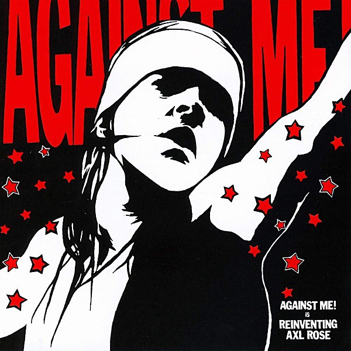

# Reinventing Axl Rose

By **Against Me!**

## Album Data

- **Catalog:** Beets
- **Format:** Digital, Album
- **Album:** Reinventing Axl Rose
- **Artist:** Against Me!
- **Albumartist:** Against Me!
- **Genre:** Hardcore Punk
- **MusicBrainz Album Artist ID:** [a66ebddc-ff04-46b8-820a-15c63e80dba1](https://musicbrainz.org/artist/a66ebddc-ff04-46b8-820a-15c63e80dba1)
- **MusicBrainz Album ID:** [84ba4bc4-fb95-4710-b755-b276e70f5175](https://musicbrainz.org/release/84ba4bc4-fb95-4710-b755-b276e70f5175)
- **MusicBrainz Release Group ID:** [dedca491-6f16-3041-acb7-5ff6dfe1b8f6](https://musicbrainz.org/release-group/dedca491-6f16-3041-acb7-5ff6dfe1b8f6)
- **Year:** 2018
- **Catalog #:** 
- **Label:** Fat Wreck Chords
- **Total Tracks:** 14

## Album Tracks

### Track 01 - Miami

- **Artist:** Against Me!
- **Format:** AAC
- **Genre:** Folk Punk
- **Length:** 4:00
- **MusicBrainz Track ID:** [https](https://musicbrainz.org/recording/https)
- **Title:** Miami
- **Track:** 01
- **Year:** 2005

### Track 02 - Mediocrity Gets You Pears (The Shaker)

- **Artist:** Against Me!
- **Format:** AAC
- **Genre:** Folk Punk
- **Length:** 2:38
- **MusicBrainz Track ID:** [https](https://musicbrainz.org/recording/https)
- **Title:** Mediocrity Gets You Pears (The Shaker)
- **Track:** 02
- **Year:** 2005

### Track 03 - Justin

- **Artist:** Against Me!
- **Format:** AAC
- **Genre:** Folk Punk
- **Length:** 3:57
- **MusicBrainz Track ID:** [https](https://musicbrainz.org/recording/https)
- **Title:** Justin
- **Track:** 03
- **Year:** 2005

### Track 04 - Unprotected Sex With Multiple Partners

- **Artist:** Against Me!
- **Format:** AAC
- **Genre:** Indie Rock
- **Length:** 4:08
- **MusicBrainz Track ID:** [https](https://musicbrainz.org/recording/https)
- **Title:** Unprotected Sex With Multiple Partners
- **Track:** 04
- **Year:** 2005

### Track 05 - From Her Lips To God's Ears (The Energizer)

- **Artist:** Against Me!
- **Format:** AAC
- **Genre:** Folk Punk
- **Length:** 2:35
- **MusicBrainz Track ID:** [https](https://musicbrainz.org/recording/https)
- **Title:** From Her Lips To God's Ears (The Energizer)
- **Track:** 05
- **Year:** 2005

### Track 06 - Violence

- **Artist:** Against Me!
- **Format:** AAC
- **Genre:** Folk Punk
- **Length:** 5:34
- **MusicBrainz Track ID:** [https](https://musicbrainz.org/recording/https)
- **Title:** Violence
- **Track:** 06
- **Year:** 2005

### Track 07 - Pretty Girls (The Mover)

- **Artist:** Against Me!
- **Format:** AAC
- **Genre:** Indie Rock
- **Length:** 2:45
- **MusicBrainz Track ID:** [https](https://musicbrainz.org/recording/https)
- **Title:** Pretty Girls (The Mover)
- **Track:** 07
- **Year:** 2005

### Track 08 - How Low

- **Artist:** Against Me!
- **Format:** AAC
- **Genre:** Folk Punk
- **Length:** 4:27
- **MusicBrainz Track ID:** [https](https://musicbrainz.org/recording/https)
- **Title:** How Low
- **Track:** 08
- **Year:** 2005

### Track 09 - Joy

- **Artist:** Against Me!
- **Format:** AAC
- **Genre:** Folk Punk
- **Length:** 2:12
- **MusicBrainz Track ID:** [https](https://musicbrainz.org/recording/https)
- **Title:** Joy
- **Track:** 09
- **Year:** 2005

### Track 10 - Holy Shit!

- **Artist:** Against Me!
- **Format:** AAC
- **Genre:** Folk Punk
- **Length:** 2:53
- **MusicBrainz Track ID:** [https](https://musicbrainz.org/recording/https)
- **Title:** Holy Shit!
- **Track:** 10
- **Year:** 2005

### Track 11 - Even At Our Worst We’re Still Better Than Most (The Roller)

- **Artist:** Against Me!
- **Format:** AAC
- **Genre:** Folk Punk
- **Length:** 2:53
- **MusicBrainz Track ID:** [https](https://musicbrainz.org/recording/https)
- **Title:** Even At Our Worst We’re Still Better Than Most (The Roller)
- **Track:** 11
- **Year:** 2005

### Track 12 - Problems

- **Artist:** Against Me!
- **Format:** AAC
- **Genre:** Folk Punk
- **Length:** 2:40
- **MusicBrainz Track ID:** [https](https://musicbrainz.org/recording/https)
- **Title:** Problems
- **Track:** 12
- **Year:** 2005

### Track 13 - Don't Lose Touch

- **Artist:** Against Me!
- **Format:** AAC
- **Genre:** Folk Punk
- **Length:** 2:50
- **MusicBrainz Track ID:** [https](https://musicbrainz.org/recording/https)
- **Title:** Don't Lose Touch
- **Track:** 13
- **Year:** 2005

### Track 14 - Searching For A Former Clarity

- **Artist:** Against Me!
- **Format:** AAC
- **Genre:** Pop Punk
- **Length:** 3:25
- **MusicBrainz Track ID:** [https](https://musicbrainz.org/recording/https)
- **Title:** Searching For A Former Clarity
- **Track:** 14
- **Year:** 2005

## See also

- [As the Eternal Cowboy](As_the_Eternal_Cowboy.md)
- [Crime as Forgiven By](Crime_as_Forgiven_By.md)
- [Live on WKDU January 31st](Live_on_WKDU_January_31st.md)
- [Searching For A Former Clarity](Searching_For_A_Former_Clarity.md)
- [The Acoustic EP](The_Acoustic_EP.md)
- [The Disco Before the Breakdown](The_Disco_Before_the_Breakdown.md)
- [We're Never Going Home](Were_Never_Going_Home.md)
