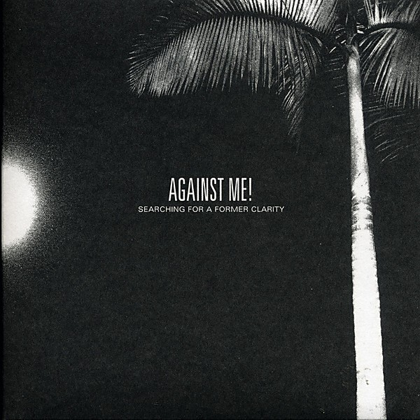

# Searching For A Former Clarity

By **Against Me!**

## Album Data

- **Catalog:** Beets
- **Format:** Digital, Album
- **Album:** Searching For A Former Clarity
- **Artist:** Against Me!
- **Albumartist:** Against Me!
- **Genre:** Folk Punk
- **MusicBrainz Album Artist ID:** [https](https://musicbrainz.org/artist/https)
- **MusicBrainz Album ID:** [https](https://musicbrainz.org/release/https)
- **MusicBrainz Release Group ID:** 
- **Year:** 2005
- **Catalog #:** ACT002CD
- **Label:** Sabot Productions
- **Total Tracks:** 06

## Album Tracks

### Track 01 - Jordan’s First Choice

- **Artist:** Against Me!
- **Format:** AAC
- **Genre:** Folk Punk
- **Length:** 2:08
- **MusicBrainz Track ID:** [c3c44fb7-bd1b-4593-a29d-f983044766a0](https://musicbrainz.org/recording/c3c44fb7-bd1b-4593-a29d-f983044766a0)
- **Title:** Jordan’s First Choice
- **Track:** 01
- **Year:** 2003

### Track 02 - Those Anarcho Punks Are Mysterious

- **Artist:** Against Me!
- **Format:** AAC
- **Genre:** Folk Punk
- **Length:** 2:40
- **MusicBrainz Track ID:** [318e20d5-3d5e-4e94-b127-6d3a178a7f24](https://musicbrainz.org/recording/318e20d5-3d5e-4e94-b127-6d3a178a7f24)
- **Title:** Those Anarcho Punks Are Mysterious
- **Track:** 02
- **Year:** 2003

### Track 03 - Reinventing Axl Rose

- **Artist:** Against Me!
- **Format:** AAC
- **Genre:** Folk Punk
- **Length:** 2:12
- **MusicBrainz Track ID:** [4a8a5357-b923-4233-88ea-99c13a9aa13a](https://musicbrainz.org/recording/4a8a5357-b923-4233-88ea-99c13a9aa13a)
- **Title:** Reinventing Axl Rose
- **Track:** 03
- **Year:** 2003

### Track 04 - We Did It All for Don

- **Artist:** Against Me!
- **Format:** AAC
- **Genre:** Folk Punk
- **Length:** 3:09
- **MusicBrainz Track ID:** [e96c81fc-3485-407a-80d0-c0a9ed461388](https://musicbrainz.org/recording/e96c81fc-3485-407a-80d0-c0a9ed461388)
- **Title:** We Did It All for Don
- **Track:** 04
- **Year:** 2003

### Track 05 - Pints of Guinness Make You Strong

- **Artist:** Against Me!
- **Format:** AAC
- **Genre:** Folk Punk
- **Length:** 3:11
- **MusicBrainz Track ID:** [7c3cff90-ded9-4c78-bcfb-271fbc193709](https://musicbrainz.org/recording/7c3cff90-ded9-4c78-bcfb-271fbc193709)
- **Title:** Pints of Guinness Make You Strong
- **Track:** 05
- **Year:** 2003

### Track 06 - Armageddon

- **Artist:** Against Me!
- **Format:** AAC
- **Genre:** Folk Punk
- **Length:** 3:36
- **MusicBrainz Track ID:** [378d5c0d-21cc-48fa-8d50-0d25cf8cc37b](https://musicbrainz.org/recording/378d5c0d-21cc-48fa-8d50-0d25cf8cc37b)
- **Title:** Armageddon
- **Track:** 06
- **Year:** 2003

## See also

- [As the Eternal Cowboy](As_the_Eternal_Cowboy.md)
- [Crime as Forgiven By](Crime_as_Forgiven_By.md)
- [Live on WKDU January 31st](Live_on_WKDU_January_31st.md)
- [Reinventing Axl Rose](Reinventing_Axl_Rose.md)
- [The Acoustic EP](The_Acoustic_EP.md)
- [The Disco Before the Breakdown](The_Disco_Before_the_Breakdown.md)
- [We're Never Going Home](Were_Never_Going_Home.md)
