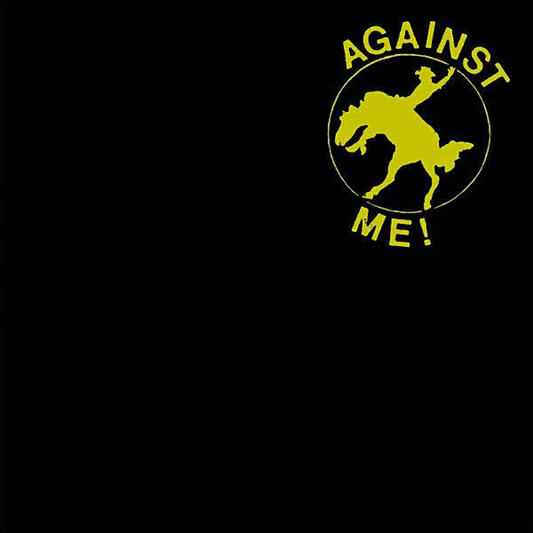

# The Acoustic EP

By **Against Me!**

## Album Data

- **Catalog:** Beets
- **Format:** Digital, Album
- **Album:** The Acoustic EP
- **Artist:** Against Me!
- **Albumartist:** Against Me!
- **Genre:** Folk Punk
- **MusicBrainz Album Artist ID:** [a66ebddc-ff04-46b8-820a-15c63e80dba1](https://musicbrainz.org/artist/a66ebddc-ff04-46b8-820a-15c63e80dba1)
- **MusicBrainz Album ID:** [d4571b5c-78b4-45fc-ae4a-fd76943058ce](https://musicbrainz.org/release/d4571b5c-78b4-45fc-ae4a-fd76943058ce)
- **MusicBrainz Release Group ID:** [5599f195-760a-3a92-8ba5-4fb8dcf63ae5](https://musicbrainz.org/release-group/5599f195-760a-3a92-8ba5-4fb8dcf63ae5)
- **Year:** 2003
- **Catalog #:** NO IDEA 137
- **Label:** No Idea Records
- **Total Tracks:** 03

## Album Tracks

### Track 01 - The Disco Before the Breakdown

- **Artist:** Against Me!
- **Format:** AAC
- **Genre:** Folk Punk
- **Length:** 3:06
- **MusicBrainz Track ID:** [048c676a-88de-44ed-988d-6564e3e6f12b](https://musicbrainz.org/recording/048c676a-88de-44ed-988d-6564e3e6f12b)
- **Title:** The Disco Before the Breakdown
- **Track:** 01
- **Year:** 2002

### Track 02 - Tonight We’re Gonna Give It 35%

- **Artist:** Against Me!
- **Format:** AAC
- **Genre:** Folk Punk
- **Length:** 3:25
- **MusicBrainz Track ID:** [11e7421a-4bdf-4f39-9904-9ffa84a11115](https://musicbrainz.org/recording/11e7421a-4bdf-4f39-9904-9ffa84a11115)
- **Title:** Tonight We’re Gonna Give It 35%
- **Track:** 02
- **Year:** 2002

### Track 03 - Beginning in an Ending

- **Artist:** Against Me!
- **Format:** AAC
- **Genre:** Folk Punk
- **Length:** 2:25
- **MusicBrainz Track ID:** [5b5cee5f-ca7f-4ddf-969a-59be02351843](https://musicbrainz.org/recording/5b5cee5f-ca7f-4ddf-969a-59be02351843)
- **Title:** Beginning in an Ending
- **Track:** 03
- **Year:** 2002

## See also

- [As the Eternal Cowboy](As_the_Eternal_Cowboy.md)
- [Crime as Forgiven By](Crime_as_Forgiven_By.md)
- [Live on WKDU January 31st](Live_on_WKDU_January_31st.md)
- [Reinventing Axl Rose](Reinventing_Axl_Rose.md)
- [Searching For A Former Clarity](Searching_For_A_Former_Clarity.md)
- [The Disco Before the Breakdown](The_Disco_Before_the_Breakdown.md)
- [We're Never Going Home](Were_Never_Going_Home.md)
