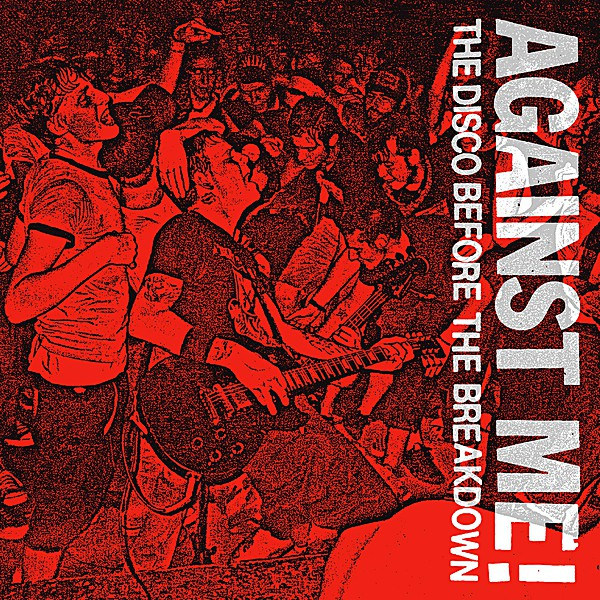

# The Disco Before the Breakdown

By **Against Me!**

## Album Data

- **Catalog:** Beets
- **Format:** Digital, Album
- **Album:** The Disco Before the Breakdown
- **Artist:** Against Me!
- **Albumartist:** Against Me!
- **Genre:** Folk Punk
- **MusicBrainz Album Artist ID:** [a66ebddc-ff04-46b8-820a-15c63e80dba1](https://musicbrainz.org/artist/a66ebddc-ff04-46b8-820a-15c63e80dba1)
- **MusicBrainz Album ID:** [6bf98a0d-2dca-4b37-a248-7c7237c00c9b](https://musicbrainz.org/release/6bf98a0d-2dca-4b37-a248-7c7237c00c9b)
- **MusicBrainz Release Group ID:** [078d721b-cf4e-36fa-8295-82c185b56238](https://musicbrainz.org/release-group/078d721b-cf4e-36fa-8295-82c185b56238)
- **Year:** 2002
- **Catalog #:** 
- **Label:** 
- **Total Tracks:** 00

## Album Tracks

### Track 01 - Exhaustion (Live)

- **Artist:** Against Me!
- **Format:** MP3
- **Genre:** Folk Punk
- **Length:** 2:34
- **MusicBrainz Track ID:** 
- **Title:** Exhaustion (Live)
- **Track:** 01
- **Year:** 2004

### Track 01 - I Still Love You Julie.

- **Artist:** Against Me!
- **Format:** MP3
- **Genre:** Folk Punk
- **Length:** 3:09
- **MusicBrainz Track ID:** 
- **Title:** I Still Love You Julie.
- **Track:** 01
- **Year:** 2005

### Track 01 - Pints of Guinness Make You Strong

- **Artist:** Against Me!
- **Format:** MP3
- **Genre:** Folk Punk
- **Length:** 2:50
- **MusicBrainz Track ID:** 
- **Title:** Pints of Guinness Make You Strong
- **Track:** 01
- **Year:** 2002

### Track 01 - Raw Dog (Live)

- **Artist:** Against Me!
- **Format:** MP3
- **Genre:** Folk Punk
- **Length:** 2:37
- **MusicBrainz Track ID:** 
- **Title:** Raw Dog (Live)
- **Track:** 01
- **Year:** 2004

### Track 01 - Shit Stroll (Live)

- **Artist:** Against Me!
- **Format:** MP3
- **Genre:** Folk Punk
- **Length:** 2:31
- **MusicBrainz Track ID:** 
- **Title:** Shit Stroll (Live)
- **Track:** 01
- **Year:** 2004

### Track 01 - T.S.R. (Live)

- **Artist:** Against Me!
- **Format:** MP3
- **Genre:** Folk Punk
- **Length:** 2:32
- **MusicBrainz Track ID:** 
- **Title:** T.S.R. (Live)
- **Track:** 01
- **Year:** 2004

### Track 02 - Cliche Guevera (Live)

- **Artist:** Against Me!
- **Format:** MP3
- **Genre:** Folk Punk
- **Length:** 2:16
- **MusicBrainz Track ID:** 
- **Title:** Cliche Guevera (Live)
- **Track:** 02
- **Year:** 2004

### Track 04 - Walking Is Still Honest.

- **Artist:** Against Me!
- **Format:** MP3
- **Genre:** Folk Punk
- **Length:** 2:19
- **MusicBrainz Track ID:** 
- **Title:** Walking Is Still Honest.
- **Track:** 04
- **Year:** 2005

### Track 05 - Impact

- **Artist:** Against Me!
- **Format:** MP3
- **Genre:** Indie Rock
- **Length:** 2:36
- **MusicBrainz Track ID:** 
- **Title:** Impact
- **Track:** 05
- **Year:** 2005

### Track 06 - Problems (Live)

- **Artist:** Against Me!
- **Format:** MP3
- **Genre:** Folk Punk
- **Length:** 2:32
- **MusicBrainz Track ID:** 
- **Title:** Problems (Live)
- **Track:** 06
- **Year:** 2004

### Track 08 - Reinventing Axl Rose

- **Artist:** Against Me!
- **Format:** MP3
- **Genre:** Folk Punk
- **Length:** 2:13
- **MusicBrainz Track ID:** 
- **Title:** Reinventing Axl Rose
- **Track:** 08
- **Year:** 2002

### Track 09 - Baby, I'm an Anarchist!

- **Artist:** Against Me!
- **Format:** MP3
- **Genre:** Folk Punk
- **Length:** 2:40
- **MusicBrainz Track ID:** 
- **Title:** Baby, I'm an Anarchist!
- **Track:** 09
- **Year:** 2002

### Track 10 - Rice and Bread (Live)

- **Artist:** Against Me!
- **Format:** MP3
- **Genre:** Folk Punk
- **Length:** 2:18
- **MusicBrainz Track ID:** 
- **Title:** Rice and Bread (Live)
- **Track:** 10
- **Year:** 2004

### Track 12 - Sink, Florida, Sink (Live)

- **Artist:** Against Me!
- **Format:** MP3
- **Genre:** Folk Punk
- **Length:** 2:12
- **MusicBrainz Track ID:** 
- **Title:** Sink, Florida, Sink (Live)
- **Track:** 12
- **Year:** 2004

### Track 14 - Turn Those Clapping Hands Into Angry Balled Fists (Live)

- **Artist:** Against Me!
- **Format:** MP3
- **Genre:** Folk Punk
- **Length:** 5:00
- **MusicBrainz Track ID:** 
- **Title:** Turn Those Clapping Hands Into Angry Balled Fists (Live)
- **Track:** 14
- **Year:** 2004

### Track 16 - Those Anarcho Punks Are Mysterious (Live)

- **Artist:** Against Me!
- **Format:** MP3
- **Genre:** Folk Punk
- **Length:** 2:10
- **MusicBrainz Track ID:** 
- **Title:** Those Anarcho Punks Are Mysterious (Live)
- **Track:** 16
- **Year:** 2004

### Track 18 - You Look Like I Need A Drink (Live)

- **Artist:** Against Me!
- **Format:** MP3
- **Genre:** Folk Punk
- **Length:** 1:49
- **MusicBrainz Track ID:** 
- **Title:** You Look Like I Need A Drink (Live)
- **Track:** 18
- **Year:** 2004

### Track 22 - We Laugh At Danger (And Break All The Rules) (Live)

- **Artist:** Against Me!
- **Format:** MP3
- **Genre:** Folk Punk
- **Length:** 2:51
- **MusicBrainz Track ID:** 
- **Title:** We Laugh At Danger (And Break All The Rules) (Live)
- **Track:** 22
- **Year:** 2004

### Track 23 - A Joy In All I Can See (Live)

- **Artist:** Against Me!
- **Format:** MP3
- **Genre:** Folk Punk
- **Length:** 1:17
- **MusicBrainz Track ID:** 
- **Title:** A Joy In All I Can See (Live)
- **Track:** 23
- **Year:** 2004

## See also

- [As the Eternal Cowboy](As_the_Eternal_Cowboy.md)
- [Crime as Forgiven By](Crime_as_Forgiven_By.md)
- [Live on WKDU January 31st](Live_on_WKDU_January_31st.md)
- [Reinventing Axl Rose](Reinventing_Axl_Rose.md)
- [Searching For A Former Clarity](Searching_For_A_Former_Clarity.md)
- [The Acoustic EP](The_Acoustic_EP.md)
- [We're Never Going Home](Were_Never_Going_Home.md)
