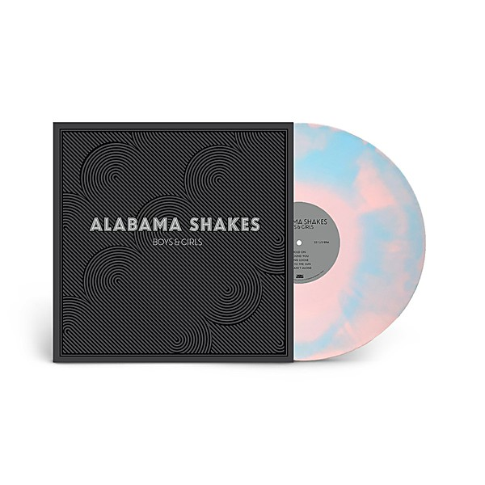

# Boys & Girls

By **Alabama Shakes**

## Album Data

- **Catalog:** Beets
- **Format:** Digital, Album
- **Album:** Boys & Girls
- **Artist:** Alabama Shakes
- **Albumartist:** Alabama Shakes
- **Genre:** Southern Rock
- **MusicBrainz Album Artist ID:** [40419b33-18e9-4d5a-a674-30b4bb14bac2](https://musicbrainz.org/artist/40419b33-18e9-4d5a-a674-30b4bb14bac2)
- **MusicBrainz Album ID:** [c8e4cfad-dd85-4fb1-8999-f727ccb7ec1b](https://musicbrainz.org/release/c8e4cfad-dd85-4fb1-8999-f727ccb7ec1b)
- **MusicBrainz Release Group ID:** [83024532-0142-4ac5-b473-e38681350db0](https://musicbrainz.org/release-group/83024532-0142-4ac5-b473-e38681350db0)
- **Year:** 2012
- **Catalog #:** 
- **Label:** ATO Records
- **Total Tracks:** 11

## Album Tracks

### Track 01 - Hold On

- **Artist:** Alabama Shakes
- **Format:** ALAC
- **Genre:** Southern Rock
- **Length:** 3:46
- **MusicBrainz Track ID:** [1822df4c-5930-4bb8-b78c-4cf65294e413](https://musicbrainz.org/recording/1822df4c-5930-4bb8-b78c-4cf65294e413)
- **Title:** Hold On
- **Track:** 01
- **Year:** 2012

### Track 02 - I Found You

- **Artist:** Alabama Shakes
- **Format:** ALAC
- **Genre:** Southern Rock
- **Length:** 2:59
- **MusicBrainz Track ID:** [89c06bd1-460e-4458-b869-53794aa9fc1a](https://musicbrainz.org/recording/89c06bd1-460e-4458-b869-53794aa9fc1a)
- **Title:** I Found You
- **Track:** 02
- **Year:** 2012

### Track 03 - Hang Loose

- **Artist:** Alabama Shakes
- **Format:** ALAC
- **Genre:** Southern Rock
- **Length:** 2:24
- **MusicBrainz Track ID:** [757d3721-dbc2-4b39-b83b-7cab7f62f73f](https://musicbrainz.org/recording/757d3721-dbc2-4b39-b83b-7cab7f62f73f)
- **Title:** Hang Loose
- **Track:** 03
- **Year:** 2012

### Track 04 - Rise to the Sun

- **Artist:** Alabama Shakes
- **Format:** ALAC
- **Genre:** Southern Rock
- **Length:** 3:08
- **MusicBrainz Track ID:** [5d2345ee-a94b-486f-9197-f6c2abf50814](https://musicbrainz.org/recording/5d2345ee-a94b-486f-9197-f6c2abf50814)
- **Title:** Rise to the Sun
- **Track:** 04
- **Year:** 2012

### Track 05 - You Ain’t Alone

- **Artist:** Alabama Shakes
- **Format:** ALAC
- **Genre:** Southern Rock
- **Length:** 4:44
- **MusicBrainz Track ID:** [59e20ade-7515-4be2-96e2-ee4d4be072b2](https://musicbrainz.org/recording/59e20ade-7515-4be2-96e2-ee4d4be072b2)
- **Title:** You Ain’t Alone
- **Track:** 05
- **Year:** 2012

### Track 06 - Goin’ to the Party

- **Artist:** Alabama Shakes
- **Format:** ALAC
- **Genre:** Southern Rock
- **Length:** 1:45
- **MusicBrainz Track ID:** [615002ad-66ee-4de1-a1be-bfb1efe9bdac](https://musicbrainz.org/recording/615002ad-66ee-4de1-a1be-bfb1efe9bdac)
- **Title:** Goin’ to the Party
- **Track:** 06
- **Year:** 2012

### Track 07 - Heartbreaker

- **Artist:** Alabama Shakes
- **Format:** ALAC
- **Genre:** Southern Rock
- **Length:** 3:47
- **MusicBrainz Track ID:** [93b4142d-d1c6-4c2a-8c51-ac3ddbe03668](https://musicbrainz.org/recording/93b4142d-d1c6-4c2a-8c51-ac3ddbe03668)
- **Title:** Heartbreaker
- **Track:** 07
- **Year:** 2012

### Track 08 - Boys & Girls

- **Artist:** Alabama Shakes
- **Format:** ALAC
- **Genre:** Southern Rock
- **Length:** 3:25
- **MusicBrainz Track ID:** [11489633-0810-4fd0-9ea4-035b4bbc95cc](https://musicbrainz.org/recording/11489633-0810-4fd0-9ea4-035b4bbc95cc)
- **Title:** Boys & Girls
- **Track:** 08
- **Year:** 2012

### Track 09 - Be Mine

- **Artist:** Alabama Shakes
- **Format:** ALAC
- **Genre:** Neo Soul
- **Length:** 4:14
- **MusicBrainz Track ID:** [edf14c82-4bc8-46f3-92ce-feff9d180495](https://musicbrainz.org/recording/edf14c82-4bc8-46f3-92ce-feff9d180495)
- **Title:** Be Mine
- **Track:** 09
- **Year:** 2012

### Track 10 - I Ain’t the Same

- **Artist:** Alabama Shakes
- **Format:** ALAC
- **Genre:** Southern Rock
- **Length:** 2:55
- **MusicBrainz Track ID:** [824b10f8-ee3c-4520-9ae9-35e4fa166692](https://musicbrainz.org/recording/824b10f8-ee3c-4520-9ae9-35e4fa166692)
- **Title:** I Ain’t the Same
- **Track:** 10
- **Year:** 2012

### Track 11 - On Your Way

- **Artist:** Alabama Shakes
- **Format:** ALAC
- **Genre:** Southern Rock
- **Length:** 3:05
- **MusicBrainz Track ID:** [e069339e-b2ab-423a-b52e-7982d9a6d309](https://musicbrainz.org/recording/e069339e-b2ab-423a-b52e-7982d9a6d309)
- **Title:** On Your Way
- **Track:** 11
- **Year:** 2012

