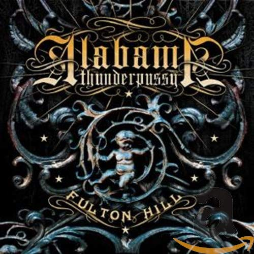

# Fulton Hill

By **Alabama Thunderpussy**

## Album Data

- **Catalog:** Beets
- **Format:** Digital, Album
- **Album:** Fulton Hill
- **Artist:** Alabama Thunderpussy
- **Albumartist:** Alabama Thunderpussy
- **Genre:** Stoner Metal
- **MusicBrainz Album Artist ID:** [299c1b0d-d6c9-4bf6-b72e-fe66bad6ec15](https://musicbrainz.org/artist/299c1b0d-d6c9-4bf6-b72e-fe66bad6ec15)
- **MusicBrainz Album ID:** [c989bde7-113c-4b09-b8b1-5921e6183668](https://musicbrainz.org/release/c989bde7-113c-4b09-b8b1-5921e6183668)
- **MusicBrainz Release Group ID:** [b2fc7746-2567-30ee-8a7b-977959c18212](https://musicbrainz.org/release-group/b2fc7746-2567-30ee-8a7b-977959c18212)
- **Year:** 2004
- **Catalog #:** RR6621-1
- **Label:** Relapse Records
- **Total Tracks:** 13

## Album Tracks

### Track 01 - Such Is Life

- **Artist:** Alabama Thunderpussy
- **Format:** AAC
- **Genre:** Stoner Rock
- **Length:** 4:28
- **MusicBrainz Track ID:** [ca76d0c5-8031-4f50-8916-05fb27bc8f07](https://musicbrainz.org/recording/ca76d0c5-8031-4f50-8916-05fb27bc8f07)
- **Title:** Such Is Life
- **Track:** 01
- **Year:** 2004

### Track 02 - R.R.C.C.

- **Artist:** Alabama Thunderpussy
- **Format:** AAC
- **Genre:** Stoner Rock
- **Length:** 4:01
- **MusicBrainz Track ID:** [5ff1c224-1929-4bb4-9512-f56982280fe4](https://musicbrainz.org/recording/5ff1c224-1929-4bb4-9512-f56982280fe4)
- **Title:** R.R.C.C.
- **Track:** 02
- **Year:** 2004

### Track 03 - Wage Slave

- **Artist:** Alabama Thunderpussy
- **Format:** AAC
- **Genre:** Stoner Metal
- **Length:** 3:38
- **MusicBrainz Track ID:** [1e4b56d1-3948-4b22-a14a-b30fec99b368](https://musicbrainz.org/recording/1e4b56d1-3948-4b22-a14a-b30fec99b368)
- **Title:** Wage Slave
- **Track:** 03
- **Year:** 2004

### Track 04 - Three Stars

- **Artist:** Alabama Thunderpussy
- **Format:** AAC
- **Genre:** Stoner Rock
- **Length:** 5:38
- **MusicBrainz Track ID:** [c7e4d84d-c744-4d9d-b1d7-7b2e1fe3d6ab](https://musicbrainz.org/recording/c7e4d84d-c744-4d9d-b1d7-7b2e1fe3d6ab)
- **Title:** Three Stars
- **Track:** 04
- **Year:** 2004

### Track 05 - Infested

- **Artist:** Alabama Thunderpussy
- **Format:** AAC
- **Genre:** Stoner Rock
- **Length:** 3:14
- **MusicBrainz Track ID:** [d5695752-54f6-4428-b879-40e1767953b6](https://musicbrainz.org/recording/d5695752-54f6-4428-b879-40e1767953b6)
- **Title:** Infested
- **Track:** 05
- **Year:** 2004

### Track 06 - Alone Again

- **Artist:** Alabama Thunderpussy
- **Format:** AAC
- **Genre:** Stoner Rock
- **Length:** 1:08
- **MusicBrainz Track ID:** [4487b033-e562-4da9-9284-0d5805d71ac5](https://musicbrainz.org/recording/4487b033-e562-4da9-9284-0d5805d71ac5)
- **Title:** Alone Again
- **Track:** 06
- **Year:** 2004

### Track 07 - Seekers

- **Artist:** Alabama Thunderpussy
- **Format:** AAC
- **Genre:** Stoner Metal
- **Length:** 17:27
- **MusicBrainz Track ID:** [194188af-6f13-4f00-9ab8-091dab06d141](https://musicbrainz.org/recording/194188af-6f13-4f00-9ab8-091dab06d141)
- **Title:** Seekers
- **Track:** 07
- **Year:** 2004

### Track 08 - Lunar Eclipse

- **Artist:** Alabama Thunderpussy
- **Format:** AAC
- **Genre:** Stoner Metal
- **Length:** 3:26
- **MusicBrainz Track ID:** [a3f97575-c24f-4970-bec3-0e36f50e8d49](https://musicbrainz.org/recording/a3f97575-c24f-4970-bec3-0e36f50e8d49)
- **Title:** Lunar Eclipse
- **Track:** 08
- **Year:** 2004

### Track 09 - Blasphemy

- **Artist:** Alabama Thunderpussy
- **Format:** AAC
- **Genre:** Stoner Metal
- **Length:** 3:56
- **MusicBrainz Track ID:** [5571f235-3c8f-470c-aaaf-d5fed25b9903](https://musicbrainz.org/recording/5571f235-3c8f-470c-aaaf-d5fed25b9903)
- **Title:** Blasphemy
- **Track:** 09
- **Year:** 2004

### Track 10 - Do Not

- **Artist:** Alabama Thunderpussy
- **Format:** AAC
- **Genre:** Stoner Metal
- **Length:** 6:30
- **MusicBrainz Track ID:** [1c5e3145-3ab7-48a9-8b38-1d4cf0c88965](https://musicbrainz.org/recording/1c5e3145-3ab7-48a9-8b38-1d4cf0c88965)
- **Title:** Do Not
- **Track:** 10
- **Year:** 2004

### Track 11 - Sociopath Shitlist

- **Artist:** Alabama Thunderpussy
- **Format:** AAC
- **Genre:** Stoner Metal
- **Length:** 4:31
- **MusicBrainz Track ID:** [f1b233d1-9489-4eec-88b5-bf62de108d55](https://musicbrainz.org/recording/f1b233d1-9489-4eec-88b5-bf62de108d55)
- **Title:** Sociopath Shitlist
- **Track:** 11
- **Year:** 2004

### Track 12 - Bear Baiting

- **Artist:** Alabama Thunderpussy
- **Format:** AAC
- **Genre:** Stoner Rock
- **Length:** 7:31
- **MusicBrainz Track ID:** [dd6f6756-a216-4c72-b33a-f2872d2c1571](https://musicbrainz.org/recording/dd6f6756-a216-4c72-b33a-f2872d2c1571)
- **Title:** Bear Baiting
- **Track:** 12
- **Year:** 2004

### Track 13 - Struggling for Balance

- **Artist:** Alabama Thunderpussy
- **Format:** AAC
- **Genre:** Stoner Rock
- **Length:** 13:54
- **MusicBrainz Track ID:** [d2480ac1-5e2d-481d-afcd-c75832437a40](https://musicbrainz.org/recording/d2480ac1-5e2d-481d-afcd-c75832437a40)
- **Title:** Struggling for Balance
- **Track:** 13
- **Year:** 2004

