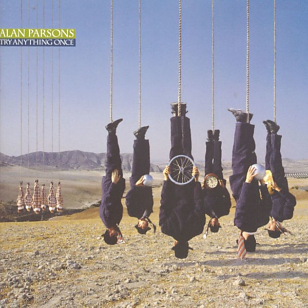

# Try Anything Once

By **Alan Parsons**

## Album Data

- **Catalog:** Beets
- **Format:** Digital, Album
- **Album:** Try Anything Once
- **Artist:** Alan Parsons
- **Albumartist:** Alan Parsons
- **Genre:** Progressive Rock
- **MusicBrainz Album Artist ID:** [9774cfd1-8862-42bd-919e-156c31f079b4](https://musicbrainz.org/artist/9774cfd1-8862-42bd-919e-156c31f079b4)
- **MusicBrainz Album ID:** [ccf2a595-9ec7-4a1e-bdfd-973232baf67f](https://musicbrainz.org/release/ccf2a595-9ec7-4a1e-bdfd-973232baf67f)
- **MusicBrainz Release Group ID:** [94baaaca-9f57-397c-9f0e-cb7e1ea06eb2](https://musicbrainz.org/release-group/94baaaca-9f57-397c-9f0e-cb7e1ea06eb2)
- **Year:** 1993
- **Catalog #:** 07822-18744-2
- **Label:** Arista
- **Total Tracks:** 12

## Album Tracks

### Track 01 - The Three of Me

- **Artist:** Alan Parsons
- **Format:** ALAC
- **Genre:** Progressive Rock
- **Length:** 5:51
- **MusicBrainz Track ID:** [1069ad7a-c6d7-4ab1-aea9-e053f62b6bfa](https://musicbrainz.org/recording/1069ad7a-c6d7-4ab1-aea9-e053f62b6bfa)
- **Title:** The Three of Me
- **Track:** 01
- **Year:** 1993

### Track 02 - Turn It Up

- **Artist:** Alan Parsons
- **Format:** ALAC
- **Genre:** Psychedelic Rock
- **Length:** 6:13
- **MusicBrainz Track ID:** [c4929ab9-a742-4ce8-b5b2-29f5197923e9](https://musicbrainz.org/recording/c4929ab9-a742-4ce8-b5b2-29f5197923e9)
- **Title:** Turn It Up
- **Track:** 02
- **Year:** 1993

### Track 03 - Wine From the Water

- **Artist:** Alan Parsons
- **Format:** ALAC
- **Genre:** Progressive Rock
- **Length:** 5:43
- **MusicBrainz Track ID:** [333337af-61db-47a7-a4e0-65b65e6f6bfe](https://musicbrainz.org/recording/333337af-61db-47a7-a4e0-65b65e6f6bfe)
- **Title:** Wine From the Water
- **Track:** 03
- **Year:** 1993

### Track 04 - Breakaway

- **Artist:** Alan Parsons
- **Format:** ALAC
- **Genre:** Progressive Rock
- **Length:** 4:07
- **MusicBrainz Track ID:** [e519bcc0-e87a-4cc7-b6cf-dc8f3aaee4c5](https://musicbrainz.org/recording/e519bcc0-e87a-4cc7-b6cf-dc8f3aaee4c5)
- **Title:** Breakaway
- **Track:** 04
- **Year:** 1993

### Track 05 - Mr. Time

- **Artist:** Alan Parsons
- **Format:** ALAC
- **Genre:** Psychedelic Rock
- **Length:** 8:17
- **MusicBrainz Track ID:** [1d96816b-5272-422c-9bdf-9df32fe15ed4](https://musicbrainz.org/recording/1d96816b-5272-422c-9bdf-9df32fe15ed4)
- **Title:** Mr. Time
- **Track:** 05
- **Year:** 1993

### Track 06 - Jigue

- **Artist:** Alan Parsons
- **Format:** ALAC
- **Genre:** Progressive Rock
- **Length:** 3:24
- **MusicBrainz Track ID:** [0442b8fa-17a7-464e-a823-3fa53d31d242](https://musicbrainz.org/recording/0442b8fa-17a7-464e-a823-3fa53d31d242)
- **Title:** Jigue
- **Track:** 06
- **Year:** 1993

### Track 07 - I’m Talking to You

- **Artist:** Alan Parsons
- **Format:** ALAC
- **Genre:** Progressive Rock
- **Length:** 4:38
- **MusicBrainz Track ID:** [9b2f1241-ed5b-47cd-a97e-f5313fdd1f5c](https://musicbrainz.org/recording/9b2f1241-ed5b-47cd-a97e-f5313fdd1f5c)
- **Title:** I’m Talking to You
- **Track:** 07
- **Year:** 1993

### Track 08 - Siren Song

- **Artist:** Alan Parsons
- **Format:** ALAC
- **Genre:** Psychedelic Rock
- **Length:** 5:01
- **MusicBrainz Track ID:** [24fd6930-2eb7-4e75-832a-5105d803a350](https://musicbrainz.org/recording/24fd6930-2eb7-4e75-832a-5105d803a350)
- **Title:** Siren Song
- **Track:** 08
- **Year:** 1993

### Track 09 - Dreamscape

- **Artist:** Alan Parsons
- **Format:** ALAC
- **Genre:** Psychedelic Rock
- **Length:** 3:01
- **MusicBrainz Track ID:** [c6772229-b619-4aa9-8b6d-a91fc021c226](https://musicbrainz.org/recording/c6772229-b619-4aa9-8b6d-a91fc021c226)
- **Title:** Dreamscape
- **Track:** 09
- **Year:** 1993

### Track 10 - Back Against the Wall

- **Artist:** Alan Parsons
- **Format:** ALAC
- **Genre:** Progressive Rock
- **Length:** 4:38
- **MusicBrainz Track ID:** [3f9e0501-3dee-4ef5-bd6e-5c21be79d9ac](https://musicbrainz.org/recording/3f9e0501-3dee-4ef5-bd6e-5c21be79d9ac)
- **Title:** Back Against the Wall
- **Track:** 10
- **Year:** 1993

### Track 11 - Re‐Jigue

- **Artist:** Alan Parsons
- **Format:** ALAC
- **Genre:** Orchestral
- **Length:** 2:27
- **MusicBrainz Track ID:** [0aeebf83-2070-4e05-b313-1632244f94bc](https://musicbrainz.org/recording/0aeebf83-2070-4e05-b313-1632244f94bc)
- **Title:** Re‐Jigue
- **Track:** 11
- **Year:** 1993

### Track 12 - Oh Life (There Must Be More)

- **Artist:** Alan Parsons
- **Format:** ALAC
- **Genre:** Progressive Rock
- **Length:** 6:34
- **MusicBrainz Track ID:** [1aefb1cc-60f9-446a-bbd7-225bce993f1a](https://musicbrainz.org/recording/1aefb1cc-60f9-446a-bbd7-225bce993f1a)
- **Title:** Oh Life (There Must Be More)
- **Track:** 12
- **Year:** 1993

## See also

- [Roon: Eye In The Sky](../../Roon/Alan_Parsons/Eye_In_The_Sky.md)
- [Roon: Pyramid (Expanded Edition)](../../Roon/Alan_Parsons/Pyramid_Expanded_Edition.md)
- [Roon: Stereotomy (Expanded Edition)](../../Roon/Alan_Parsons/Stereotomy_Expanded_Edition.md)
- [Roon: Tales Of Mystery And Imagination - Edgar Allan Poe (1987 Remix)](../../Roon/Alan_Parsons/Tales_Of_Mystery_And_Imagination_-_Edgar_Allan_Poe_1987_Remix.md)
- [Roon: The Best Of The Alan Parsons Project](../../Roon/Alan_Parsons/The_Best_Of_The_Alan_Parsons_Project.md)
- [Roon: The Essential Alan Parsons Project](../../Roon/Alan_Parsons/The_Essential_Alan_Parsons_Project.md)
- [Roon: The Turn Of A Friendly Card (Expanded Edition)](../../Roon/Alan_Parsons/The_Turn_Of_A_Friendly_Card_Expanded_Edition.md)
- [Roon: Try Anything Once](../../Roon/Alan_Parsons/Try_Anything_Once.md)
