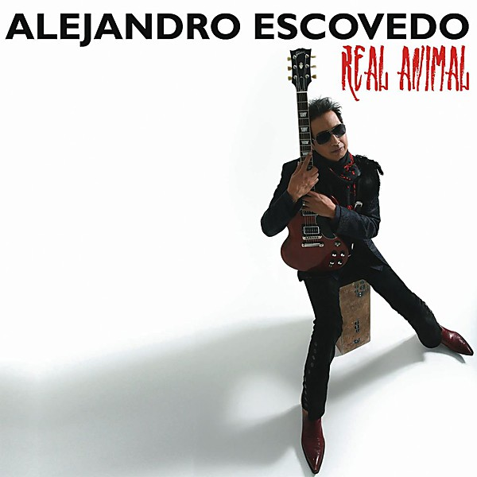

# Real Animal

By **Alejandro Escovedo**

## Album Data

- **Catalog:** Beets
- **Format:** Digital, Album
- **Album:** Real Animal
- **Artist:** Alejandro Escovedo
- **Albumartist:** Alejandro Escovedo
- **Genre:** Americana
- **MusicBrainz Album Artist ID:** [bf103bec-70e3-45a5-9d1b-97715db04a96](https://musicbrainz.org/artist/bf103bec-70e3-45a5-9d1b-97715db04a96)
- **MusicBrainz Album ID:** [ef4998e4-dabe-4b0c-9053-d070dbd0d63a](https://musicbrainz.org/release/ef4998e4-dabe-4b0c-9053-d070dbd0d63a)
- **MusicBrainz Release Group ID:** [ee93311d-6ff2-3f64-9d39-f51d97604d0f](https://musicbrainz.org/release-group/ee93311d-6ff2-3f64-9d39-f51d97604d0f)
- **Year:** 2008
- **Catalog #:** 0946 3 82411 2 6
- **Label:** MANHATTAN
- **Total Tracks:** 13

## Album Tracks

### Track 01 - Always a Friend

- **Artist:** Alejandro Escovedo
- **Format:** ALAC
- **Genre:** Alternative Country
- **Length:** 3:35
- **MusicBrainz Track ID:** [14b8a24c-1cdb-49ff-a75e-4802b08665e2](https://musicbrainz.org/recording/14b8a24c-1cdb-49ff-a75e-4802b08665e2)
- **Title:** Always a Friend
- **Track:** 01
- **Year:** 2008

### Track 02 - Chelsea Hotel ’78

- **Artist:** Alejandro Escovedo
- **Format:** ALAC
- **Genre:** Americana
- **Length:** 3:30
- **MusicBrainz Track ID:** [846cfbf5-a006-4717-b453-f8392f378684](https://musicbrainz.org/recording/846cfbf5-a006-4717-b453-f8392f378684)
- **Title:** Chelsea Hotel ’78
- **Track:** 02
- **Year:** 2008

### Track 03 - Sister Lost Soul

- **Artist:** Alejandro Escovedo
- **Format:** ALAC
- **Genre:** Country Rock
- **Length:** 4:16
- **MusicBrainz Track ID:** [51116947-3df5-4c39-b06e-14ffc59cadf0](https://musicbrainz.org/recording/51116947-3df5-4c39-b06e-14ffc59cadf0)
- **Title:** Sister Lost Soul
- **Track:** 03
- **Year:** 2008

### Track 04 - Smoke

- **Artist:** Alejandro Escovedo
- **Format:** ALAC
- **Genre:** Rock
- **Length:** 3:53
- **MusicBrainz Track ID:** [c16d738a-e612-4768-bc91-530a0e35eb97](https://musicbrainz.org/recording/c16d738a-e612-4768-bc91-530a0e35eb97)
- **Title:** Smoke
- **Track:** 04
- **Year:** 2008

### Track 05 - Sensitive Boys

- **Artist:** Alejandro Escovedo
- **Format:** ALAC
- **Genre:** Emo
- **Length:** 4:29
- **MusicBrainz Track ID:** [8244435f-33f3-4491-bcfb-87fa97feacbb](https://musicbrainz.org/recording/8244435f-33f3-4491-bcfb-87fa97feacbb)
- **Title:** Sensitive Boys
- **Track:** 05
- **Year:** 2008

### Track 06 - People (We’re Only Gonna Live So Long)

- **Artist:** Alejandro Escovedo
- **Format:** ALAC
- **Genre:** Americana
- **Length:** 3:21
- **MusicBrainz Track ID:** [3e4ea58d-b662-4873-b21f-b92a20c374af](https://musicbrainz.org/recording/3e4ea58d-b662-4873-b21f-b92a20c374af)
- **Title:** People (We’re Only Gonna Live So Long)
- **Track:** 06
- **Year:** 2008

### Track 07 - Golden Bear

- **Artist:** Alejandro Escovedo
- **Format:** ALAC
- **Genre:** Rock And Roll
- **Length:** 3:58
- **MusicBrainz Track ID:** [e541118a-31eb-412f-b0f3-7a3300098cd6](https://musicbrainz.org/recording/e541118a-31eb-412f-b0f3-7a3300098cd6)
- **Title:** Golden Bear
- **Track:** 07
- **Year:** 2008

### Track 08 - Nuns Song

- **Artist:** Alejandro Escovedo
- **Format:** ALAC
- **Genre:** Cowpunk
- **Length:** 4:20
- **MusicBrainz Track ID:** [fed9427d-bda5-4882-aa30-b15e8c9f442d](https://musicbrainz.org/recording/fed9427d-bda5-4882-aa30-b15e8c9f442d)
- **Title:** Nuns Song
- **Track:** 08
- **Year:** 2008

### Track 09 - Real as an Animal

- **Artist:** Alejandro Escovedo
- **Format:** ALAC
- **Genre:** Rock
- **Length:** 3:04
- **MusicBrainz Track ID:** [83289224-03d7-4ee7-bac2-0738a7da6e2e](https://musicbrainz.org/recording/83289224-03d7-4ee7-bac2-0738a7da6e2e)
- **Title:** Real as an Animal
- **Track:** 09
- **Year:** 2008

### Track 10 - Hollywood Hills

- **Artist:** Alejandro Escovedo
- **Format:** ALAC
- **Genre:** Americana
- **Length:** 3:42
- **MusicBrainz Track ID:** [7578548e-4361-4504-8d5a-a4dc0b6494e9](https://musicbrainz.org/recording/7578548e-4361-4504-8d5a-a4dc0b6494e9)
- **Title:** Hollywood Hills
- **Track:** 10
- **Year:** 2008

### Track 11 - Swallows of San Juan

- **Artist:** Alejandro Escovedo
- **Format:** ALAC
- **Genre:** Americana
- **Length:** 4:06
- **MusicBrainz Track ID:** [5bd50f01-4f24-42f8-9882-d2769d8aae18](https://musicbrainz.org/recording/5bd50f01-4f24-42f8-9882-d2769d8aae18)
- **Title:** Swallows of San Juan
- **Track:** 11
- **Year:** 2008

### Track 12 - Chip N’ Tony

- **Artist:** Alejandro Escovedo
- **Format:** ALAC
- **Genre:** Americana
- **Length:** 2:41
- **MusicBrainz Track ID:** [057a581a-833f-4cb2-9927-dbe62f47660c](https://musicbrainz.org/recording/057a581a-833f-4cb2-9927-dbe62f47660c)
- **Title:** Chip N’ Tony
- **Track:** 12
- **Year:** 2008

### Track 13 - Slow Down

- **Artist:** Alejandro Escovedo
- **Format:** ALAC
- **Genre:** Americana
- **Length:** 4:07
- **MusicBrainz Track ID:** [5c4b229a-ab30-4e7f-9dae-77bd74048918](https://musicbrainz.org/recording/5c4b229a-ab30-4e7f-9dae-77bd74048918)
- **Title:** Slow Down
- **Track:** 13
- **Year:** 2008

## See also

- [Roon: Real Animal](../../Roon/Alejandro_Escovedo/Real_Animal.md)
