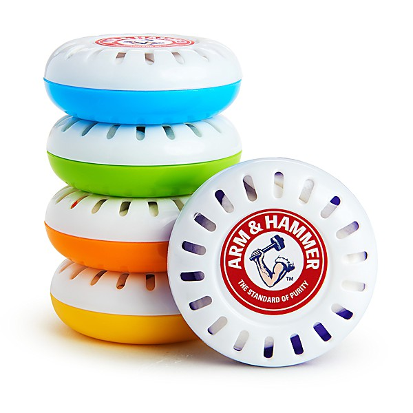

# Miscellaneous

By **Aleka's Attic**

## Album Data

- **Catalog:** Beets
- **Format:** Digital, Album
- **Album:** Miscellaneous
- **Artist:** Aleka's Attic
- **Albumartist:** Aleka's Attic
- **Genre:** Indie Rock
- **MusicBrainz Album Artist ID:** 
- **MusicBrainz Album ID:** 
- **MusicBrainz Release Group ID:** 
- **Year:** 1989
- **Catalog #:** 
- **Label:** 
- **Total Tracks:** 10

## Album Tracks

### Track 01 - Alone We Elope

- **Artist:** Aleka's Attic
- **Format:** MP3
- **Genre:** Indie Rock
- **Length:** 3:16
- **MusicBrainz Track ID:** 
- **Title:** Alone We Elope
- **Track:** 01
- **Year:** 1993

### Track 02 - Below Beloved

- **Artist:** Aleka's Attic
- **Format:** MP3
- **Genre:** Grunge
- **Length:** 4:29
- **MusicBrainz Track ID:** 
- **Title:** Below Beloved
- **Track:** 02
- **Year:** 1993

### Track 03 - Bliss Is...

- **Artist:** Aleka's Attic
- **Format:** MP3
- **Genre:** Indie Rock
- **Length:** 3:39
- **MusicBrainz Track ID:** 
- **Title:** Bliss Is...
- **Track:** 03
- **Year:** 1993

### Track 04 - Dog God

- **Artist:** Aleka's Attic
- **Format:** MP3
- **Genre:** Indie Rock
- **Length:** 3:26
- **MusicBrainz Track ID:** 
- **Title:** Dog God
- **Track:** 04
- **Year:** 1993

### Track 05 - Get Anything

- **Artist:** Aleka's Attic
- **Format:** MP3
- **Genre:** Indie Rock
- **Length:** 3:52
- **MusicBrainz Track ID:** 
- **Title:** Get Anything
- **Track:** 05
- **Year:** 1993

### Track 06 - Note To A Friend

- **Artist:** Aleka's Attic
- **Format:** MP3
- **Genre:** Indie Rock
- **Length:** 1:12
- **MusicBrainz Track ID:** 
- **Title:** Note To A Friend
- **Track:** 06
- **Year:** 1993

### Track 07 - Safety Pins & Army Boots

- **Artist:** Aleka's Attic
- **Format:** MP3
- **Genre:** Indie Rock
- **Length:** 1:50
- **MusicBrainz Track ID:** 
- **Title:** Safety Pins & Army Boots
- **Track:** 07
- **Year:** 1993

### Track 08 - Scales & Fishnails

- **Artist:** Aleka's Attic
- **Format:** MP3
- **Genre:** Indie Rock
- **Length:** 0:49
- **MusicBrainz Track ID:** 
- **Title:** Scales & Fishnails
- **Track:** 08
- **Year:** 1993

### Track 09 - Senile Felines

- **Artist:** Aleka's Attic
- **Format:** MP3
- **Genre:** Indie Rock
- **Length:** 2:49
- **MusicBrainz Track ID:** 
- **Title:** Senile Felines
- **Track:** 09
- **Year:** 1993

### Track 10 - You're So Ostentatious

- **Artist:** Aleka's Attic
- **Format:** MP3
- **Genre:** Indie Rock
- **Length:** 2:40
- **MusicBrainz Track ID:** 
- **Title:** You're So Ostentatious
- **Track:** 10
- **Year:** 1993

## See also

- [Never Odd Or Even](Never_Odd_Or_Even.md)
- [Roon: Miscellaneous](../../Roon/Alekas_Attic/Miscellaneous.md)
- [Roon: Never Odd Or Even](../../Roon/Alekas_Attic/Never_Odd_Or_Even.md)
