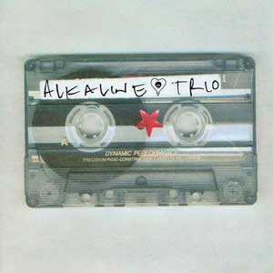

# Alkaline Trio

By **Alkaline Trio**

## Album Data

- **Catalog:** Beets
- **Format:** Digital, Album
- **Album:** Alkaline Trio
- **Artist:** Alkaline Trio
- **Albumartist:** Alkaline Trio
- **Genre:** Punk Rock
- **MusicBrainz Album Artist ID:** 
- **MusicBrainz Album ID:** 
- **MusicBrainz Release Group ID:** 
- **Year:** 2000
- **Catalog #:** 
- **Label:** Vagrant Records
- **Total Tracks:** 13

## Album Tracks

### Track 01 - Time to Waste

- **Artist:** Alkaline Trio
- **Format:** MP3
- **Genre:** Emo
- **Length:** 4:21
- **MusicBrainz Track ID:** [ac2966eb-7482-432f-b7f8-7e8af893f6d4](https://musicbrainz.org/recording/ac2966eb-7482-432f-b7f8-7e8af893f6d4)
- **Title:** Time to Waste
- **Track:** 01
- **Year:** 2005

### Track 02 - The Poison

- **Artist:** Alkaline Trio
- **Format:** MP3
- **Genre:** Emo
- **Length:** 1:39
- **MusicBrainz Track ID:** [9858c108-3cc6-431e-b7cf-c0533f361087](https://musicbrainz.org/recording/9858c108-3cc6-431e-b7cf-c0533f361087)
- **Title:** The Poison
- **Track:** 02
- **Year:** 2005

### Track 03 - Burn

- **Artist:** Alkaline Trio
- **Format:** MP3
- **Genre:** Emo
- **Length:** 2:57
- **MusicBrainz Track ID:** [1ebba036-5065-4334-bfad-fb890c17fcad](https://musicbrainz.org/recording/1ebba036-5065-4334-bfad-fb890c17fcad)
- **Title:** Burn
- **Track:** 03
- **Year:** 2005

### Track 04 - Mercy Me

- **Artist:** Alkaline Trio
- **Format:** MP3
- **Genre:** Emo
- **Length:** 3:12
- **MusicBrainz Track ID:** [e0df15a8-c2a7-4dbb-9e0c-f4fe3f814663](https://musicbrainz.org/recording/e0df15a8-c2a7-4dbb-9e0c-f4fe3f814663)
- **Title:** Mercy Me
- **Track:** 04
- **Year:** 2005

### Track 05 - Dethbed

- **Artist:** Alkaline Trio
- **Format:** MP3
- **Genre:** Emo
- **Length:** 2:56
- **MusicBrainz Track ID:** [59e512df-cfd5-492b-98b9-252e2531fbbf](https://musicbrainz.org/recording/59e512df-cfd5-492b-98b9-252e2531fbbf)
- **Title:** Dethbed
- **Track:** 05
- **Year:** 2005

### Track 06 - Settle for Satin

- **Artist:** Alkaline Trio
- **Format:** MP3
- **Genre:** Emo
- **Length:** 3:31
- **MusicBrainz Track ID:** [a7b2a6c6-4924-4e38-8bf2-40eb83c52f49](https://musicbrainz.org/recording/a7b2a6c6-4924-4e38-8bf2-40eb83c52f49)
- **Title:** Settle for Satin
- **Track:** 06
- **Year:** 2005

### Track 07 - Sadie

- **Artist:** Alkaline Trio
- **Format:** MP3
- **Genre:** Emo
- **Length:** 3:19
- **MusicBrainz Track ID:** [c0fd8ace-ea2f-41a0-a3d6-40516ed8cbba](https://musicbrainz.org/recording/c0fd8ace-ea2f-41a0-a3d6-40516ed8cbba)
- **Title:** Sadie
- **Track:** 07
- **Year:** 2005

### Track 08 - Fall Victim

- **Artist:** Alkaline Trio
- **Format:** MP3
- **Genre:** Emo
- **Length:** 3:04
- **MusicBrainz Track ID:** [4612e47e-2575-4275-9334-6991cdd1b4c6](https://musicbrainz.org/recording/4612e47e-2575-4275-9334-6991cdd1b4c6)
- **Title:** Fall Victim
- **Track:** 08
- **Year:** 2005

### Track 09 - I Was a Prayer

- **Artist:** Alkaline Trio
- **Format:** MP3
- **Genre:** Emo
- **Length:** 2:54
- **MusicBrainz Track ID:** [78bba04d-37b3-44e3-b249-401dc88f2924](https://musicbrainz.org/recording/78bba04d-37b3-44e3-b249-401dc88f2924)
- **Title:** I Was a Prayer
- **Track:** 09
- **Year:** 2005

### Track 10 - Prevent This Tragedy

- **Artist:** Alkaline Trio
- **Format:** MP3
- **Genre:** Emo
- **Length:** 3:40
- **MusicBrainz Track ID:** [4e81abf9-8ebf-4f91-a205-12db8973db80](https://musicbrainz.org/recording/4e81abf9-8ebf-4f91-a205-12db8973db80)
- **Title:** Prevent This Tragedy
- **Track:** 10
- **Year:** 2005

### Track 11 - Back to Hell

- **Artist:** Alkaline Trio
- **Format:** MP3
- **Genre:** Emo
- **Length:** 2:56
- **MusicBrainz Track ID:** [15248156-8cef-4997-8a7e-da152749acb3](https://musicbrainz.org/recording/15248156-8cef-4997-8a7e-da152749acb3)
- **Title:** Back to Hell
- **Track:** 11
- **Year:** 2005

### Track 12 - Your Neck

- **Artist:** Alkaline Trio
- **Format:** AAC
- **Genre:** Emo
- **Length:** 3:15
- **MusicBrainz Track ID:** [af30bbe1-7e7b-44d2-879b-ba64a109e761](https://musicbrainz.org/recording/af30bbe1-7e7b-44d2-879b-ba64a109e761)
- **Title:** Your Neck
- **Track:** 12
- **Year:** 2005

### Track 13 - Smoke

- **Artist:** Alkaline Trio
- **Format:** MP3
- **Genre:** Emo
- **Length:** 3:07
- **MusicBrainz Track ID:** [1c2897c6-7399-4083-befc-a98872e9701d](https://musicbrainz.org/recording/1c2897c6-7399-4083-befc-a98872e9701d)
- **Title:** Smoke
- **Track:** 13
- **Year:** 2005

## See also

- [Crimson [Deluxe Edition] Disc 2](Crimson_[Deluxe_Edition]_Disc_2.md)
- [Crimson](Crimson.md)
- [From Here to Infirmary](From_Here_to_Infirmary.md)
- [Goddamnit!](Goddamnit!.md)
- [Good Mourning](Good_Mourning.md)
- [Maybe I’ll Catch Fire](Maybe_I’ll_Catch_Fire.md)
