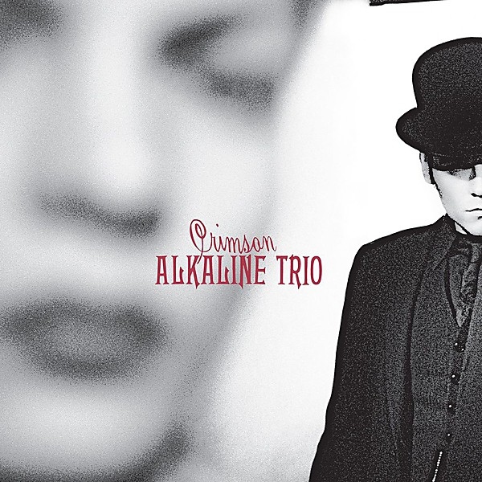

# Crimson

By **Alkaline Trio**

## Album Data

- **Catalog:** Beets
- **Format:** Digital, Album
- **Album:** Crimson
- **Artist:** Alkaline Trio
- **Albumartist:** Alkaline Trio
- **Genre:** Emo
- **MusicBrainz Album Artist ID:** [69421e11-e4c3-4854-951b-ceab4972e38e](https://musicbrainz.org/artist/69421e11-e4c3-4854-951b-ceab4972e38e)
- **MusicBrainz Album ID:** [01e5090a-e70f-4069-8785-6bf0d95a27bf](https://musicbrainz.org/release/01e5090a-e70f-4069-8785-6bf0d95a27bf)
- **MusicBrainz Release Group ID:** [16521034-8046-39e2-b241-72ad50f7971d](https://musicbrainz.org/release-group/16521034-8046-39e2-b241-72ad50f7971d)
- **Year:** 2005
- **Catalog #:** 
- **Label:** JVC Victor
- **Total Tracks:** 00

## Album Tracks

### Track 04 - Mercy Me [Acoustic][*]

- **Artist:** Alkaline Trio
- **Format:** MP3
- **Genre:** Emo
- **Length:** 3:33
- **MusicBrainz Track ID:** 
- **Title:** Mercy Me [Acoustic][*]
- **Track:** 04
- **Year:** 2005

### Track 05 - Mercy Me

- **Artist:** Alkaline Trio
- **Format:** MP3
- **Genre:** Emo
- **Length:** 3:23
- **MusicBrainz Track ID:** 
- **Title:** Mercy Me
- **Track:** 05
- **Year:** 2005

### Track 09 - I Was a Prayer [Acoustic][*]

- **Artist:** Alkaline Trio
- **Format:** MP3
- **Genre:** Emo
- **Length:** 3:02
- **MusicBrainz Track ID:** 
- **Title:** I Was a Prayer [Acoustic][*]
- **Track:** 09
- **Year:** 2005

### Track 09 - Sadie

- **Artist:** Alkaline Trio
- **Format:** MP3
- **Genre:** Emo
- **Length:** 3:34
- **MusicBrainz Track ID:** 
- **Title:** Sadie
- **Track:** 09
- **Year:** 2005

### Track 14 - Time to Waste [Acoustic][*]

- **Artist:** Alkaline Trio
- **Format:** MP3
- **Genre:** Emo
- **Length:** 4:19
- **MusicBrainz Track ID:** 
- **Title:** Time to Waste [Acoustic][*]
- **Track:** 14
- **Year:** 2005

### Track 01 - This Could Be Love

- **Artist:** Alkaline Trio (Acoustic in London)
- **Format:** MP3
- **Genre:** Emo
- **Length:** 4:21
- **MusicBrainz Track ID:** 
- **Title:** This Could Be Love
- **Track:** 01
- **Year:** 2005

### Track 02 - Sorry About That

- **Artist:** Alkaline Trio (Acoustic in London)
- **Format:** MP3
- **Genre:** Emo
- **Length:** 4:13
- **MusicBrainz Track ID:** 
- **Title:** Sorry About That
- **Track:** 02
- **Year:** 2005

### Track 03 - Emma

- **Artist:** Alkaline Trio (Acoustic in London)
- **Format:** MP3
- **Genre:** Emo
- **Length:** 3:02
- **MusicBrainz Track ID:** 
- **Title:** Emma
- **Track:** 03
- **Year:** 2005

### Track 04 - Private Eye

- **Artist:** Alkaline Trio (Acoustic in London)
- **Format:** MP3
- **Genre:** Emo
- **Length:** 3:44
- **MusicBrainz Track ID:** 
- **Title:** Private Eye
- **Track:** 04
- **Year:** 2005

### Track 06 - Goodbye Forever

- **Artist:** Alkaline Trio (Acoustic in London)
- **Format:** MP3
- **Genre:** Emo
- **Length:** 3:08
- **MusicBrainz Track ID:** 
- **Title:** Goodbye Forever
- **Track:** 06
- **Year:** 2005

### Track 07 - Clavicle

- **Artist:** Alkaline Trio (Acoustic in London)
- **Format:** MP3
- **Genre:** Emo
- **Length:** 2:54
- **MusicBrainz Track ID:** 
- **Title:** Clavicle
- **Track:** 07
- **Year:** 2005

### Track 08 - Maybe I'll Catch Fire

- **Artist:** Alkaline Trio (Acoustic in London)
- **Format:** MP3
- **Genre:** Emo
- **Length:** 3:01
- **MusicBrainz Track ID:** 
- **Title:** Maybe I'll Catch Fire
- **Track:** 08
- **Year:** 2005

### Track 10 - Hell Yes

- **Artist:** Alkaline Trio (Acoustic in London)
- **Format:** MP3
- **Genre:** Emo
- **Length:** 3:53
- **MusicBrainz Track ID:** 
- **Title:** Hell Yes
- **Track:** 10
- **Year:** 2005

### Track 11 - Crawl

- **Artist:** Alkaline Trio (Acoustic in London)
- **Format:** MP3
- **Genre:** Emo
- **Length:** 4:32
- **MusicBrainz Track ID:** 
- **Title:** Crawl
- **Track:** 11
- **Year:** 2005

### Track 12 - Radio

- **Artist:** Alkaline Trio (Acoustic in London)
- **Format:** MP3
- **Genre:** Emo
- **Length:** 4:07
- **MusicBrainz Track ID:** 
- **Title:** Radio
- **Track:** 12
- **Year:** 2005

### Track 13 - My Friend Peter

- **Artist:** Alkaline Trio (Acoustic in London)
- **Format:** MP3
- **Genre:** Punk Rock
- **Length:** 2:40
- **MusicBrainz Track ID:** 
- **Title:** My Friend Peter
- **Track:** 13
- **Year:** 2005

### Track 14 - Blue In The Face

- **Artist:** Alkaline Trio (Acoustic in London)
- **Format:** MP3
- **Genre:** Emo
- **Length:** 3:37
- **MusicBrainz Track ID:** 
- **Title:** Blue In The Face
- **Track:** 14
- **Year:** 2005

## See also

- [Alkaline Trio](Alkaline_Trio.md)
- [Crimson [Deluxe Edition] Disc 2](Crimson_[Deluxe_Edition]_Disc_2.md)
- [From Here to Infirmary](From_Here_to_Infirmary.md)
- [Goddamnit!](Goddamnit!.md)
- [Good Mourning](Good_Mourning.md)
- [Maybe I’ll Catch Fire](Maybe_I’ll_Catch_Fire.md)
