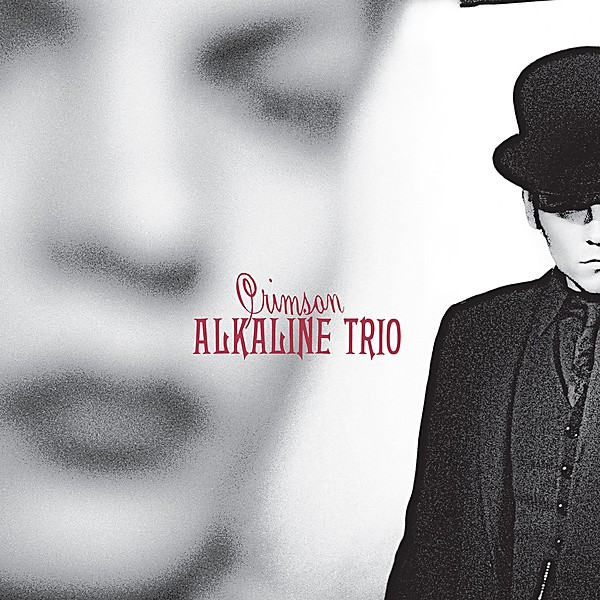

# Crimson [Deluxe Edition] Disc 2

By **Alkaline Trio**

## Album Data

- **Catalog:** Beets
- **Format:** Digital, Album
- **Album:** Crimson [Deluxe Edition] Disc 2
- **Artist:** Alkaline Trio
- **Albumartist:** Alkaline Trio
- **Genre:** Emo
- **MusicBrainz Album Artist ID:** 
- **MusicBrainz Album ID:** 
- **MusicBrainz Release Group ID:** 
- **Year:** 2005
- **Catalog #:** BUN008
- **Label:** B‐Unique Records
- **Total Tracks:** 14

## Album Tracks

### Track 01 - Private Eye

- **Artist:** Alkaline Trio
- **Format:** AAC
- **Genre:** Emo
- **Length:** 3:31
- **MusicBrainz Track ID:** [3c77de0b-93b1-490b-b7f4-f7998aabe8ca](https://musicbrainz.org/recording/3c77de0b-93b1-490b-b7f4-f7998aabe8ca)
- **Title:** Private Eye
- **Track:** 01
- **Year:** 2001

### Track 02 - Mr. Chainsaw

- **Artist:** Alkaline Trio
- **Format:** MP3
- **Genre:** Emo
- **Length:** 3:05
- **MusicBrainz Track ID:** [b58a1a90-f23b-4958-b8bb-ce54d60cce5f](https://musicbrainz.org/recording/b58a1a90-f23b-4958-b8bb-ce54d60cce5f)
- **Title:** Mr. Chainsaw
- **Track:** 02
- **Year:** 2001

### Track 03 - Take Lots With Alcohol

- **Artist:** Alkaline Trio
- **Format:** AAC
- **Genre:** Emo
- **Length:** 3:15
- **MusicBrainz Track ID:** [13743ac8-820f-4a3c-b216-873b381b0523](https://musicbrainz.org/recording/13743ac8-820f-4a3c-b216-873b381b0523)
- **Title:** Take Lots With Alcohol
- **Track:** 03
- **Year:** 2001

### Track 04 - Stupid Kid

- **Artist:** Alkaline Trio
- **Format:** AAC
- **Genre:** Emo
- **Length:** 2:25
- **MusicBrainz Track ID:** [b43dadae-eff2-4725-b31f-6e6f3a82fc79](https://musicbrainz.org/recording/b43dadae-eff2-4725-b31f-6e6f3a82fc79)
- **Title:** Stupid Kid
- **Track:** 04
- **Year:** 2001

### Track 05 - Another Innocent Girl

- **Artist:** Alkaline Trio
- **Format:** AAC
- **Genre:** Emo
- **Length:** 3:37
- **MusicBrainz Track ID:** [6f164ebe-b530-440d-86d7-fcd2acfdc300](https://musicbrainz.org/recording/6f164ebe-b530-440d-86d7-fcd2acfdc300)
- **Title:** Another Innocent Girl
- **Track:** 05
- **Year:** 2001

### Track 06 - Steamer Trunk

- **Artist:** Alkaline Trio
- **Format:** AAC
- **Genre:** Emo
- **Length:** 2:52
- **MusicBrainz Track ID:** [5ee2de37-e01e-49c6-8631-462458be88a6](https://musicbrainz.org/recording/5ee2de37-e01e-49c6-8631-462458be88a6)
- **Title:** Steamer Trunk
- **Track:** 06
- **Year:** 2001

### Track 07 - You’re Dead

- **Artist:** Alkaline Trio
- **Format:** AAC
- **Genre:** Pop Punk
- **Length:** 3:52
- **MusicBrainz Track ID:** [4130c64f-7f89-4b39-85c0-107794f367b2](https://musicbrainz.org/recording/4130c64f-7f89-4b39-85c0-107794f367b2)
- **Title:** You’re Dead
- **Track:** 07
- **Year:** 2001

### Track 08 - Armageddon

- **Artist:** Alkaline Trio
- **Format:** AAC
- **Genre:** Emo
- **Length:** 2:49
- **MusicBrainz Track ID:** [2b37c855-3843-4d1c-a317-8112040c6ca7](https://musicbrainz.org/recording/2b37c855-3843-4d1c-a317-8112040c6ca7)
- **Title:** Armageddon
- **Track:** 08
- **Year:** 2001

### Track 09 - I’m Dying Tomorrow

- **Artist:** Alkaline Trio
- **Format:** AAC
- **Genre:** Pop Punk
- **Length:** 2:18
- **MusicBrainz Track ID:** [c9c16237-bba4-4592-a9fc-da9e3924b1b5](https://musicbrainz.org/recording/c9c16237-bba4-4592-a9fc-da9e3924b1b5)
- **Title:** I’m Dying Tomorrow
- **Track:** 09
- **Year:** 2001

### Track 10 - Bloodied Up

- **Artist:** Alkaline Trio
- **Format:** AAC
- **Genre:** Emo
- **Length:** 2:51
- **MusicBrainz Track ID:** [f4402d13-f8b7-4176-9a62-914e956dcb99](https://musicbrainz.org/recording/f4402d13-f8b7-4176-9a62-914e956dcb99)
- **Title:** Bloodied Up
- **Track:** 10
- **Year:** 2001

### Track 11 - Trucks and Trains

- **Artist:** Alkaline Trio
- **Format:** AAC
- **Genre:** Emo
- **Length:** 3:18
- **MusicBrainz Track ID:** [039edec5-8879-4f10-9be0-fa605eec9ca5](https://musicbrainz.org/recording/039edec5-8879-4f10-9be0-fa605eec9ca5)
- **Title:** Trucks and Trains
- **Track:** 11
- **Year:** 2001

### Track 12 - Crawl

- **Artist:** Alkaline Trio
- **Format:** AAC
- **Genre:** Emo
- **Length:** 4:25
- **MusicBrainz Track ID:** [356ecac9-804e-45f7-a0b8-57ec0c5bc3ec](https://musicbrainz.org/recording/356ecac9-804e-45f7-a0b8-57ec0c5bc3ec)
- **Title:** Crawl
- **Track:** 12
- **Year:** 2001

### Track 13 - Standard Break

- **Artist:** Alkaline Trio
- **Format:** AAC
- **Genre:** Punk Rock
- **Length:** 2:34
- **MusicBrainz Track ID:** [cc7ca6d7-e361-4566-a275-dd7d51ccd7ee](https://musicbrainz.org/recording/cc7ca6d7-e361-4566-a275-dd7d51ccd7ee)
- **Title:** Standard Break
- **Track:** 13
- **Year:** 2001

### Track 14 - Hell Yes

- **Artist:** Alkaline Trio
- **Format:** AAC
- **Genre:** Emo
- **Length:** 3:49
- **MusicBrainz Track ID:** [d86dd02f-f8e7-43b3-bc04-d6d0c295ceee](https://musicbrainz.org/recording/d86dd02f-f8e7-43b3-bc04-d6d0c295ceee)
- **Title:** Hell Yes
- **Track:** 14
- **Year:** 2001

## See also

- [Alkaline Trio](Alkaline_Trio.md)
- [Crimson](Crimson.md)
- [From Here to Infirmary](From_Here_to_Infirmary.md)
- [Goddamnit!](Goddamnit!.md)
- [Good Mourning](Good_Mourning.md)
- [Maybe I’ll Catch Fire](Maybe_I’ll_Catch_Fire.md)
