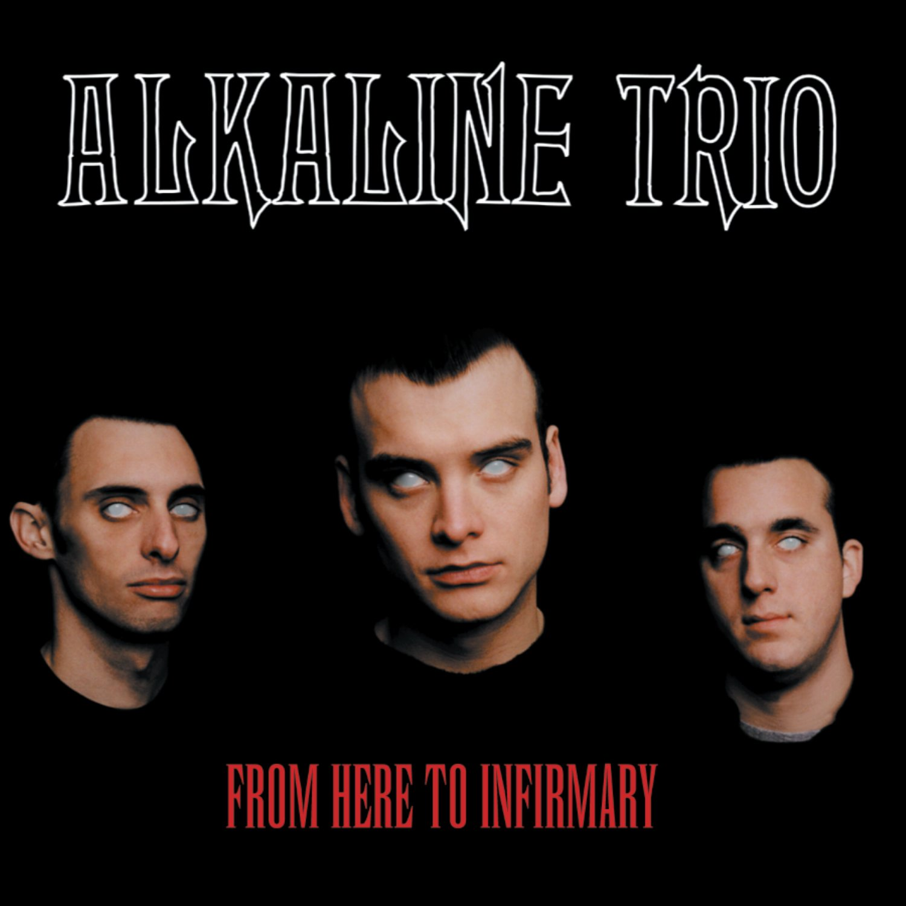

# From Here to Infirmary

By **Alkaline Trio**

## Album Data

- **Catalog:** Beets
- **Format:** Digital, Album
- **Album:** From Here to Infirmary
- **Artist:** Alkaline Trio
- **Albumartist:** Alkaline Trio
- **Genre:** Pop Punk
- **MusicBrainz Album Artist ID:** [69421e11-e4c3-4854-951b-ceab4972e38e](https://musicbrainz.org/artist/69421e11-e4c3-4854-951b-ceab4972e38e)
- **MusicBrainz Album ID:** [c20fe9d6-a991-46d7-b954-04ad4892d77f](https://musicbrainz.org/release/c20fe9d6-a991-46d7-b954-04ad4892d77f)
- **MusicBrainz Release Group ID:** [2dd61d00-3771-34cf-befa-a75ae2cfd5b8](https://musicbrainz.org/release-group/2dd61d00-3771-34cf-befa-a75ae2cfd5b8)
- **Year:** 2001
- **Catalog #:** 
- **Label:** Asian Man Records
- **Total Tracks:** 12

## Album Tracks

### Track 01 - Cringe

- **Artist:** Alkaline Trio
- **Format:** AAC
- **Genre:** Emo
- **Length:** 2:23
- **MusicBrainz Track ID:** [bcc88de5-3d1d-49c5-9523-3a987fb7f5c3](https://musicbrainz.org/recording/bcc88de5-3d1d-49c5-9523-3a987fb7f5c3)
- **Title:** Cringe
- **Track:** 01
- **Year:** 1998

### Track 02 - Cop

- **Artist:** Alkaline Trio
- **Format:** AAC
- **Genre:** Emo
- **Length:** 2:18
- **MusicBrainz Track ID:** [f1c48c17-9997-46df-b9b2-6eaa041d27bf](https://musicbrainz.org/recording/f1c48c17-9997-46df-b9b2-6eaa041d27bf)
- **Title:** Cop
- **Track:** 02
- **Year:** 1998

### Track 03 - San Francisco

- **Artist:** Alkaline Trio
- **Format:** AAC
- **Genre:** Emo
- **Length:** 3:52
- **MusicBrainz Track ID:** [be8ecae3-02bb-4b2d-9f57-42049cce8252](https://musicbrainz.org/recording/be8ecae3-02bb-4b2d-9f57-42049cce8252)
- **Title:** San Francisco
- **Track:** 03
- **Year:** 1998

### Track 04 - Nose Over Tail

- **Artist:** Alkaline Trio
- **Format:** AAC
- **Genre:** Emo
- **Length:** 2:37
- **MusicBrainz Track ID:** [635efd95-5ed9-48b3-a8d1-819b744c0199](https://musicbrainz.org/recording/635efd95-5ed9-48b3-a8d1-819b744c0199)
- **Title:** Nose Over Tail
- **Track:** 04
- **Year:** 1998

### Track 05 - As You Were

- **Artist:** Alkaline Trio
- **Format:** AAC
- **Genre:** Emo
- **Length:** 2:11
- **MusicBrainz Track ID:** [b7424488-ed73-40d3-8762-69fa9eaf0080](https://musicbrainz.org/recording/b7424488-ed73-40d3-8762-69fa9eaf0080)
- **Title:** As You Were
- **Track:** 05
- **Year:** 1998

### Track 06 - Enjoy Your Day

- **Artist:** Alkaline Trio
- **Format:** AAC
- **Genre:** Emo
- **Length:** 2:19
- **MusicBrainz Track ID:** [cfceddae-45a6-4530-8f96-4c2fccf44b2c](https://musicbrainz.org/recording/cfceddae-45a6-4530-8f96-4c2fccf44b2c)
- **Title:** Enjoy Your Day
- **Track:** 06
- **Year:** 1998

### Track 07 - Clavicle

- **Artist:** Alkaline Trio
- **Format:** AAC
- **Genre:** Emo
- **Length:** 2:28
- **MusicBrainz Track ID:** [f116f562-06dd-4c90-9bbc-1be9b07a75fc](https://musicbrainz.org/recording/f116f562-06dd-4c90-9bbc-1be9b07a75fc)
- **Title:** Clavicle
- **Track:** 07
- **Year:** 1998

### Track 08 - My Little Needle

- **Artist:** Alkaline Trio
- **Format:** AAC
- **Genre:** Emo
- **Length:** 3:01
- **MusicBrainz Track ID:** [ce6dfddf-1f27-41c5-88a3-656a21d60141](https://musicbrainz.org/recording/ce6dfddf-1f27-41c5-88a3-656a21d60141)
- **Title:** My Little Needle
- **Track:** 08
- **Year:** 1998

### Track 09 - Southern Rock

- **Artist:** Alkaline Trio
- **Format:** AAC
- **Genre:** Punk Rock
- **Length:** 3:05
- **MusicBrainz Track ID:** [9875b82c-a177-4592-a982-d4c1384c0ad4](https://musicbrainz.org/recording/9875b82c-a177-4592-a982-d4c1384c0ad4)
- **Title:** Southern Rock
- **Track:** 09
- **Year:** 1998

### Track 10 - Message From Kathlene

- **Artist:** Alkaline Trio
- **Format:** AAC
- **Genre:** Emo
- **Length:** 3:22
- **MusicBrainz Track ID:** [57cf235d-33eb-46fb-b8e3-f18cb8e900d2](https://musicbrainz.org/recording/57cf235d-33eb-46fb-b8e3-f18cb8e900d2)
- **Title:** Message From Kathlene
- **Track:** 10
- **Year:** 1998

### Track 11 - Trouble Breathing

- **Artist:** Alkaline Trio
- **Format:** AAC
- **Genre:** Emo
- **Length:** 3:55
- **MusicBrainz Track ID:** [03e018c6-d3e5-4216-9501-bcd83154f417](https://musicbrainz.org/recording/03e018c6-d3e5-4216-9501-bcd83154f417)
- **Title:** Trouble Breathing
- **Track:** 11
- **Year:** 1998

### Track 12 - Sorry About That

- **Artist:** Alkaline Trio
- **Format:** AAC
- **Genre:** Emo
- **Length:** 3:23
- **MusicBrainz Track ID:** [6409c664-50fc-4456-b378-f9ed3adfc999](https://musicbrainz.org/recording/6409c664-50fc-4456-b378-f9ed3adfc999)
- **Title:** Sorry About That
- **Track:** 12
- **Year:** 1998

## See also

- [Alkaline Trio](Alkaline_Trio.md)
- [Crimson [Deluxe Edition] Disc 2](Crimson_[Deluxe_Edition]_Disc_2.md)
- [Crimson](Crimson.md)
- [Goddamnit!](Goddamnit!.md)
- [Good Mourning](Good_Mourning.md)
- [Maybe I’ll Catch Fire](Maybe_I’ll_Catch_Fire.md)
