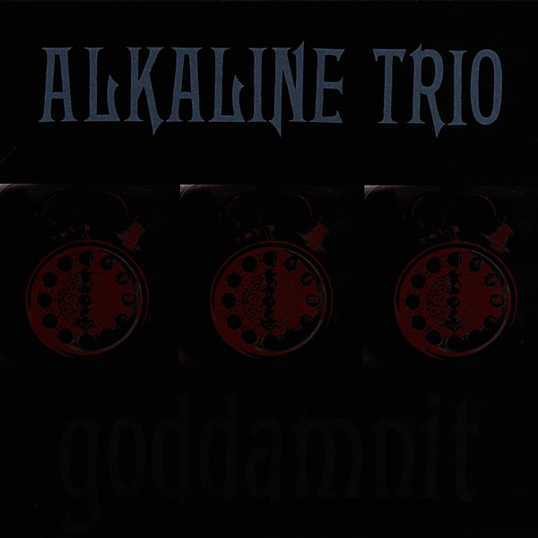

# Goddamnit!

By **Alkaline Trio**

## Album Data

- **Catalog:** Beets
- **Format:** Digital, Album
- **Album:** Goddamnit!
- **Artist:** Alkaline Trio
- **Albumartist:** Alkaline Trio
- **Genre:** Emo
- **MusicBrainz Album Artist ID:** [69421e11-e4c3-4854-951b-ceab4972e38e](https://musicbrainz.org/artist/69421e11-e4c3-4854-951b-ceab4972e38e)
- **MusicBrainz Album ID:** [df419f38-cca5-49d6-9948-6799e789a3ff](https://musicbrainz.org/release/df419f38-cca5-49d6-9948-6799e789a3ff)
- **MusicBrainz Release Group ID:** [292893a7-e8c8-354f-b8c1-492071f2fc4f](https://musicbrainz.org/release-group/292893a7-e8c8-354f-b8c1-492071f2fc4f)
- **Year:** 1998
- **Catalog #:** 980 123-8
- **Label:** Vagrant Records
- **Total Tracks:** 14

## Album Tracks

### Track 01 - This Could Be Love

- **Artist:** Alkaline Trio
- **Format:** AAC
- **Genre:** Emo
- **Length:** 3:47
- **MusicBrainz Track ID:** [0b50f1cc-c5b7-4083-b60b-d40b51f35f83](https://musicbrainz.org/recording/0b50f1cc-c5b7-4083-b60b-d40b51f35f83)
- **Title:** This Could Be Love
- **Track:** 01
- **Year:** 2003

### Track 02 - We’ve Had Enough

- **Artist:** Alkaline Trio
- **Format:** AAC
- **Genre:** Emo
- **Length:** 2:51
- **MusicBrainz Track ID:** [f12d7eca-bd63-4183-8021-d122ee936e30](https://musicbrainz.org/recording/f12d7eca-bd63-4183-8021-d122ee936e30)
- **Title:** We’ve Had Enough
- **Track:** 02
- **Year:** 2003

### Track 03 - One Hundred Stories

- **Artist:** Alkaline Trio
- **Format:** AAC
- **Genre:** Emo
- **Length:** 3:40
- **MusicBrainz Track ID:** [6e30111e-ca34-4c5b-9588-302477f1925c](https://musicbrainz.org/recording/6e30111e-ca34-4c5b-9588-302477f1925c)
- **Title:** One Hundred Stories
- **Track:** 03
- **Year:** 2003

### Track 04 - Continental

- **Artist:** Alkaline Trio
- **Format:** AAC
- **Genre:** Emo
- **Length:** 3:28
- **MusicBrainz Track ID:** [1a365e41-03b0-4ab1-a3d0-b99d19f5b136](https://musicbrainz.org/recording/1a365e41-03b0-4ab1-a3d0-b99d19f5b136)
- **Title:** Continental
- **Track:** 04
- **Year:** 2003

### Track 05 - All on Black

- **Artist:** Alkaline Trio
- **Format:** AAC
- **Genre:** Emo
- **Length:** 4:00
- **MusicBrainz Track ID:** [9d8905d4-1ee2-43b4-af14-27aa319ff24a](https://musicbrainz.org/recording/9d8905d4-1ee2-43b4-af14-27aa319ff24a)
- **Title:** All on Black
- **Track:** 05
- **Year:** 2003

### Track 06 - Emma

- **Artist:** Alkaline Trio
- **Format:** AAC
- **Genre:** Emo
- **Length:** 2:42
- **MusicBrainz Track ID:** [27650354-d5d5-4c00-a204-4b2a3b4eb27b](https://musicbrainz.org/recording/27650354-d5d5-4c00-a204-4b2a3b4eb27b)
- **Title:** Emma
- **Track:** 06
- **Year:** 2003

### Track 07 - Fatally Yours

- **Artist:** Alkaline Trio
- **Format:** AAC
- **Genre:** Emo
- **Length:** 2:16
- **MusicBrainz Track ID:** [ef02facb-2c6c-4b96-a2fc-c09e0c780d23](https://musicbrainz.org/recording/ef02facb-2c6c-4b96-a2fc-c09e0c780d23)
- **Title:** Fatally Yours
- **Track:** 07
- **Year:** 2003

### Track 08 - Every Thug Needs a Lady

- **Artist:** Alkaline Trio
- **Format:** AAC
- **Genre:** Emo
- **Length:** 3:18
- **MusicBrainz Track ID:** [e62d9cc2-4f00-491f-80e3-7ac052bc24f7](https://musicbrainz.org/recording/e62d9cc2-4f00-491f-80e3-7ac052bc24f7)
- **Title:** Every Thug Needs a Lady
- **Track:** 08
- **Year:** 2003

### Track 09 - Blue Carolina

- **Artist:** Alkaline Trio
- **Format:** AAC
- **Genre:** Pop Punk
- **Length:** 3:28
- **MusicBrainz Track ID:** [4df19aee-25fd-493b-a2ac-eec833bb03da](https://musicbrainz.org/recording/4df19aee-25fd-493b-a2ac-eec833bb03da)
- **Title:** Blue Carolina
- **Track:** 09
- **Year:** 2003

### Track 10 - Donner Party (All Night)

- **Artist:** Alkaline Trio
- **Format:** AAC
- **Genre:** Emo
- **Length:** 2:44
- **MusicBrainz Track ID:** [750230e6-64a0-4c19-bf0b-2bc7c295a4ac](https://musicbrainz.org/recording/750230e6-64a0-4c19-bf0b-2bc7c295a4ac)
- **Title:** Donner Party (All Night)
- **Track:** 10
- **Year:** 2003

### Track 11 - If We Never Go Inside

- **Artist:** Alkaline Trio
- **Format:** AAC
- **Genre:** Screamo
- **Length:** 3:45
- **MusicBrainz Track ID:** [065c99dc-c2c1-4f72-956c-0b42c36d84e2](https://musicbrainz.org/recording/065c99dc-c2c1-4f72-956c-0b42c36d84e2)
- **Title:** If We Never Go Inside
- **Track:** 11
- **Year:** 2003

### Track 12 - Blue in the Face

- **Artist:** Alkaline Trio
- **Format:** AAC
- **Genre:** Emo
- **Length:** 3:02
- **MusicBrainz Track ID:** [39396160-132d-4ef4-b4f8-6a0a62e4d8a5](https://musicbrainz.org/recording/39396160-132d-4ef4-b4f8-6a0a62e4d8a5)
- **Title:** Blue in the Face
- **Track:** 12
- **Year:** 2003

### Track 13 - Dead End Road

- **Artist:** Alkaline Trio
- **Format:** AAC
- **Genre:** Pop Punk
- **Length:** 3:08
- **MusicBrainz Track ID:** [20bf867f-949e-4de9-b12e-a7be9734a840](https://musicbrainz.org/recording/20bf867f-949e-4de9-b12e-a7be9734a840)
- **Title:** Dead End Road
- **Track:** 13
- **Year:** 2003

### Track 14 - Old School Reasons

- **Artist:** Alkaline Trio
- **Format:** AAC
- **Genre:** Screamo
- **Length:** 2:51
- **MusicBrainz Track ID:** [5405457f-c662-439e-bf1f-3927b253f576](https://musicbrainz.org/recording/5405457f-c662-439e-bf1f-3927b253f576)
- **Title:** Old School Reasons
- **Track:** 14
- **Year:** 2003

## See also

- [Alkaline Trio](Alkaline_Trio.md)
- [Crimson [Deluxe Edition] Disc 2](Crimson_[Deluxe_Edition]_Disc_2.md)
- [Crimson](Crimson.md)
- [From Here to Infirmary](From_Here_to_Infirmary.md)
- [Good Mourning](Good_Mourning.md)
- [Maybe I’ll Catch Fire](Maybe_I’ll_Catch_Fire.md)
