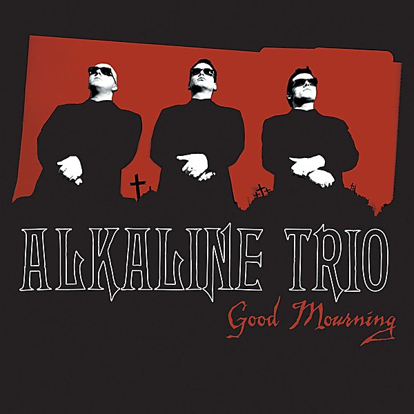

# Good Mourning

By **Alkaline Trio**

## Album Data

- **Catalog:** Beets
- **Format:** Digital, Album
- **Album:** Good Mourning
- **Artist:** Alkaline Trio
- **Albumartist:** Alkaline Trio
- **Genre:** Emo
- **MusicBrainz Album Artist ID:** [69421e11-e4c3-4854-951b-ceab4972e38e](https://musicbrainz.org/artist/69421e11-e4c3-4854-951b-ceab4972e38e)
- **MusicBrainz Album ID:** [d09eb97a-d4d9-4aec-ac81-524f4ee1c09d](https://musicbrainz.org/release/d09eb97a-d4d9-4aec-ac81-524f4ee1c09d)
- **MusicBrainz Release Group ID:** [35bac29f-3c0b-3057-8607-f4c3bef9e287](https://musicbrainz.org/release-group/35bac29f-3c0b-3057-8607-f4c3bef9e287)
- **Year:** 2003
- **Catalog #:** 
- **Label:** Asian Man Records
- **Total Tracks:** 10

## Album Tracks

### Track 01 - Keep ’em Coming

- **Artist:** Alkaline Trio
- **Format:** AAC
- **Genre:** Emo
- **Length:** 4:10
- **MusicBrainz Track ID:** [6cffd413-42e7-4409-a135-b1bbec125f0d](https://musicbrainz.org/recording/6cffd413-42e7-4409-a135-b1bbec125f0d)
- **Title:** Keep ’em Coming
- **Track:** 01
- **Year:** 2000

### Track 02 - Madam Me

- **Artist:** Alkaline Trio
- **Format:** AAC
- **Genre:** Emo
- **Length:** 2:59
- **MusicBrainz Track ID:** [d5860187-f7e4-4088-adb9-e11b77028df5](https://musicbrainz.org/recording/d5860187-f7e4-4088-adb9-e11b77028df5)
- **Title:** Madam Me
- **Track:** 02
- **Year:** 2000

### Track 03 - You’ve Got So Far to Go

- **Artist:** Alkaline Trio
- **Format:** AAC
- **Genre:** Emo
- **Length:** 3:14
- **MusicBrainz Track ID:** [8a3241c2-edd1-44b8-a847-1d36bc75b730](https://musicbrainz.org/recording/8a3241c2-edd1-44b8-a847-1d36bc75b730)
- **Title:** You’ve Got So Far to Go
- **Track:** 03
- **Year:** 2000

### Track 04 - Fuck You Aurora

- **Artist:** Alkaline Trio
- **Format:** AAC
- **Genre:** Screamo
- **Length:** 4:49
- **MusicBrainz Track ID:** [d3d2e85a-2b63-4d65-a614-3370e9df32c7](https://musicbrainz.org/recording/d3d2e85a-2b63-4d65-a614-3370e9df32c7)
- **Title:** Fuck You Aurora
- **Track:** 04
- **Year:** 2000

### Track 05 - Sleepyhead

- **Artist:** Alkaline Trio
- **Format:** AAC
- **Genre:** Emo
- **Length:** 3:56
- **MusicBrainz Track ID:** [c7f40c87-4f48-4d06-9403-f70549c39974](https://musicbrainz.org/recording/c7f40c87-4f48-4d06-9403-f70549c39974)
- **Title:** Sleepyhead
- **Track:** 05
- **Year:** 2000

### Track 06 - Maybe I’ll Catch Fire

- **Artist:** Alkaline Trio
- **Format:** AAC
- **Genre:** Emo
- **Length:** 3:07
- **MusicBrainz Track ID:** [e5b79880-3420-4e30-8958-00a09bfebd8a](https://musicbrainz.org/recording/e5b79880-3420-4e30-8958-00a09bfebd8a)
- **Title:** Maybe I’ll Catch Fire
- **Track:** 06
- **Year:** 2000

### Track 08 - She Took Him to the Lake

- **Artist:** Alkaline Trio
- **Format:** AAC
- **Genre:** Punk Rock
- **Length:** 2:40
- **MusicBrainz Track ID:** [c6c082d5-87b8-4458-acaa-eff8b50b2d0f](https://musicbrainz.org/recording/c6c082d5-87b8-4458-acaa-eff8b50b2d0f)
- **Title:** She Took Him to the Lake
- **Track:** 08
- **Year:** 2000

### Track 09 - 5‐3‐10‐4

- **Artist:** Alkaline Trio
- **Format:** AAC
- **Genre:** Emo
- **Length:** 2:56
- **MusicBrainz Track ID:** [b27ef748-1c05-4f53-8cb4-34e2ccd9c970](https://musicbrainz.org/recording/b27ef748-1c05-4f53-8cb4-34e2ccd9c970)
- **Title:** 5‐3‐10‐4
- **Track:** 09
- **Year:** 2000

### Track 10 - Radio

- **Artist:** Alkaline Trio
- **Format:** AAC
- **Genre:** Emo
- **Length:** 2:39
- **MusicBrainz Track ID:** [aa7979d7-98f7-4dde-8f16-f08eef449a54](https://musicbrainz.org/recording/aa7979d7-98f7-4dde-8f16-f08eef449a54)
- **Title:** Radio
- **Track:** 10
- **Year:** 2000

## See also

- [Alkaline Trio](Alkaline_Trio.md)
- [Crimson [Deluxe Edition] Disc 2](Crimson_[Deluxe_Edition]_Disc_2.md)
- [Crimson](Crimson.md)
- [From Here to Infirmary](From_Here_to_Infirmary.md)
- [Goddamnit!](Goddamnit!.md)
- [Maybe I’ll Catch Fire](Maybe_I’ll_Catch_Fire.md)
