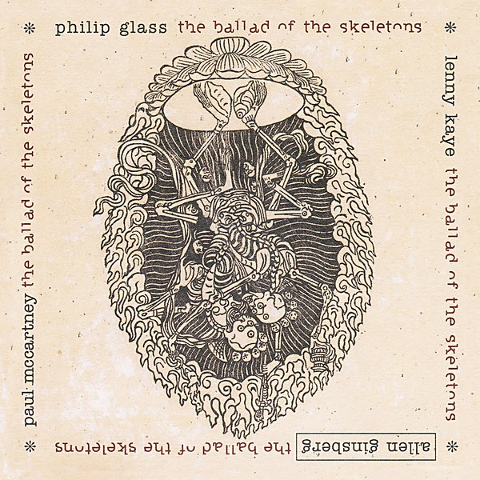

# Ballad of the Skeletons

By **Allen Ginsberg & Paul McCartney**

## Album Data

- **Catalog:** Beets
- **Format:** Digital, Album
- **Album:** Ballad of the Skeletons
- **Artist:** Allen Ginsberg & Paul Mccartney
- **Albumartist:** Allen Ginsberg & Paul McCartney
- **Genre:** Jazz
- **MusicBrainz Album Artist ID:** 
- **MusicBrainz Album ID:** 
- **MusicBrainz Release Group ID:** 
- **Year:** 1996
- **Catalog #:** 
- **Label:** Mouth Almighty
- **Total Tracks:** 00

## Album Tracks

### Track 01 - The Ballad of the Skeletons

- **Artist:** Allen Ginsberg
- **Format:** MP3
- **Genre:** Jazz
- **Length:** 7:48
- **MusicBrainz Track ID:** 
- **Title:** The Ballad of the Skeletons
- **Track:** 01
- **Year:** 1996

### Track 02 - The Ballad of the Skeletons [Edit]

- **Artist:** Allen Ginsberg
- **Format:** MP3
- **Genre:** Jazz
- **Length:** 4:10
- **MusicBrainz Track ID:** 
- **Title:** The Ballad of the Skeletons [Edit]
- **Track:** 02
- **Year:** 1996

### Track 03 - Amazing Grace

- **Artist:** Allen Ginsberg
- **Format:** MP3
- **Genre:** Jazz
- **Length:** 2:50
- **MusicBrainz Track ID:** 
- **Title:** Amazing Grace
- **Track:** 03
- **Year:** 1996

### Track 04 - The Ballad of the Skeletons [Clean]

- **Artist:** Allen Ginsberg
- **Format:** MP3
- **Genre:** Jazz
- **Length:** 7:47
- **MusicBrainz Track ID:** 
- **Title:** The Ballad of the Skeletons [Clean]
- **Track:** 04
- **Year:** 1996

