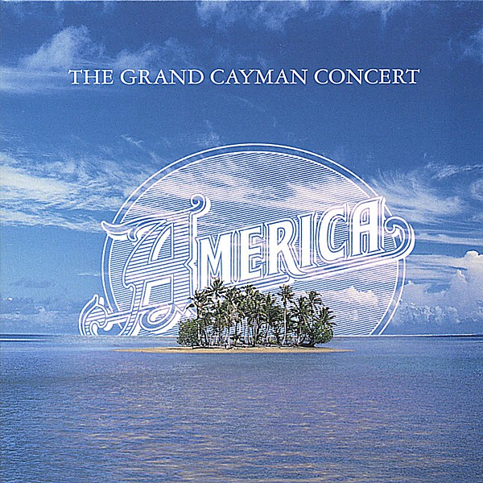

# The Grand Cayman Concert

By **America**

## Album Data

- **Catalog:** Beets
- **Format:** Digital, Album
- **Album:** The Grand Cayman Concert
- **Artist:** America
- **Albumartist:** America
- **Genre:** Soft Rock
- **MusicBrainz Album Artist ID:** 
- **MusicBrainz Album ID:** 
- **MusicBrainz Release Group ID:** 
- **Year:** 1972
- **Catalog #:** 
- **Label:** 
- **Total Tracks:** 00

## Album Tracks

### Track 16 - A Horse With No Name

- **Artist:** America
- **Format:** AAC
- **Genre:** Soft Rock
- **Length:** 4:06
- **MusicBrainz Track ID:** 
- **Title:** A Horse With No Name
- **Track:** 16
- **Year:** 1972

## See also

- [Roon: America](../../Roon/America/America.md)
- [Roon: Hearts](../../Roon/America/Hearts.md)
