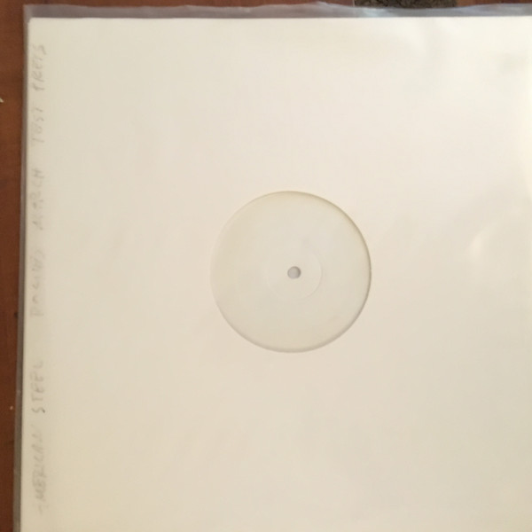

# Rogue's March

By **American Steel**

## Album Data

- **Catalog:** Beets
- **Format:** Digital, Album
- **Album:** Rogue's March
- **Artist:** American Steel
- **Albumartist:** American Steel
- **Genre:** Punk Rock
- **MusicBrainz Album Artist ID:** [bcd5f174-bf86-40d6-ab24-065157a3ecd1](https://musicbrainz.org/artist/bcd5f174-bf86-40d6-ab24-065157a3ecd1)
- **MusicBrainz Album ID:** [2b69a1bc-2889-45dd-b25d-5e8deb79fcfb](https://musicbrainz.org/release/2b69a1bc-2889-45dd-b25d-5e8deb79fcfb)
- **MusicBrainz Release Group ID:** [3db32d04-1c35-33d5-bf55-fdb3c879966e](https://musicbrainz.org/release-group/3db32d04-1c35-33d5-bf55-fdb3c879966e)
- **Year:** 1999
- **Catalog #:** 
- **Label:** 
- **Total Tracks:** 13

## Album Tracks

### Track 01 - Loaded Gun

- **Artist:** American Steel
- **Format:** AAC
- **Genre:** Punk Rock
- **Length:** 2:00
- **MusicBrainz Track ID:** [7620854f-5368-4b13-b2ac-19877b07f887](https://musicbrainz.org/recording/7620854f-5368-4b13-b2ac-19877b07f887)
- **Title:** Loaded Gun
- **Track:** 01
- **Year:** 1999

### Track 02 - Every New Morning

- **Artist:** American Steel
- **Format:** AAC
- **Genre:** Punk Rock
- **Length:** 3:04
- **MusicBrainz Track ID:** [dd905a43-5000-493b-95c8-51d20584bb7c](https://musicbrainz.org/recording/dd905a43-5000-493b-95c8-51d20584bb7c)
- **Title:** Every New Morning
- **Track:** 02
- **Year:** 1999

### Track 03 - Graveyards

- **Artist:** American Steel
- **Format:** AAC
- **Genre:** Punk Rock
- **Length:** 1:57
- **MusicBrainz Track ID:** [5b884892-1e1b-45a3-8547-3bc8ba83ea96](https://musicbrainz.org/recording/5b884892-1e1b-45a3-8547-3bc8ba83ea96)
- **Title:** Graveyards
- **Track:** 03
- **Year:** 1999

### Track 04 - Got a Backbeat

- **Artist:** American Steel
- **Format:** AAC
- **Genre:** Punk Rock
- **Length:** 2:55
- **MusicBrainz Track ID:** [1030114c-d5e6-426a-bd0c-00ff3db5a0f4](https://musicbrainz.org/recording/1030114c-d5e6-426a-bd0c-00ff3db5a0f4)
- **Title:** Got a Backbeat
- **Track:** 04
- **Year:** 1999

### Track 05 - Rogue's March

- **Artist:** American Steel
- **Format:** AAC
- **Genre:** Punk Rock
- **Length:** 2:12
- **MusicBrainz Track ID:** [fc2c204a-dfe0-4f14-aac4-051b781c4167](https://musicbrainz.org/recording/fc2c204a-dfe0-4f14-aac4-051b781c4167)
- **Title:** Rogue's March
- **Track:** 05
- **Year:** 1999

### Track 06 - Whiskey, Women, and Blackguarding (Ain't No Cure for a Broken Heart)

- **Artist:** American Steel
- **Format:** AAC
- **Genre:** Punk Rock
- **Length:** 2:27
- **MusicBrainz Track ID:** [2ccad9f7-ad5f-4c1f-97e9-07272340f12a](https://musicbrainz.org/recording/2ccad9f7-ad5f-4c1f-97e9-07272340f12a)
- **Title:** Whiskey, Women, and Blackguarding (Ain't No Cure for a Broken Heart)
- **Track:** 06
- **Year:** 1999

### Track 07 - Hope Springs From Somewhere

- **Artist:** American Steel
- **Format:** AAC
- **Genre:** Punk Rock
- **Length:** 2:11
- **MusicBrainz Track ID:** [c3e014c4-d5d0-44ea-9f25-d50e682871ea](https://musicbrainz.org/recording/c3e014c4-d5d0-44ea-9f25-d50e682871ea)
- **Title:** Hope Springs From Somewhere
- **Track:** 07
- **Year:** 1999

### Track 08 - Insurrection Ave

- **Artist:** American Steel
- **Format:** AAC
- **Genre:** Punk Rock
- **Length:** 3:15
- **MusicBrainz Track ID:** [06a20558-911a-4531-bdff-12c6ad192545](https://musicbrainz.org/recording/06a20558-911a-4531-bdff-12c6ad192545)
- **Title:** Insurrection Ave
- **Track:** 08
- **Year:** 1999

### Track 09 - Bloody Murder

- **Artist:** American Steel
- **Format:** AAC
- **Genre:** Punk Rock
- **Length:** 2:45
- **MusicBrainz Track ID:** [a9dd7054-66bc-4894-b6e8-a8b1c5d515db](https://musicbrainz.org/recording/a9dd7054-66bc-4894-b6e8-a8b1c5d515db)
- **Title:** Bloody Murder
- **Track:** 09
- **Year:** 1999

### Track 10 - One of These Days

- **Artist:** American Steel
- **Format:** AAC
- **Genre:** Hardcore Punk
- **Length:** 3:05
- **MusicBrainz Track ID:** [42c7e766-6daa-48bd-8bde-5fadb346ecff](https://musicbrainz.org/recording/42c7e766-6daa-48bd-8bde-5fadb346ecff)
- **Title:** One of These Days
- **Track:** 10
- **Year:** 1999

### Track 11 - There Could Be More

- **Artist:** American Steel
- **Format:** AAC
- **Genre:** Punk Rock
- **Length:** 2:00
- **MusicBrainz Track ID:** [2b5b5d57-147b-4ac7-b8aa-4c3dcb75d68e](https://musicbrainz.org/recording/2b5b5d57-147b-4ac7-b8aa-4c3dcb75d68e)
- **Title:** There Could Be More
- **Track:** 11
- **Year:** 1999

### Track 12 - Optimist

- **Artist:** American Steel
- **Format:** AAC
- **Genre:** Punk Rock
- **Length:** 2:39
- **MusicBrainz Track ID:** [3c2706e5-a8d7-4445-8b68-5852a6fc74bd](https://musicbrainz.org/recording/3c2706e5-a8d7-4445-8b68-5852a6fc74bd)
- **Title:** Optimist
- **Track:** 12
- **Year:** 1999

### Track 13 - Parting Glass

- **Artist:** American Steel
- **Format:** AAC
- **Genre:** Punk Rock
- **Length:** 6:19
- **MusicBrainz Track ID:** [cefb294d-6565-4c10-94fb-8f34a40f6bc4](https://musicbrainz.org/recording/cefb294d-6565-4c10-94fb-8f34a40f6bc4)
- **Title:** Parting Glass
- **Track:** 13
- **Year:** 1999

