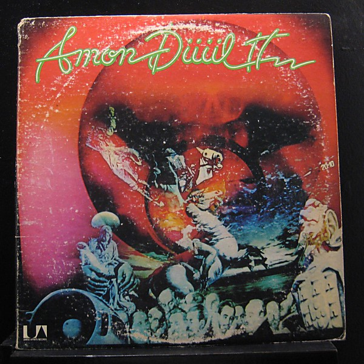

# Dance of the Lemmings

By **Amon Düül II**

## Album Data

- **Catalog:** Beets
- **Format:** Digital, Album
- **Album:** Dance of the Lemmings
- **Artist:** Amon Düül Ii
- **Albumartist:** Amon Düül II
- **Genre:** Krautrock
- **MusicBrainz Album Artist ID:** 
- **MusicBrainz Album ID:** 
- **MusicBrainz Release Group ID:** 
- **Year:** 1971
- **Catalog #:** 
- **Label:** 
- **Total Tracks:** 00

## Album Tracks

### Track 01 - In the Glass Garden

- **Artist:** Amon Düül II
- **Format:** AAC
- **Genre:** Krautrock
- **Length:** 1:39
- **MusicBrainz Track ID:** 
- **Title:** In the Glass Garden
- **Track:** 01
- **Year:** 1971

### Track 02 - Pull Down Your Mask

- **Artist:** Amon Düül II
- **Format:** AAC
- **Genre:** Krautrock
- **Length:** 4:41
- **MusicBrainz Track ID:** 
- **Title:** Pull Down Your Mask
- **Track:** 02
- **Year:** 1971

### Track 03 - Prayer to the Silence

- **Artist:** Amon Düül II
- **Format:** AAC
- **Genre:** Krautrock
- **Length:** 1:05
- **MusicBrainz Track ID:** 
- **Title:** Prayer to the Silence
- **Track:** 03
- **Year:** 1971

### Track 04 - Telephonecomplex

- **Artist:** Amon Düül II
- **Format:** AAC
- **Genre:** Krautrock
- **Length:** 8:26
- **MusicBrainz Track ID:** 
- **Title:** Telephonecomplex
- **Track:** 04
- **Year:** 1971

### Track 05 - Landing in a Ditch

- **Artist:** Amon Düül II
- **Format:** AAC
- **Genre:** Krautrock
- **Length:** 1:03
- **MusicBrainz Track ID:** 
- **Title:** Landing in a Ditch
- **Track:** 05
- **Year:** 1971

### Track 06 - Dehypnotized Toothpaste

- **Artist:** Amon Düül II
- **Format:** AAC
- **Genre:** Krautrock
- **Length:** 0:53
- **MusicBrainz Track ID:** 
- **Title:** Dehypnotized Toothpaste
- **Track:** 06
- **Year:** 1971

### Track 07 - A Short Stop at the Transylvanian Brain-Surgery

- **Artist:** Amon Düül II
- **Format:** AAC
- **Genre:** Krautrock
- **Length:** 4:44
- **MusicBrainz Track ID:** 
- **Title:** A Short Stop at the Transylvanian Brain-Surgery
- **Track:** 07
- **Year:** 1971

### Track 08 - Race From Here to Your Ears. Part I - Little Tornadoes

- **Artist:** Amon Düül II
- **Format:** AAC
- **Genre:** Krautrock
- **Length:** 2:08
- **MusicBrainz Track ID:** 
- **Title:** Race From Here to Your Ears. Part I - Little Tornadoes
- **Track:** 08
- **Year:** 1971

### Track 09 - Race From Here to Your Ears. Part II - Overheated Tiara

- **Artist:** Amon Düül II
- **Format:** AAC
- **Genre:** Krautrock
- **Length:** 1:40
- **MusicBrainz Track ID:** 
- **Title:** Race From Here to Your Ears. Part II - Overheated Tiara
- **Track:** 09
- **Year:** 1971

### Track 10 - Race From Here to Your Ears. Part III - The Flyweighted Five

- **Artist:** Amon Düül II
- **Format:** AAC
- **Genre:** Krautrock
- **Length:** 1:33
- **MusicBrainz Track ID:** 
- **Title:** Race From Here to Your Ears. Part III - The Flyweighted Five
- **Track:** 10
- **Year:** 1971

### Track 11 - Riding on a Cloud

- **Artist:** Amon Düül II
- **Format:** AAC
- **Genre:** Krautrock
- **Length:** 2:34
- **MusicBrainz Track ID:** 
- **Title:** Riding on a Cloud
- **Track:** 11
- **Year:** 1971

### Track 12 - Paralyzed Paradise

- **Artist:** Amon Düül II
- **Format:** AAC
- **Genre:** Krautrock
- **Length:** 3:07
- **MusicBrainz Track ID:** 
- **Title:** Paralyzed Paradise
- **Track:** 12
- **Year:** 1971

### Track 13 - H.G. Wells' Take Off

- **Artist:** Amon Düül II
- **Format:** AAC
- **Genre:** Krautrock
- **Length:** 1:24
- **MusicBrainz Track ID:** 
- **Title:** H.G. Wells' Take Off
- **Track:** 13
- **Year:** 1971

### Track 14 - The Marilyn Monroe-Memorial-Church

- **Artist:** Amon Düül II
- **Format:** AAC
- **Genre:** Krautrock
- **Length:** 18:10
- **MusicBrainz Track ID:** 
- **Title:** The Marilyn Monroe-Memorial-Church
- **Track:** 14
- **Year:** 1971

### Track 15 - Chewing Gum Telegram

- **Artist:** Amon Düül II
- **Format:** AAC
- **Genre:** Krautrock
- **Length:** 2:45
- **MusicBrainz Track ID:** 
- **Title:** Chewing Gum Telegram
- **Track:** 15
- **Year:** 1971

### Track 16 - Stumbling Over Melted Moonlight

- **Artist:** Amon Düül II
- **Format:** AAC
- **Genre:** Space Rock
- **Length:** 4:30
- **MusicBrainz Track ID:** 
- **Title:** Stumbling Over Melted Moonlight
- **Track:** 16
- **Year:** 1971

### Track 17 - Toxicological Whispering

- **Artist:** Amon Düül II
- **Format:** AAC
- **Genre:** Krautrock
- **Length:** 7:47
- **MusicBrainz Track ID:** 
- **Title:** Toxicological Whispering
- **Track:** 17
- **Year:** 1971

