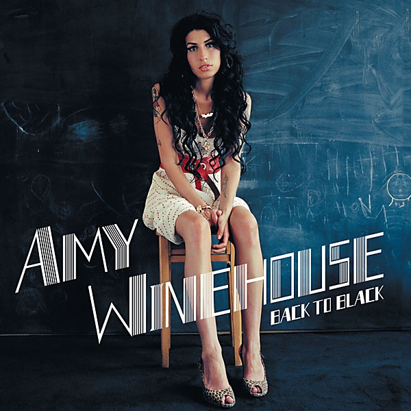

# Back to Black

By **Amy Winehouse**

## Album Data

- **Catalog:** Beets
- **Format:** Digital, Album
- **Album:** Back to Black
- **Artist:** Amy Winehouse
- **Albumartist:** Amy Winehouse
- **Genre:** Soul
- **MusicBrainz Album Artist ID:** [dfe9a7c4-8cf2-47f4-9dcb-d233c2b86ec3](https://musicbrainz.org/artist/dfe9a7c4-8cf2-47f4-9dcb-d233c2b86ec3)
- **MusicBrainz Album ID:** [3960527e-87e4-49da-b4a5-5c7f83b2e4a3](https://musicbrainz.org/release/3960527e-87e4-49da-b4a5-5c7f83b2e4a3)
- **MusicBrainz Release Group ID:** [6eac2e57-ee50-36f8-b0c4-c4c847a2c098](https://musicbrainz.org/release-group/6eac2e57-ee50-36f8-b0c4-c4c847a2c098)
- **Year:** 2006
- **Catalog #:** 
- **Label:** 
- **Total Tracks:** 12

## Album Tracks

### Track 01 - Rehab

- **Artist:** Amy Winehouse
- **Format:** AAC
- **Genre:** Soul
- **Length:** 3:32
- **MusicBrainz Track ID:** [873eba85-b721-4728-be2e-96ce94cccb8b](https://musicbrainz.org/recording/873eba85-b721-4728-be2e-96ce94cccb8b)
- **Title:** Rehab
- **Track:** 01
- **Year:** 2006

### Track 02 - You Know I’m No Good

- **Artist:** Amy Winehouse
- **Format:** MP3
- **Genre:** Soul
- **Length:** 4:17
- **MusicBrainz Track ID:** [222e611f-2e4b-4569-80a4-0a38402f0c63](https://musicbrainz.org/recording/222e611f-2e4b-4569-80a4-0a38402f0c63)
- **Title:** You Know I’m No Good
- **Track:** 02
- **Year:** 2006

### Track 03 - Me & Mr. Jones

- **Artist:** Amy Winehouse
- **Format:** AAC
- **Genre:** Soul
- **Length:** 2:33
- **MusicBrainz Track ID:** [217c4f4a-d6d1-44db-9581-4cc83b738446](https://musicbrainz.org/recording/217c4f4a-d6d1-44db-9581-4cc83b738446)
- **Title:** Me & Mr. Jones
- **Track:** 03
- **Year:** 2006

### Track 04 - Just Friends

- **Artist:** Amy Winehouse
- **Format:** AAC
- **Genre:** Soul
- **Length:** 3:11
- **MusicBrainz Track ID:** [8f3461f5-6833-44a6-b705-1b65ef610102](https://musicbrainz.org/recording/8f3461f5-6833-44a6-b705-1b65ef610102)
- **Title:** Just Friends
- **Track:** 04
- **Year:** 2006

### Track 05 - Back to Black

- **Artist:** Amy Winehouse
- **Format:** AAC
- **Genre:** Soul
- **Length:** 4:00
- **MusicBrainz Track ID:** [b0adc7a8-0a90-4e09-8839-a66f315234a2](https://musicbrainz.org/recording/b0adc7a8-0a90-4e09-8839-a66f315234a2)
- **Title:** Back to Black
- **Track:** 05
- **Year:** 2006

### Track 06 - Love Is a Losing Game

- **Artist:** Amy Winehouse
- **Format:** MP3
- **Genre:** Soul
- **Length:** 2:47
- **MusicBrainz Track ID:** [b7e172f3-1f8f-49bf-a4a9-141cd64979c7](https://musicbrainz.org/recording/b7e172f3-1f8f-49bf-a4a9-141cd64979c7)
- **Title:** Love Is a Losing Game
- **Track:** 06
- **Year:** 2006

### Track 07 - Tears Dry on Their Own

- **Artist:** Amy Winehouse
- **Format:** AAC
- **Genre:** Soul
- **Length:** 3:05
- **MusicBrainz Track ID:** [b47bf632-f6ca-42fa-9db9-10d38797aa9d](https://musicbrainz.org/recording/b47bf632-f6ca-42fa-9db9-10d38797aa9d)
- **Title:** Tears Dry on Their Own
- **Track:** 07
- **Year:** 2006

### Track 08 - Wake Up Alone

- **Artist:** Amy Winehouse
- **Format:** AAC
- **Genre:** Soul
- **Length:** 3:41
- **MusicBrainz Track ID:** [3f221ae8-79b1-442f-8af6-c020028e58f1](https://musicbrainz.org/recording/3f221ae8-79b1-442f-8af6-c020028e58f1)
- **Title:** Wake Up Alone
- **Track:** 08
- **Year:** 2006

### Track 09 - Some Unholy War

- **Artist:** Amy Winehouse
- **Format:** AAC
- **Genre:** Soul
- **Length:** 2:21
- **MusicBrainz Track ID:** [17c5cd7a-c6d3-4483-8aab-51ee156a2e77](https://musicbrainz.org/recording/17c5cd7a-c6d3-4483-8aab-51ee156a2e77)
- **Title:** Some Unholy War
- **Track:** 09
- **Year:** 2006

### Track 10 - He Can Only Hold Her

- **Artist:** Amy Winehouse
- **Format:** AAC
- **Genre:** Soul
- **Length:** 2:46
- **MusicBrainz Track ID:** [a224ccb6-2eb5-4bd9-b32a-65d474ddd2cf](https://musicbrainz.org/recording/a224ccb6-2eb5-4bd9-b32a-65d474ddd2cf)
- **Title:** He Can Only Hold Her
- **Track:** 10
- **Year:** 2006

### Track 12 - Rehab (Hot Chip remix)

- **Artist:** Amy Winehouse
- **Format:** MP3
- **Genre:** Soul
- **Length:** 3:13
- **MusicBrainz Track ID:** [bdc0ee87-1e21-41e7-89e1-c26050e811c3](https://musicbrainz.org/recording/bdc0ee87-1e21-41e7-89e1-c26050e811c3)
- **Title:** Rehab (Hot Chip remix)
- **Track:** 12
- **Year:** 2006

### Track 11 - You Know I’m No Good (remix)

- **Artist:** Amy Winehouse feat. Ghostface Killah
- **Format:** MP3
- **Genre:** Soul
- **Length:** 3:20
- **MusicBrainz Track ID:** [75855dc2-d0b2-41c9-9906-59ccd254291b](https://musicbrainz.org/recording/75855dc2-d0b2-41c9-9906-59ccd254291b)
- **Title:** You Know I’m No Good (remix)
- **Track:** 11
- **Year:** 2006

