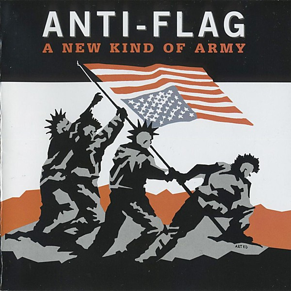

# A New Kind Of Army

By **Anti-Flag**

## Album Data

- **Catalog:** Beets
- **Format:** Digital, Album
- **Album:** A New Kind Of Army
- **Artist:** Anti-flag
- **Albumartist:** Anti-Flag
- **Genre:** rock
- **MusicBrainz Album Artist ID:** [https](https://musicbrainz.org/artist/https)
- **MusicBrainz Album ID:** [https](https://musicbrainz.org/release/https)
- **MusicBrainz Release Group ID:** 
- **Year:** 1999
- **Catalog #:** 
- **Label:** 
- **Total Tracks:** 00

## Album Tracks

### Track 01 - I Hate My School

- **Artist:** Anti-Flag
- **Format:** MP3
- **Genre:** Punk Rock
- **Length:** 1:12
- **MusicBrainz Track ID:** 
- **Title:** I Hate My School
- **Track:** 01
- **Year:** 1982

### Track 05 - The School of Assassins [#]

- **Artist:** Anti-Flag
- **Format:** MP3
- **Genre:** Punk Rock
- **Length:** 2:38
- **MusicBrainz Track ID:** 
- **Title:** The School of Assassins [#]
- **Track:** 05
- **Year:** 2004

## See also

- [Rock Against Bush](Rock_Against_Bush.md)
- [The Terror State](The_Terror_State.md)
- [Underground Network](Underground_Network.md)
