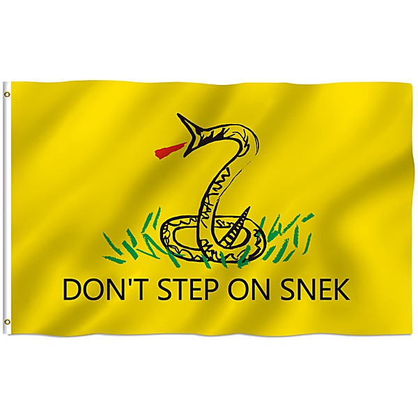

# Rock Against Bush

By **Anti-Flag**

## Album Data

- **Catalog:** Beets
- **Format:** Digital, Album
- **Album:** Rock Against Bush
- **Artist:** Anti-flag
- **Albumartist:** Anti-Flag
- **Genre:** Punk Rock
- **MusicBrainz Album Artist ID:** 
- **MusicBrainz Album ID:** 
- **MusicBrainz Release Group ID:** 
- **Year:** 1982
- **Catalog #:** 
- **Label:** Fat Wreck Chords
- **Total Tracks:** 13

## Album Tracks

### Track 01 - Turncoat

- **Artist:** Anti-Flag
- **Format:** AAC
- **Genre:** rock
- **Length:** 2:10
- **MusicBrainz Track ID:** [https](https://musicbrainz.org/recording/https)
- **Title:** Turncoat
- **Track:** 01
- **Year:** 2003

### Track 02 - Rank-n-File

- **Artist:** Anti-Flag
- **Format:** AAC
- **Genre:** rock
- **Length:** 3:46
- **MusicBrainz Track ID:** [https](https://musicbrainz.org/recording/https)
- **Title:** Rank-n-File
- **Track:** 02
- **Year:** 2003

### Track 03 - Post-War-Breakout

- **Artist:** Anti-Flag
- **Format:** AAC
- **Genre:** rock
- **Length:** 3:11
- **MusicBrainz Track ID:** [https](https://musicbrainz.org/recording/https)
- **Title:** Post-War-Breakout
- **Track:** 03
- **Year:** 2003

### Track 04 - Sold As Freedom

- **Artist:** Anti-Flag
- **Format:** AAC
- **Genre:** rock
- **Length:** 2:16
- **MusicBrainz Track ID:** [https](https://musicbrainz.org/recording/https)
- **Title:** Sold As Freedom
- **Track:** 04
- **Year:** 2003

### Track 05 - Power To The Peaceful

- **Artist:** Anti-Flag
- **Format:** AAC
- **Genre:** rock
- **Length:** 2:57
- **MusicBrainz Track ID:** [https](https://musicbrainz.org/recording/https)
- **Title:** Power To The Peaceful
- **Track:** 05
- **Year:** 2003

### Track 06 - Mind The G.A.T.T.

- **Artist:** Anti-Flag
- **Format:** AAC
- **Genre:** rock
- **Length:** 3:14
- **MusicBrainz Track ID:** [https](https://musicbrainz.org/recording/https)
- **Title:** Mind The G.A.T.T.
- **Track:** 06
- **Year:** 2003

### Track 07 - You Can Kill The Protester, But You Can’t Kill The Protest

- **Artist:** Anti-Flag
- **Format:** AAC
- **Genre:** rock
- **Length:** 2:33
- **MusicBrainz Track ID:** [https](https://musicbrainz.org/recording/https)
- **Title:** You Can Kill The Protester, But You Can’t Kill The Protest
- **Track:** 07
- **Year:** 2003

### Track 08 - When You Don’t Control Your Government People Want To Kill You

- **Artist:** Anti-Flag
- **Format:** AAC
- **Genre:** rock
- **Length:** 2:47
- **MusicBrainz Track ID:** [https](https://musicbrainz.org/recording/https)
- **Title:** When You Don’t Control Your Government People Want To Kill You
- **Track:** 08
- **Year:** 2003

### Track 09 - Wake Up!

- **Artist:** Anti-Flag
- **Format:** AAC
- **Genre:** rock
- **Length:** 2:35
- **MusicBrainz Track ID:** [https](https://musicbrainz.org/recording/https)
- **Title:** Wake Up!
- **Track:** 09
- **Year:** 2003

### Track 10 - Tearing Down The Borders

- **Artist:** Anti-Flag
- **Format:** AAC
- **Genre:** rock
- **Length:** 3:07
- **MusicBrainz Track ID:** [https](https://musicbrainz.org/recording/https)
- **Title:** Tearing Down The Borders
- **Track:** 10
- **Year:** 2003

### Track 11 - Death Of A Nation

- **Artist:** Anti-Flag
- **Format:** AAC
- **Genre:** rock
- **Length:** 1:55
- **MusicBrainz Track ID:** [https](https://musicbrainz.org/recording/https)
- **Title:** Death Of A Nation
- **Track:** 11
- **Year:** 2003

### Track 12 - Operation Iraqi Liberation (O.I.L.)

- **Artist:** Anti-Flag
- **Format:** AAC
- **Genre:** rock
- **Length:** 2:21
- **MusicBrainz Track ID:** [https](https://musicbrainz.org/recording/https)
- **Title:** Operation Iraqi Liberation (O.I.L.)
- **Track:** 12
- **Year:** 2003

### Track 13 - One People, One Struggle

- **Artist:** Anti-Flag
- **Format:** AAC
- **Genre:** rock
- **Length:** 3:00
- **MusicBrainz Track ID:** [https](https://musicbrainz.org/recording/https)
- **Title:** One People, One Struggle
- **Track:** 13
- **Year:** 2003

## See also

- [A New Kind Of Army](A_New_Kind_Of_Army.md)
- [The Terror State](The_Terror_State.md)
- [Underground Network](Underground_Network.md)
