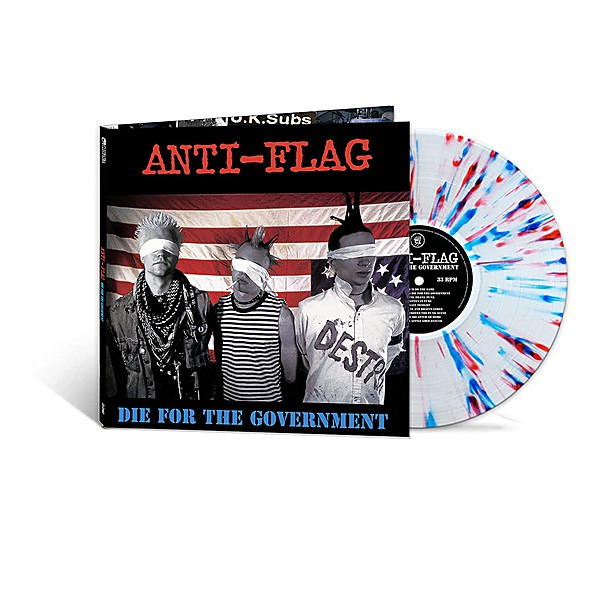

# Die for the Government

By **Anti‐Flag**

## Album Data

- **Catalog:** Beets
- **Format:** Digital, Album
- **Album:** Die for the Government
- **Artist:** Anti‐flag
- **Albumartist:** Anti‐Flag
- **Genre:** Punk Rock
- **MusicBrainz Album Artist ID:** [b88f21a7-a1b9-48fd-bbc4-ae758026f17f](https://musicbrainz.org/artist/b88f21a7-a1b9-48fd-bbc4-ae758026f17f)
- **MusicBrainz Album ID:** [3e8a9097-5328-4d23-87d3-6322563756f5](https://musicbrainz.org/release/3e8a9097-5328-4d23-87d3-6322563756f5)
- **MusicBrainz Release Group ID:** [b3c4f94f-7c89-32a3-83ee-a27c4ffdbb82](https://musicbrainz.org/release-group/b3c4f94f-7c89-32a3-83ee-a27c4ffdbb82)
- **Year:** 2012
- **Catalog #:** 82876 76836-2
- **Label:** RCA
- **Total Tracks:** 13

## Album Tracks

### Track 01 - I’d Tell You But…

- **Artist:** Anti‐Flag
- **Format:** MP3
- **Genre:** Pop Punk
- **Length:** 2:10
- **MusicBrainz Track ID:** [9ff692b5-78bd-404f-9179-e5266ec0589d](https://musicbrainz.org/recording/9ff692b5-78bd-404f-9179-e5266ec0589d)
- **Title:** I’d Tell You But…
- **Track:** 01
- **Year:** 2006

### Track 02 - The Press Corpse

- **Artist:** Anti‐Flag
- **Format:** AAC
- **Genre:** Punk Rock
- **Length:** 3:21
- **MusicBrainz Track ID:** [859a02df-9fe0-4b3e-a65d-87070a378a8e](https://musicbrainz.org/recording/859a02df-9fe0-4b3e-a65d-87070a378a8e)
- **Title:** The Press Corpse
- **Track:** 02
- **Year:** 2006

### Track 03 - Emigre

- **Artist:** Anti‐Flag
- **Format:** AAC
- **Genre:** Hardcore Punk
- **Length:** 3:00
- **MusicBrainz Track ID:** [b3fe0083-ae7a-402e-b9e9-e7e8408e8f3d](https://musicbrainz.org/recording/b3fe0083-ae7a-402e-b9e9-e7e8408e8f3d)
- **Title:** Emigre
- **Track:** 03
- **Year:** 2006

### Track 04 - The Project for a New American Century

- **Artist:** Anti‐Flag
- **Format:** AAC
- **Genre:** Punk Rock
- **Length:** 3:17
- **MusicBrainz Track ID:** [b595933f-0351-4387-bb86-49180dfdb1a0](https://musicbrainz.org/recording/b595933f-0351-4387-bb86-49180dfdb1a0)
- **Title:** The Project for a New American Century
- **Track:** 04
- **Year:** 2006

### Track 05 - Hymn for the Dead

- **Artist:** Anti‐Flag
- **Format:** AAC
- **Genre:** Hardcore Punk
- **Length:** 3:39
- **MusicBrainz Track ID:** [f843b216-728e-46e4-92a8-cc3e7701f056](https://musicbrainz.org/recording/f843b216-728e-46e4-92a8-cc3e7701f056)
- **Title:** Hymn for the Dead
- **Track:** 05
- **Year:** 2006

### Track 06 - This Is the End (for You My Friend)

- **Artist:** Anti‐Flag
- **Format:** AAC
- **Genre:** Punk Rock
- **Length:** 3:12
- **MusicBrainz Track ID:** [2bfdb860-634b-4395-a0f2-16515b704486](https://musicbrainz.org/recording/2bfdb860-634b-4395-a0f2-16515b704486)
- **Title:** This Is the End (for You My Friend)
- **Track:** 06
- **Year:** 2006

### Track 07 - 1 Trillion Dollar$

- **Artist:** Anti‐Flag
- **Format:** MP3
- **Genre:** Punk Rock
- **Length:** 2:30
- **MusicBrainz Track ID:** [a462f01b-9729-4270-9b4a-e6c91e6066d4](https://musicbrainz.org/recording/a462f01b-9729-4270-9b4a-e6c91e6066d4)
- **Title:** 1 Trillion Dollar$
- **Track:** 07
- **Year:** 2006

### Track 08 - State Funeral

- **Artist:** Anti‐Flag
- **Format:** AAC
- **Genre:** Skate Punk
- **Length:** 2:01
- **MusicBrainz Track ID:** [c17764be-66ec-49af-9a36-0fa9d10617d6](https://musicbrainz.org/recording/c17764be-66ec-49af-9a36-0fa9d10617d6)
- **Title:** State Funeral
- **Track:** 08
- **Year:** 2006

### Track 09 - Confessions of an Economic Hit Man

- **Artist:** Anti‐Flag
- **Format:** AAC
- **Genre:** Punk Rock
- **Length:** 2:43
- **MusicBrainz Track ID:** [5b2ea93d-2d90-4ae6-8f66-7775c09623ef](https://musicbrainz.org/recording/5b2ea93d-2d90-4ae6-8f66-7775c09623ef)
- **Title:** Confessions of an Economic Hit Man
- **Track:** 09
- **Year:** 2006

### Track 10 - War Sucks, Let’s Party!

- **Artist:** Anti‐Flag
- **Format:** MP3
- **Genre:** Pop Punk
- **Length:** 2:18
- **MusicBrainz Track ID:** [d57f254d-899b-482f-8b2e-863e3318877d](https://musicbrainz.org/recording/d57f254d-899b-482f-8b2e-863e3318877d)
- **Title:** War Sucks, Let’s Party!
- **Track:** 10
- **Year:** 2006

### Track 11 - The W.T.O. Kills Farmers

- **Artist:** Anti‐Flag
- **Format:** MP3
- **Genre:** Hardcore Punk
- **Length:** 3:32
- **MusicBrainz Track ID:** [425eaee8-22e1-46fb-b8d7-9e43d57254ba](https://musicbrainz.org/recording/425eaee8-22e1-46fb-b8d7-9e43d57254ba)
- **Title:** The W.T.O. Kills Farmers
- **Track:** 11
- **Year:** 2006

### Track 12 - Cities Burn

- **Artist:** Anti‐Flag
- **Format:** AAC
- **Genre:** Punk Rock
- **Length:** 3:02
- **MusicBrainz Track ID:** [10dae31f-d43a-401b-b673-bda2f3a8cbc4](https://musicbrainz.org/recording/10dae31f-d43a-401b-b673-bda2f3a8cbc4)
- **Title:** Cities Burn
- **Track:** 12
- **Year:** 2006

### Track 13 - Depleted Uranium Is a War Crime

- **Artist:** Anti‐Flag
- **Format:** AAC
- **Genre:** Hardcore Punk
- **Length:** 4:07
- **MusicBrainz Track ID:** [8d537b42-c30b-4e55-8688-05707a2c5a4d](https://musicbrainz.org/recording/8d537b42-c30b-4e55-8688-05707a2c5a4d)
- **Title:** Depleted Uranium Is a War Crime
- **Track:** 13
- **Year:** 2006

## See also

- [For Blood and Empire](For_Blood_and_Empire.md)
- [Mobilize](Mobilize.md)
- [Their System Doesn’t Work for You](Their_System_Doesn’t_Work_for_You.md)
