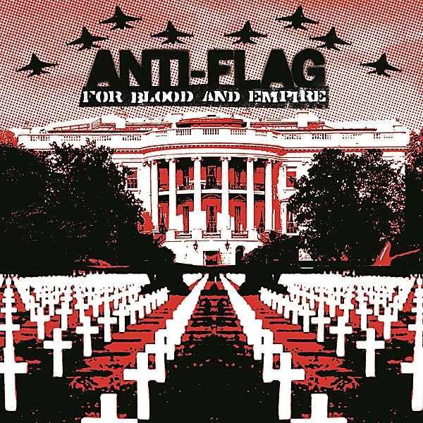

# For Blood and Empire

By **Anti‐Flag**

## Album Data

- **Catalog:** Beets
- **Format:** Digital, Album
- **Album:** For Blood and Empire
- **Artist:** Anti‐flag
- **Albumartist:** Anti‐Flag
- **Genre:** Pop Punk
- **MusicBrainz Album Artist ID:** [b88f21a7-a1b9-48fd-bbc4-ae758026f17f](https://musicbrainz.org/artist/b88f21a7-a1b9-48fd-bbc4-ae758026f17f)
- **MusicBrainz Album ID:** [cccb7c71-d6d9-46b5-9302-849b19068da9](https://musicbrainz.org/release/cccb7c71-d6d9-46b5-9302-849b19068da9)
- **MusicBrainz Release Group ID:** [ee02c98d-8b3f-3958-8a6f-1dac3f472094](https://musicbrainz.org/release-group/ee02c98d-8b3f-3958-8a6f-1dac3f472094)
- **Year:** 2006
- **Catalog #:** AF014
- **Label:** A‐F Records
- **Total Tracks:** 16

## Album Tracks

### Track 01 - 911 for Peace

- **Artist:** Anti‐Flag
- **Format:** MP3
- **Genre:** Punk Rock
- **Length:** 3:34
- **MusicBrainz Track ID:** [67528495-b0b7-42dc-8e91-cb9616888f02](https://musicbrainz.org/recording/67528495-b0b7-42dc-8e91-cb9616888f02)
- **Title:** 911 for Peace
- **Track:** 01
- **Year:** 2013

### Track 02 - Mumia’s Song

- **Artist:** Anti‐Flag
- **Format:** MP3
- **Genre:** Punk Rock
- **Length:** 2:24
- **MusicBrainz Track ID:** [68f20591-9ed8-48cf-bb40-1a43ba3082ae](https://musicbrainz.org/recording/68f20591-9ed8-48cf-bb40-1a43ba3082ae)
- **Title:** Mumia’s Song
- **Track:** 02
- **Year:** 2013

### Track 03 - What’s the Difference?

- **Artist:** Anti‐Flag
- **Format:** MP3
- **Genre:** Punk Rock
- **Length:** 1:59
- **MusicBrainz Track ID:** [44395562-e7af-4ce8-b588-16e827043921](https://musicbrainz.org/recording/44395562-e7af-4ce8-b588-16e827043921)
- **Title:** What’s the Difference?
- **Track:** 03
- **Year:** 2013

### Track 04 - We Want to Be Free

- **Artist:** Anti‐Flag
- **Format:** MP3
- **Genre:** Hardcore Punk
- **Length:** 1:36
- **MusicBrainz Track ID:** [9d6291cc-ec25-4ab0-bb5d-101c221f8dfd](https://musicbrainz.org/recording/9d6291cc-ec25-4ab0-bb5d-101c221f8dfd)
- **Title:** We Want to Be Free
- **Track:** 04
- **Year:** 2013

### Track 05 - N.B.C. (No Blood‐Thirsty Corporations)

- **Artist:** Anti‐Flag
- **Format:** MP3
- **Genre:** Punk Rock
- **Length:** 2:12
- **MusicBrainz Track ID:** [b6b353b6-80f3-4d88-addd-8d84553da895](https://musicbrainz.org/recording/b6b353b6-80f3-4d88-addd-8d84553da895)
- **Title:** N.B.C. (No Blood‐Thirsty Corporations)
- **Track:** 05
- **Year:** 2013

### Track 06 - Right to Choose

- **Artist:** Anti‐Flag
- **Format:** MP3
- **Genre:** Pop Punk
- **Length:** 2:57
- **MusicBrainz Track ID:** [b67cfd60-94d1-401b-a3a1-5e7ca71e09e3](https://musicbrainz.org/recording/b67cfd60-94d1-401b-a3a1-5e7ca71e09e3)
- **Title:** Right to Choose
- **Track:** 06
- **Year:** 2013

### Track 07 - We Don't Need It!

- **Artist:** Anti‐Flag
- **Format:** MP3
- **Genre:** Hardcore Punk
- **Length:** 3:12
- **MusicBrainz Track ID:** [84d21344-7b06-4f94-b561-0f086f9a064d](https://musicbrainz.org/recording/84d21344-7b06-4f94-b561-0f086f9a064d)
- **Title:** We Don't Need It!
- **Track:** 07
- **Year:** 2013

### Track 08 - Anatomy of Your Enemy

- **Artist:** Anti‐Flag
- **Format:** MP3
- **Genre:** Hardcore Punk
- **Length:** 3:02
- **MusicBrainz Track ID:** [724f789a-720a-404e-81f4-0523a39fa26c](https://musicbrainz.org/recording/724f789a-720a-404e-81f4-0523a39fa26c)
- **Title:** Anatomy of Your Enemy
- **Track:** 08
- **Year:** 2013

### Track 09 - Underground Network (live)

- **Artist:** Anti‐Flag
- **Format:** MP3
- **Genre:** Punk Rock
- **Length:** 3:32
- **MusicBrainz Track ID:** [9b085b4b-831c-4cf0-b8a3-1c851425e72c](https://musicbrainz.org/recording/9b085b4b-831c-4cf0-b8a3-1c851425e72c)
- **Title:** Underground Network (live)
- **Track:** 09
- **Year:** 2013

### Track 10 - Tearing Everyone Down (live)

- **Artist:** Anti‐Flag
- **Format:** MP3
- **Genre:** Hardcore Punk
- **Length:** 2:44
- **MusicBrainz Track ID:** [8b549095-47f9-46ee-9070-8aa0c3ea2c87](https://musicbrainz.org/recording/8b549095-47f9-46ee-9070-8aa0c3ea2c87)
- **Title:** Tearing Everyone Down (live)
- **Track:** 10
- **Year:** 2013

### Track 11 - Bring Out Your Dead (live)

- **Artist:** Anti‐Flag
- **Format:** MP3
- **Genre:** Hardcore Punk
- **Length:** 3:01
- **MusicBrainz Track ID:** [98c77f5f-a3b9-49c3-8517-efc4fcce307c](https://musicbrainz.org/recording/98c77f5f-a3b9-49c3-8517-efc4fcce307c)
- **Title:** Bring Out Your Dead (live)
- **Track:** 11
- **Year:** 2013

### Track 12 - A New Kind of Army (live)

- **Artist:** Anti‐Flag
- **Format:** MP3
- **Genre:** Punk Rock
- **Length:** 3:46
- **MusicBrainz Track ID:** [80ef9379-30c0-4405-a4e0-072ae52ec87c](https://musicbrainz.org/recording/80ef9379-30c0-4405-a4e0-072ae52ec87c)
- **Title:** A New Kind of Army (live)
- **Track:** 12
- **Year:** 2013

### Track 13 - Their System Doesn’t Work for You (live)

- **Artist:** Anti‐Flag
- **Format:** MP3
- **Genre:** Punk Rock
- **Length:** 2:25
- **MusicBrainz Track ID:** [2034bcd6-fc69-4183-8a64-8736ce55c08f](https://musicbrainz.org/recording/2034bcd6-fc69-4183-8a64-8736ce55c08f)
- **Title:** Their System Doesn’t Work for You (live)
- **Track:** 13
- **Year:** 2013

### Track 14 - Free Nation (live)

- **Artist:** Anti‐Flag
- **Format:** MP3
- **Genre:** Punk Rock
- **Length:** 2:56
- **MusicBrainz Track ID:** [8ad0e003-5e67-43ba-bfbc-308f15083b5c](https://musicbrainz.org/recording/8ad0e003-5e67-43ba-bfbc-308f15083b5c)
- **Title:** Free Nation (live)
- **Track:** 14
- **Year:** 2013

### Track 15 - Spaz’s House Destruction Party (live)

- **Artist:** Anti‐Flag
- **Format:** MP3
- **Genre:** Punk Rock
- **Length:** 3:10
- **MusicBrainz Track ID:** [7610fbba-69a5-4a92-8299-dfa74a584a0b](https://musicbrainz.org/recording/7610fbba-69a5-4a92-8299-dfa74a584a0b)
- **Title:** Spaz’s House Destruction Party (live)
- **Track:** 15
- **Year:** 2013

### Track 16 - Die for the Government (live)

- **Artist:** Anti‐Flag
- **Format:** MP3
- **Genre:** Punk Rock
- **Length:** 31:22
- **MusicBrainz Track ID:** [985f2d08-9ddb-405c-9b6d-65b91f20068c](https://musicbrainz.org/recording/985f2d08-9ddb-405c-9b6d-65b91f20068c)
- **Title:** Die for the Government (live)
- **Track:** 16
- **Year:** 2013

## See also

- [Die for the Government](Die_for_the_Government.md)
- [Mobilize](Mobilize.md)
- [Their System Doesn’t Work for You](Their_System_Doesn’t_Work_for_You.md)
