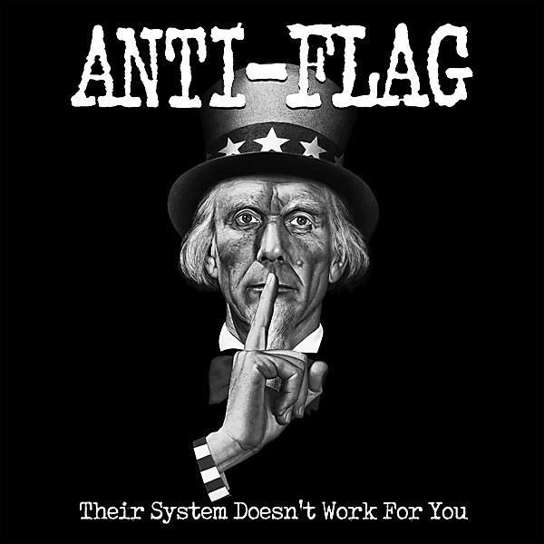

# Their System Doesn’t Work for You

By **Anti‐Flag**

## Album Data

- **Catalog:** Beets
- **Format:** Digital, Album
- **Album:** Their System Doesn’t Work for You
- **Artist:** Anti‐flag
- **Albumartist:** Anti‐Flag
- **Genre:** Punk Rock
- **MusicBrainz Album Artist ID:** [b88f21a7-a1b9-48fd-bbc4-ae758026f17f](https://musicbrainz.org/artist/b88f21a7-a1b9-48fd-bbc4-ae758026f17f)
- **MusicBrainz Album ID:** [04a9106f-6a67-40c9-9905-0344641cdc8f](https://musicbrainz.org/release/04a9106f-6a67-40c9-9905-0344641cdc8f)
- **MusicBrainz Release Group ID:** [87141423-bcb4-36ab-85e4-5a9d6018b9ed](https://musicbrainz.org/release-group/87141423-bcb4-36ab-85e4-5a9d6018b9ed)
- **Year:** 2013
- **Catalog #:** AF001
- **Label:** A‐F Records
- **Total Tracks:** 19

## Album Tracks

### Track 01 - I Can’t Stand Being With You

- **Artist:** Anti‐Flag
- **Format:** MP3
- **Genre:** Punk Rock
- **Length:** 2:07
- **MusicBrainz Track ID:** [e35c7ad0-afb9-445b-90cb-d66d3d8e4f21](https://musicbrainz.org/recording/e35c7ad0-afb9-445b-90cb-d66d3d8e4f21)
- **Title:** I Can’t Stand Being With You
- **Track:** 01
- **Year:** 2013

### Track 02 - Their System Doesn’t Work for You

- **Artist:** Anti‐Flag
- **Format:** MP3
- **Genre:** Punk Rock
- **Length:** 2:33
- **MusicBrainz Track ID:** [e184ad43-9675-4b48-9ed2-ccfba4e43122](https://musicbrainz.org/recording/e184ad43-9675-4b48-9ed2-ccfba4e43122)
- **Title:** Their System Doesn’t Work for You
- **Track:** 02
- **Year:** 2013

### Track 03 - We’ve Got His Gun

- **Artist:** Anti‐Flag
- **Format:** MP3
- **Genre:** Punk Rock
- **Length:** 2:27
- **MusicBrainz Track ID:** [c41bc976-19fb-435d-9662-0797783d8d1b](https://musicbrainz.org/recording/c41bc976-19fb-435d-9662-0797783d8d1b)
- **Title:** We’ve Got His Gun
- **Track:** 03
- **Year:** 2013

### Track 04 - Born to Die

- **Artist:** Anti‐Flag
- **Format:** MP3
- **Genre:** Punk Rock
- **Length:** 2:07
- **MusicBrainz Track ID:** [f0af999a-5093-4da5-a424-111444a21efa](https://musicbrainz.org/recording/f0af999a-5093-4da5-a424-111444a21efa)
- **Title:** Born to Die
- **Track:** 04
- **Year:** 2013

### Track 05 - The Truth

- **Artist:** Anti‐Flag
- **Format:** MP3
- **Genre:** Punk Rock
- **Length:** 2:42
- **MusicBrainz Track ID:** [460fd01c-da6a-4cc4-b351-d5745053e711](https://musicbrainz.org/recording/460fd01c-da6a-4cc4-b351-d5745053e711)
- **Title:** The Truth
- **Track:** 05
- **Year:** 2013

### Track 06 - You’ll Scream Tonight

- **Artist:** Anti‐Flag
- **Format:** MP3
- **Genre:** Punk Rock
- **Length:** 5:17
- **MusicBrainz Track ID:** [b76a0230-509e-4f4a-a311-dc4b3f7b2068](https://musicbrainz.org/recording/b76a0230-509e-4f4a-a311-dc4b3f7b2068)
- **Title:** You’ll Scream Tonight
- **Track:** 06
- **Year:** 2013

### Track 07 - Indie Sux, Hardline Sux, Emo Sux, You Suck!

- **Artist:** Anti‐Flag
- **Format:** MP3
- **Genre:** Emo
- **Length:** 2:07
- **MusicBrainz Track ID:** [4471664f-4f3d-44a8-b580-a2e74c116b47](https://musicbrainz.org/recording/4471664f-4f3d-44a8-b580-a2e74c116b47)
- **Title:** Indie Sux, Hardline Sux, Emo Sux, You Suck!
- **Track:** 07
- **Year:** 2013

### Track 08 - Anti‐violent

- **Artist:** Anti‐Flag
- **Format:** MP3
- **Genre:** Punk Rock
- **Length:** 3:07
- **MusicBrainz Track ID:** [b10b076e-fad2-45bd-a4d6-50c68468da03](https://musicbrainz.org/recording/b10b076e-fad2-45bd-a4d6-50c68468da03)
- **Title:** Anti‐violent
- **Track:** 08
- **Year:** 2013

### Track 09 - 20 Years of Hell

- **Artist:** Anti‐Flag
- **Format:** MP3
- **Genre:** Punk Rock
- **Length:** 2:34
- **MusicBrainz Track ID:** [724cdf00-cef3-4e1a-873c-5503bb29ebb8](https://musicbrainz.org/recording/724cdf00-cef3-4e1a-873c-5503bb29ebb8)
- **Title:** 20 Years of Hell
- **Track:** 09
- **Year:** 2013

### Track 10 - I’m Having a Good Day

- **Artist:** Anti‐Flag
- **Format:** MP3
- **Genre:** Punk Rock
- **Length:** 2:43
- **MusicBrainz Track ID:** [0d7005bc-538e-464c-99be-c978c9335eef](https://musicbrainz.org/recording/0d7005bc-538e-464c-99be-c978c9335eef)
- **Title:** I’m Having a Good Day
- **Track:** 10
- **Year:** 2013

### Track 11 - I Don’t Want to Be Like You

- **Artist:** Anti‐Flag
- **Format:** MP3
- **Genre:** Punk Rock
- **Length:** 3:30
- **MusicBrainz Track ID:** [20e0dace-77c5-4bbc-8d8e-bbb7758a58ea](https://musicbrainz.org/recording/20e0dace-77c5-4bbc-8d8e-bbb7758a58ea)
- **Title:** I Don’t Want to Be Like You
- **Track:** 11
- **Year:** 2013

### Track 12 - Too Late

- **Artist:** Anti‐Flag
- **Format:** MP3
- **Genre:** Punk Rock
- **Length:** 2:52
- **MusicBrainz Track ID:** [7be452e9-e908-4d48-9d46-343d2acfdcbe](https://musicbrainz.org/recording/7be452e9-e908-4d48-9d46-343d2acfdcbe)
- **Title:** Too Late
- **Track:** 12
- **Year:** 2013

### Track 13 - I Don’t Need Anybody

- **Artist:** Anti‐Flag
- **Format:** MP3
- **Genre:** Punk Rock
- **Length:** 3:51
- **MusicBrainz Track ID:** [bedd5977-be05-491b-a1a9-b8f3c0b3d874](https://musicbrainz.org/recording/bedd5977-be05-491b-a1a9-b8f3c0b3d874)
- **Title:** I Don’t Need Anybody
- **Track:** 13
- **Year:** 2013

### Track 14 - Betty Sue Is Dead

- **Artist:** Anti‐Flag
- **Format:** MP3
- **Genre:** Punk Rock
- **Length:** 3:16
- **MusicBrainz Track ID:** [52f37856-5b5c-4649-965f-bea7d4835b0a](https://musicbrainz.org/recording/52f37856-5b5c-4649-965f-bea7d4835b0a)
- **Title:** Betty Sue Is Dead
- **Track:** 14
- **Year:** 2013

### Track 15 - If Not for You

- **Artist:** Anti‐Flag
- **Format:** MP3
- **Genre:** Punk Rock
- **Length:** 3:18
- **MusicBrainz Track ID:** [f1304caf-d761-4cc0-bc5c-959f2889f3ba](https://musicbrainz.org/recording/f1304caf-d761-4cc0-bc5c-959f2889f3ba)
- **Title:** If Not for You
- **Track:** 15
- **Year:** 2013

### Track 16 - Meet Your Master

- **Artist:** Anti‐Flag
- **Format:** MP3
- **Genre:** Punk Rock
- **Length:** 3:59
- **MusicBrainz Track ID:** [0d567b57-24ad-40e6-b099-117391717a6b](https://musicbrainz.org/recording/0d567b57-24ad-40e6-b099-117391717a6b)
- **Title:** Meet Your Master
- **Track:** 16
- **Year:** 2013

### Track 17 - We Won’t Take No

- **Artist:** Anti‐Flag
- **Format:** MP3
- **Genre:** Punk Rock
- **Length:** 2:36
- **MusicBrainz Track ID:** [df230c10-eb4c-4a15-b9bb-abb853c7f9e6](https://musicbrainz.org/recording/df230c10-eb4c-4a15-b9bb-abb853c7f9e6)
- **Title:** We Won’t Take No
- **Track:** 17
- **Year:** 2013

### Track 18 - Save Me

- **Artist:** Anti‐Flag
- **Format:** MP3
- **Genre:** Punk Rock
- **Length:** 3:02
- **MusicBrainz Track ID:** [7275ff12-fec1-42d6-b23c-d92955d2f077](https://musicbrainz.org/recording/7275ff12-fec1-42d6-b23c-d92955d2f077)
- **Title:** Save Me
- **Track:** 18
- **Year:** 2013

### Track 19 - I’m Feeling Slightly Violent

- **Artist:** Anti‐Flag
- **Format:** MP3
- **Genre:** Punk Rock
- **Length:** 3:29
- **MusicBrainz Track ID:** [183848ad-ba41-4fac-b4bc-0dda1bb61b99](https://musicbrainz.org/recording/183848ad-ba41-4fac-b4bc-0dda1bb61b99)
- **Title:** I’m Feeling Slightly Violent
- **Track:** 19
- **Year:** 2013

## See also

- [Die for the Government](Die_for_the_Government.md)
- [For Blood and Empire](For_Blood_and_Empire.md)
- [Mobilize](Mobilize.md)
