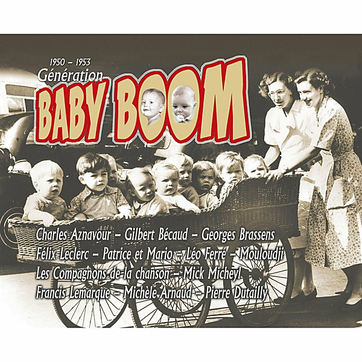

# 1950

By **Anton Karas**

## Album Data

- **Catalog:** Beets
- **Format:** Digital, Album
- **Album:** 1950
- **Artist:** Anton Karas
- **Albumartist:** Anton Karas
- **Genre:** Schlager
- **MusicBrainz Album Artist ID:** 
- **MusicBrainz Album ID:** 
- **MusicBrainz Release Group ID:** 
- **Year:** 1950
- **Catalog #:** 
- **Label:** 
- **Total Tracks:** 00

## Album Tracks

### Track 01 - Third Man Theme

- **Artist:** Anton Karas
- **Format:** AAC
- **Genre:** Schlager
- **Length:** 3:18
- **MusicBrainz Track ID:** 
- **Title:** Third Man Theme
- **Track:** 01
- **Year:** 1950

