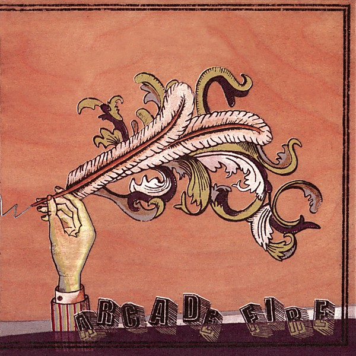

# Funeral

By **Arcade Fire**

## Album Data

- **Catalog:** Beets
- **Format:** Digital, Album
- **Album:** Funeral
- **Artist:** Arcade Fire
- **Albumartist:** Arcade Fire
- **Genre:** Indie Rock
- **MusicBrainz Album Artist ID:** [52074ba6-e495-4ef3-9bb4-0703888a9f68](https://musicbrainz.org/artist/52074ba6-e495-4ef3-9bb4-0703888a9f68)
- **MusicBrainz Album ID:** [da4becdc-1614-458e-b7cd-13ac1a711a34](https://musicbrainz.org/release/da4becdc-1614-458e-b7cd-13ac1a711a34)
- **MusicBrainz Release Group ID:** [05affa96-5959-32da-8d75-1c9eb985ca59](https://musicbrainz.org/release-group/05affa96-5959-32da-8d75-1c9eb985ca59)
- **Year:** 2004
- **Catalog #:** 
- **Label:** 
- **Total Tracks:** 10

## Album Tracks

### Track 01 - Neighborhood #1 (Tunnels)

- **Artist:** Arcade Fire
- **Format:** MP3
- **Genre:** Indie Rock
- **Length:** 4:48
- **MusicBrainz Track ID:** [e6d80ec5-85b3-4900-8e52-f83e9bf16852](https://musicbrainz.org/recording/e6d80ec5-85b3-4900-8e52-f83e9bf16852)
- **Title:** Neighborhood #1 (Tunnels)
- **Track:** 01
- **Year:** 2004

### Track 02 - Neighborhood #2 (Laïka)

- **Artist:** Arcade Fire
- **Format:** MP3
- **Genre:** Indie Rock
- **Length:** 3:32
- **MusicBrainz Track ID:** [c05048f1-47f6-4532-8d98-75ca80fa1792](https://musicbrainz.org/recording/c05048f1-47f6-4532-8d98-75ca80fa1792)
- **Title:** Neighborhood #2 (Laïka)
- **Track:** 02
- **Year:** 2004

### Track 03 - Une année sans lumière

- **Artist:** Arcade Fire
- **Format:** MP3
- **Genre:** Indie Rock
- **Length:** 3:40
- **MusicBrainz Track ID:** [d2e67c9e-3600-450c-aa69-cab51ff0c990](https://musicbrainz.org/recording/d2e67c9e-3600-450c-aa69-cab51ff0c990)
- **Title:** Une année sans lumière
- **Track:** 03
- **Year:** 2004

### Track 04 - Neighborhood #3 (Power Out)

- **Artist:** Arcade Fire
- **Format:** MP3
- **Genre:** Indie Rock
- **Length:** 5:12
- **MusicBrainz Track ID:** [07689d4c-540d-4518-9a41-52931b7f061f](https://musicbrainz.org/recording/07689d4c-540d-4518-9a41-52931b7f061f)
- **Title:** Neighborhood #3 (Power Out)
- **Track:** 04
- **Year:** 2004

### Track 05 - Neighborhood #4 (7 Kettles)

- **Artist:** Arcade Fire
- **Format:** MP3
- **Genre:** Indie Rock
- **Length:** 4:49
- **MusicBrainz Track ID:** [fbf3c1c1-b5cf-41a1-8818-ccb3c7e231be](https://musicbrainz.org/recording/fbf3c1c1-b5cf-41a1-8818-ccb3c7e231be)
- **Title:** Neighborhood #4 (7 Kettles)
- **Track:** 05
- **Year:** 2004

### Track 06 - Crown of Love

- **Artist:** Arcade Fire
- **Format:** MP3
- **Genre:** Indie Rock
- **Length:** 4:42
- **MusicBrainz Track ID:** [5551e780-656c-410f-91ff-03aed3af9b7a](https://musicbrainz.org/recording/5551e780-656c-410f-91ff-03aed3af9b7a)
- **Title:** Crown of Love
- **Track:** 06
- **Year:** 2004

### Track 07 - Wake Up

- **Artist:** Arcade Fire
- **Format:** MP3
- **Genre:** Indie Rock
- **Length:** 5:35
- **MusicBrainz Track ID:** [a1a4b6c4-d1c5-4a26-b155-75052d407c83](https://musicbrainz.org/recording/a1a4b6c4-d1c5-4a26-b155-75052d407c83)
- **Title:** Wake Up
- **Track:** 07
- **Year:** 2004

### Track 08 - Haïti

- **Artist:** Arcade Fire
- **Format:** MP3
- **Genre:** Indie Rock
- **Length:** 4:07
- **MusicBrainz Track ID:** [7ead9a3d-902c-404f-97e4-bb03f2dc8c56](https://musicbrainz.org/recording/7ead9a3d-902c-404f-97e4-bb03f2dc8c56)
- **Title:** Haïti
- **Track:** 08
- **Year:** 2004

### Track 09 - Rebellion (Lies)

- **Artist:** Arcade Fire
- **Format:** MP3
- **Genre:** Indie Rock
- **Length:** 5:10
- **MusicBrainz Track ID:** [f874c752-65bc-4d50-ac7e-932243ae9f02](https://musicbrainz.org/recording/f874c752-65bc-4d50-ac7e-932243ae9f02)
- **Title:** Rebellion (Lies)
- **Track:** 09
- **Year:** 2004

### Track 10 - In the Backseat

- **Artist:** Arcade Fire
- **Format:** MP3
- **Genre:** Indie Rock
- **Length:** 6:20
- **MusicBrainz Track ID:** [5781661a-6adf-4e82-8fc3-2ef0f6a22454](https://musicbrainz.org/recording/5781661a-6adf-4e82-8fc3-2ef0f6a22454)
- **Title:** In the Backseat
- **Track:** 10
- **Year:** 2004

## See also

- [Roon: Funeral](../../Roon/Arcade_Fire/Funeral.md)
