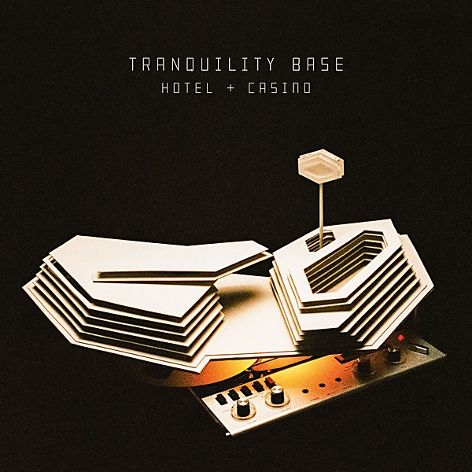

# Tranquility Base Hotel + Casino

By **Arctic Monkeys**

## Album Data

- **Catalog:** Beets
- **Format:** Digital, Album
- **Album:** Tranquility Base Hotel + Casino
- **Artist:** Arctic Monkeys
- **Albumartist:** Arctic Monkeys
- **Genre:** Indie Rock
- **MusicBrainz Album Artist ID:** [ada7a83c-e3e1-40f1-93f9-3e73dbc9298a](https://musicbrainz.org/artist/ada7a83c-e3e1-40f1-93f9-3e73dbc9298a)
- **MusicBrainz Album ID:** [7736fac1-8e0c-4734-8b5e-d9a6392850dd](https://musicbrainz.org/release/7736fac1-8e0c-4734-8b5e-d9a6392850dd)
- **MusicBrainz Release Group ID:** [97ee3a0f-183b-4830-aa5c-45507a084d37](https://musicbrainz.org/release-group/97ee3a0f-183b-4830-aa5c-45507a084d37)
- **Year:** 2018
- **Catalog #:** HSE-1339
- **Label:** Hostess Entertainment Unlimited.
- **Total Tracks:** 11

## Album Tracks

### Track 01 - Star Treatment

- **Artist:** Arctic Monkeys
- **Format:** ALAC
- **Genre:** Indie Rock
- **Length:** 5:54
- **MusicBrainz Track ID:** [c4540caa-9f07-4a2f-a95f-c4a9e7356fd1](https://musicbrainz.org/recording/c4540caa-9f07-4a2f-a95f-c4a9e7356fd1)
- **Title:** Star Treatment
- **Track:** 01
- **Year:** 2018

### Track 02 - One Point Perspective

- **Artist:** Arctic Monkeys
- **Format:** ALAC
- **Genre:** Indie Rock
- **Length:** 3:28
- **MusicBrainz Track ID:** [71613e9d-535a-4a8d-bc6d-1bfc9acc2999](https://musicbrainz.org/recording/71613e9d-535a-4a8d-bc6d-1bfc9acc2999)
- **Title:** One Point Perspective
- **Track:** 02
- **Year:** 2018

### Track 03 - American Sports

- **Artist:** Arctic Monkeys
- **Format:** ALAC
- **Genre:** Indie Rock
- **Length:** 2:38
- **MusicBrainz Track ID:** [f64f0e47-3da2-4389-aecc-624e55af5b35](https://musicbrainz.org/recording/f64f0e47-3da2-4389-aecc-624e55af5b35)
- **Title:** American Sports
- **Track:** 03
- **Year:** 2018

### Track 04 - Tranquility Base Hotel + Casino

- **Artist:** Arctic Monkeys
- **Format:** ALAC
- **Genre:** Indie Rock
- **Length:** 3:32
- **MusicBrainz Track ID:** [5e6711e2-d8cf-403a-8ac5-4994e3f2f9f7](https://musicbrainz.org/recording/5e6711e2-d8cf-403a-8ac5-4994e3f2f9f7)
- **Title:** Tranquility Base Hotel + Casino
- **Track:** 04
- **Year:** 2018

### Track 05 - Golden Trunks

- **Artist:** Arctic Monkeys
- **Format:** ALAC
- **Genre:** Indie Rock
- **Length:** 2:53
- **MusicBrainz Track ID:** [e286e5cd-d8fb-419b-96f6-fc000dee2888](https://musicbrainz.org/recording/e286e5cd-d8fb-419b-96f6-fc000dee2888)
- **Title:** Golden Trunks
- **Track:** 05
- **Year:** 2018

### Track 06 - Four Out of Five

- **Artist:** Arctic Monkeys
- **Format:** ALAC
- **Genre:** Indie Rock
- **Length:** 5:12
- **MusicBrainz Track ID:** [509742f6-6b34-4dd9-9f8c-d4112e283d4e](https://musicbrainz.org/recording/509742f6-6b34-4dd9-9f8c-d4112e283d4e)
- **Title:** Four Out of Five
- **Track:** 06
- **Year:** 2018

### Track 07 - The World's First Ever Monster Truck Front Flip

- **Artist:** Arctic Monkeys
- **Format:** ALAC
- **Genre:** Indie Rock
- **Length:** 3:00
- **MusicBrainz Track ID:** [926d2a04-0306-4cd5-82b6-d4647f10cd73](https://musicbrainz.org/recording/926d2a04-0306-4cd5-82b6-d4647f10cd73)
- **Title:** The World's First Ever Monster Truck Front Flip
- **Track:** 07
- **Year:** 2018

### Track 08 - Science Fiction

- **Artist:** Arctic Monkeys
- **Format:** ALAC
- **Genre:** Indie Rock
- **Length:** 3:05
- **MusicBrainz Track ID:** [e35f0788-05f5-40e5-acfa-bad6b4f20750](https://musicbrainz.org/recording/e35f0788-05f5-40e5-acfa-bad6b4f20750)
- **Title:** Science Fiction
- **Track:** 08
- **Year:** 2018

### Track 09 - She Looks Like Fun

- **Artist:** Arctic Monkeys
- **Format:** ALAC
- **Genre:** Indie Rock
- **Length:** 3:02
- **MusicBrainz Track ID:** [ec1c4a36-fa36-4628-8d40-77f59e6d1d56](https://musicbrainz.org/recording/ec1c4a36-fa36-4628-8d40-77f59e6d1d56)
- **Title:** She Looks Like Fun
- **Track:** 09
- **Year:** 2018

### Track 10 - Batphone

- **Artist:** Arctic Monkeys
- **Format:** ALAC
- **Genre:** Indie Rock
- **Length:** 4:31
- **MusicBrainz Track ID:** [dac8e2fc-b38d-44c5-a444-c4ebded524a4](https://musicbrainz.org/recording/dac8e2fc-b38d-44c5-a444-c4ebded524a4)
- **Title:** Batphone
- **Track:** 10
- **Year:** 2018

### Track 11 - The Ultracheese

- **Artist:** Arctic Monkeys
- **Format:** ALAC
- **Genre:** Indie Rock
- **Length:** 3:37
- **MusicBrainz Track ID:** [a88328d6-78c0-4c33-b3f6-ce27169ec03c](https://musicbrainz.org/recording/a88328d6-78c0-4c33-b3f6-ce27169ec03c)
- **Title:** The Ultracheese
- **Track:** 11
- **Year:** 2018

