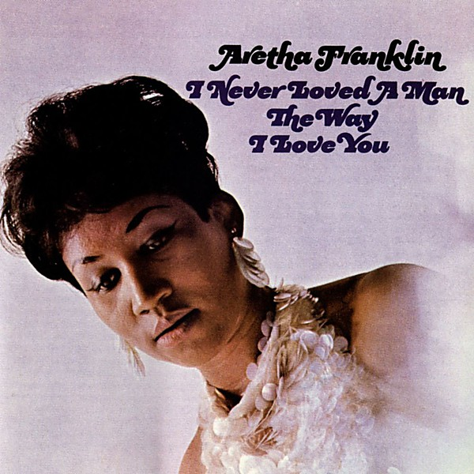

# I Never Loved a Man the Way I Love You

By **Aretha Franklin**

## Album Data

- **Catalog:** Beets
- **Format:** Digital, Album
- **Album:** I Never Loved a Man the Way I Love You
- **Artist:** Aretha Franklin
- **Albumartist:** Aretha Franklin
- **Genre:** Soul
- **MusicBrainz Album Artist ID:** [2f9ecbed-27be-40e6-abca-6de49d50299e](https://musicbrainz.org/artist/2f9ecbed-27be-40e6-abca-6de49d50299e)
- **MusicBrainz Album ID:** [d3556fe9-207e-40e9-a60a-540b8270ab26](https://musicbrainz.org/release/d3556fe9-207e-40e9-a60a-540b8270ab26)
- **MusicBrainz Release Group ID:** [7d8f07a7-4c64-3afb-8daf-8f1d4df89a78](https://musicbrainz.org/release-group/7d8f07a7-4c64-3afb-8daf-8f1d4df89a78)
- **Year:** 2013
- **Catalog #:** WPCR-27601
- **Label:** Atlantic
- **Total Tracks:** 14

## Album Tracks

### Track 01 - Respect

- **Artist:** Aretha Franklin
- **Format:** ALAC
- **Genre:** Soul
- **Length:** 2:27
- **MusicBrainz Track ID:** [4855f9bc-1189-4915-aeba-1871cf6016c9](https://musicbrainz.org/recording/4855f9bc-1189-4915-aeba-1871cf6016c9)
- **Title:** Respect
- **Track:** 01
- **Year:** 2013

### Track 02 - Drown in My Own Tears

- **Artist:** Aretha Franklin
- **Format:** ALAC
- **Genre:** Soul
- **Length:** 4:07
- **MusicBrainz Track ID:** [1f558084-f0c6-49a7-ad6a-a32119a1fc2d](https://musicbrainz.org/recording/1f558084-f0c6-49a7-ad6a-a32119a1fc2d)
- **Title:** Drown in My Own Tears
- **Track:** 02
- **Year:** 2013

### Track 03 - I Never Loved a Man (The Way I Love You)

- **Artist:** Aretha Franklin
- **Format:** ALAC
- **Genre:** Soul
- **Length:** 2:51
- **MusicBrainz Track ID:** [a0d90e97-442d-4bb6-86fc-b0af8b572846](https://musicbrainz.org/recording/a0d90e97-442d-4bb6-86fc-b0af8b572846)
- **Title:** I Never Loved a Man (The Way I Love You)
- **Track:** 03
- **Year:** 2013

### Track 04 - Soul Serenade

- **Artist:** Aretha Franklin
- **Format:** ALAC
- **Genre:** Soul
- **Length:** 2:39
- **MusicBrainz Track ID:** [1bf2d906-97ac-4c2d-acd4-e10e12b9c781](https://musicbrainz.org/recording/1bf2d906-97ac-4c2d-acd4-e10e12b9c781)
- **Title:** Soul Serenade
- **Track:** 04
- **Year:** 2013

### Track 05 - Don’t Let Me Lose This Dream

- **Artist:** Aretha Franklin
- **Format:** ALAC
- **Genre:** Soul
- **Length:** 2:23
- **MusicBrainz Track ID:** [d48322f4-2cdb-4a6c-bfc2-66215b6fd29f](https://musicbrainz.org/recording/d48322f4-2cdb-4a6c-bfc2-66215b6fd29f)
- **Title:** Don’t Let Me Lose This Dream
- **Track:** 05
- **Year:** 2013

### Track 06 - Baby, Baby, Baby

- **Artist:** Aretha Franklin
- **Format:** ALAC
- **Genre:** Soul
- **Length:** 2:54
- **MusicBrainz Track ID:** [fb5bf77c-4371-4135-b38c-aa8a368e5086](https://musicbrainz.org/recording/fb5bf77c-4371-4135-b38c-aa8a368e5086)
- **Title:** Baby, Baby, Baby
- **Track:** 06
- **Year:** 2013

### Track 07 - Dr. Feelgood (Love Is a Serious Business)

- **Artist:** Aretha Franklin
- **Format:** ALAC
- **Genre:** Soul
- **Length:** 3:23
- **MusicBrainz Track ID:** [63afff66-371a-4016-bc48-efb948316ed0](https://musicbrainz.org/recording/63afff66-371a-4016-bc48-efb948316ed0)
- **Title:** Dr. Feelgood (Love Is a Serious Business)
- **Track:** 07
- **Year:** 2013

### Track 08 - Good Times

- **Artist:** Aretha Franklin
- **Format:** ALAC
- **Genre:** Soul
- **Length:** 2:10
- **MusicBrainz Track ID:** [64f7788e-53d1-498e-806c-704c0ef4b2a7](https://musicbrainz.org/recording/64f7788e-53d1-498e-806c-704c0ef4b2a7)
- **Title:** Good Times
- **Track:** 08
- **Year:** 2013

### Track 09 - Do Right Woman – Do Right Man

- **Artist:** Aretha Franklin
- **Format:** ALAC
- **Genre:** Soul
- **Length:** 3:16
- **MusicBrainz Track ID:** [8ddc1396-f0b6-40b9-84b4-ca3efa7d7869](https://musicbrainz.org/recording/8ddc1396-f0b6-40b9-84b4-ca3efa7d7869)
- **Title:** Do Right Woman – Do Right Man
- **Track:** 09
- **Year:** 2013

### Track 10 - Save Me

- **Artist:** Aretha Franklin
- **Format:** ALAC
- **Genre:** Soul
- **Length:** 2:21
- **MusicBrainz Track ID:** [ff109218-a975-4051-9b5b-2e2a55ec0126](https://musicbrainz.org/recording/ff109218-a975-4051-9b5b-2e2a55ec0126)
- **Title:** Save Me
- **Track:** 10
- **Year:** 2013

### Track 11 - A Change Is Gonna Come

- **Artist:** Aretha Franklin
- **Format:** ALAC
- **Genre:** Soul
- **Length:** 4:20
- **MusicBrainz Track ID:** [cc8752aa-292d-489d-bc02-574cceceadf8](https://musicbrainz.org/recording/cc8752aa-292d-489d-bc02-574cceceadf8)
- **Title:** A Change Is Gonna Come
- **Track:** 11
- **Year:** 2013

### Track 12 - Respect (mono version)

- **Artist:** Aretha Franklin
- **Format:** ALAC
- **Genre:** Soul
- **Length:** 2:28
- **MusicBrainz Track ID:** [04bb8880-4c81-4d23-8b09-f294f7222921](https://musicbrainz.org/recording/04bb8880-4c81-4d23-8b09-f294f7222921)
- **Title:** Respect (mono version)
- **Track:** 12
- **Year:** 2013

### Track 13 - I Never Loved a Man (The Way I Love You) (mono version)

- **Artist:** Aretha Franklin
- **Format:** ALAC
- **Genre:** Soul
- **Length:** 2:46
- **MusicBrainz Track ID:** [5beb05d0-6ef5-4bd4-9b60-57f99f1bd751](https://musicbrainz.org/recording/5beb05d0-6ef5-4bd4-9b60-57f99f1bd751)
- **Title:** I Never Loved a Man (The Way I Love You) (mono version)
- **Track:** 13
- **Year:** 2013

### Track 14 - Do Right Woman – Do Right Man (mono version)

- **Artist:** Aretha Franklin
- **Format:** ALAC
- **Genre:** Soul
- **Length:** 3:14
- **MusicBrainz Track ID:** [dc6b9f6e-28c5-4756-8e35-5d978ca1c2fd](https://musicbrainz.org/recording/dc6b9f6e-28c5-4756-8e35-5d978ca1c2fd)
- **Title:** Do Right Woman – Do Right Man (mono version)
- **Track:** 14
- **Year:** 2013

## See also

- [Gospel Greats](Gospel_Greats.md)
- [Roon: Aretha In Person with The Ray Bryant Combo (Expanded Edition)](../../Roon/Aretha_Franklin/Aretha_In_Person_with_The_Ray_Bryant_Combo_Expanded_Edition.md)
- [Roon: Aretha](../../Roon/Aretha_Franklin/Aretha.md)
- [Roon: Aretha Now](../../Roon/Aretha_Franklin/Aretha_Now.md)
- [Roon: I Never Loved A Man The Way I Loved You](../../Roon/Aretha_Franklin/I_Never_Loved_A_Man_The_Way_I_Loved_You.md)
- [Roon: Lady Soul](../../Roon/Aretha_Franklin/Lady_Soul.md)
- [Roon: Soul '69](../../Roon/Aretha_Franklin/Soul_69.md)
- [Roon: Spirit in the Dark](../../Roon/Aretha_Franklin/Spirit_in_the_Dark.md)
- [Roon: The Electrifying Aretha Franklin (Expanded Edition)](../../Roon/Aretha_Franklin/The_Electrifying_Aretha_Franklin_Expanded_Edition.md)
- [Roon: The Tender, The Moving, The Swinging Aretha Franklin (Expanded Edition)](../../Roon/Aretha_Franklin/The_Tender__The_Moving__The_Swinging_Aretha_Franklin_Expanded_Edition.md)
- [Roon: Young, Gifted and Black](../../Roon/Aretha_Franklin/Young__Gifted_and_Black.md)
- [Vinyl: ](../../Vinyl/Aretha_Franklin/Aretha_Franklin.md)
- [Vinyl: Freeway Of Love](../../Vinyl/Aretha_Franklin/Freeway_Of_Love.md)
