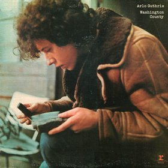

# Washington County

By **Arlo Guthrie**

## Album Data

- **Catalog:** Beets
- **Format:** Digital, Album
- **Album:** Washington County
- **Artist:** Arlo Guthrie
- **Albumartist:** Arlo Guthrie
- **Genre:** Americana
- **MusicBrainz Album Artist ID:** [b8efe8ac-45db-4a71-bb51-c1503986172f](https://musicbrainz.org/artist/b8efe8ac-45db-4a71-bb51-c1503986172f)
- **MusicBrainz Album ID:** [aa5aaf46-4b25-4f87-ad94-d6368b538187](https://musicbrainz.org/release/aa5aaf46-4b25-4f87-ad94-d6368b538187)
- **MusicBrainz Release Group ID:** [56d2d6d5-323b-33f9-82e3-76405e23f7d1](https://musicbrainz.org/release-group/56d2d6d5-323b-33f9-82e3-76405e23f7d1)
- **Year:** 2004
- **Catalog #:** RSR 1105
- **Label:** Rising Son Records
- **Total Tracks:** 10

## Album Tracks

### Track 01 - Introduction

- **Artist:** Arlo Guthrie
- **Format:** MP3
- **Genre:** Americana
- **Length:** 3:20
- **MusicBrainz Track ID:** [a045d269-f825-474c-85ee-3a3b6828f072](https://musicbrainz.org/recording/a045d269-f825-474c-85ee-3a3b6828f072)
- **Title:** Introduction
- **Track:** 01
- **Year:** 2004

### Track 02 - Fencepost Blues

- **Artist:** Arlo Guthrie
- **Format:** MP3
- **Genre:** Folk Rock
- **Length:** 3:08
- **MusicBrainz Track ID:** [01b29bcc-2868-4246-8650-9ec3d12011b5](https://musicbrainz.org/recording/01b29bcc-2868-4246-8650-9ec3d12011b5)
- **Title:** Fencepost Blues
- **Track:** 02
- **Year:** 2004

### Track 03 - Gabriel's Mother's Highway Ballad #16

- **Artist:** Arlo Guthrie
- **Format:** MP3
- **Genre:** Americana
- **Length:** 6:22
- **MusicBrainz Track ID:** [69171ed9-b47e-42b1-bcde-d9fcb9bc4c1b](https://musicbrainz.org/recording/69171ed9-b47e-42b1-bcde-d9fcb9bc4c1b)
- **Title:** Gabriel's Mother's Highway Ballad #16
- **Track:** 03
- **Year:** 2004

### Track 04 - Washington County

- **Artist:** Arlo Guthrie
- **Format:** MP3
- **Genre:** Bluegrass
- **Length:** 1:57
- **MusicBrainz Track ID:** [58a00b16-6f22-476b-b129-6edf5893a5bc](https://musicbrainz.org/recording/58a00b16-6f22-476b-b129-6edf5893a5bc)
- **Title:** Washington County
- **Track:** 04
- **Year:** 2004

### Track 05 - Valley to Pray

- **Artist:** Arlo Guthrie
- **Format:** MP3
- **Genre:** Folk Rock
- **Length:** 2:43
- **MusicBrainz Track ID:** [3b1287be-6229-4de9-a0fb-fc467d389143](https://musicbrainz.org/recording/3b1287be-6229-4de9-a0fb-fc467d389143)
- **Title:** Valley to Pray
- **Track:** 05
- **Year:** 2004

### Track 06 - Lay Down Little Doggies

- **Artist:** Arlo Guthrie
- **Format:** MP3
- **Genre:** Americana
- **Length:** 3:16
- **MusicBrainz Track ID:** [738190b8-6aff-4882-8f7a-78e8d9a14e93](https://musicbrainz.org/recording/738190b8-6aff-4882-8f7a-78e8d9a14e93)
- **Title:** Lay Down Little Doggies
- **Track:** 06
- **Year:** 2004

### Track 07 - I Could Be Singing

- **Artist:** Arlo Guthrie
- **Format:** MP3
- **Genre:** Americana
- **Length:** 3:17
- **MusicBrainz Track ID:** [f668b3e2-47a9-4657-a535-668fb95a08b6](https://musicbrainz.org/recording/f668b3e2-47a9-4657-a535-668fb95a08b6)
- **Title:** I Could Be Singing
- **Track:** 07
- **Year:** 2004

### Track 08 - If You Would Just Drop By

- **Artist:** Arlo Guthrie
- **Format:** MP3
- **Genre:** Americana
- **Length:** 4:20
- **MusicBrainz Track ID:** [1471b4b5-aa23-4b8e-b698-d1e696aa5c74](https://musicbrainz.org/recording/1471b4b5-aa23-4b8e-b698-d1e696aa5c74)
- **Title:** If You Would Just Drop By
- **Track:** 08
- **Year:** 2004

### Track 09 - Percy's Song

- **Artist:** Arlo Guthrie
- **Format:** MP3
- **Genre:** Americana
- **Length:** 4:56
- **MusicBrainz Track ID:** [953b4565-795f-425a-9590-a8350ed5af96](https://musicbrainz.org/recording/953b4565-795f-425a-9590-a8350ed5af96)
- **Title:** Percy's Song
- **Track:** 09
- **Year:** 2004

### Track 10 - I Want to Be Around

- **Artist:** Arlo Guthrie
- **Format:** MP3
- **Genre:** Americana
- **Length:** 2:41
- **MusicBrainz Track ID:** [1c6cf54f-54a4-4328-a2f9-93502b9441f6](https://musicbrainz.org/recording/1c6cf54f-54a4-4328-a2f9-93502b9441f6)
- **Title:** I Want to Be Around
- **Track:** 10
- **Year:** 2004

## See also

- [Arlo Guthrie](Arlo_Guthrie.md)
- [Running Down the Road](Running_Down_the_Road.md)
- [Woody's 20 Grow Big Songs](Woodys_20_Grow_Big_Songs.md)
