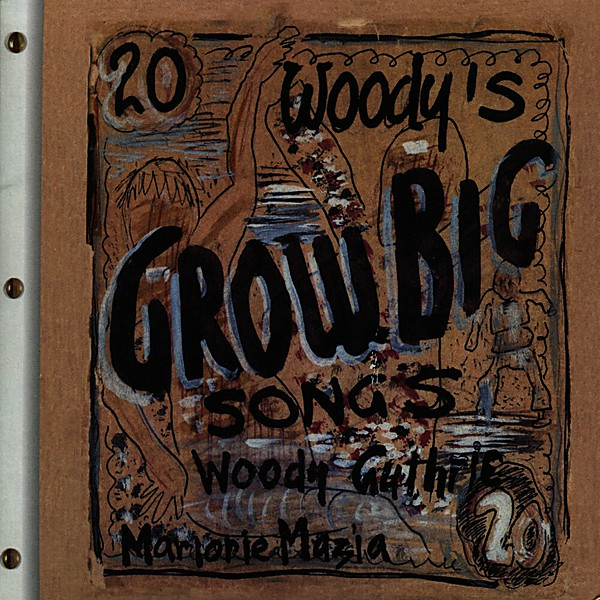

# Woody's 20 Grow Big Songs

By **Arlo Guthrie**

## Album Data

- **Catalog:** Beets
- **Format:** Digital, Album
- **Album:** Woody's 20 Grow Big Songs
- **Artist:** Arlo Guthrie
- **Albumartist:** Arlo Guthrie
- **Genre:** Americana
- **MusicBrainz Album Artist ID:** 
- **MusicBrainz Album ID:** 
- **MusicBrainz Release Group ID:** 
- **Year:** 0000
- **Catalog #:** KOC-CD-7953
- **Label:** KOCH
- **Total Tracks:** 11

## Album Tracks

### Track 01 - Won't Be Long

- **Artist:** Arlo Guthrie
- **Format:** MP3
- **Genre:** Folk Rock
- **Length:** 2:38
- **MusicBrainz Track ID:** [11bcd700-23c1-4e4a-9092-b32fe17260cd](https://musicbrainz.org/recording/11bcd700-23c1-4e4a-9092-b32fe17260cd)
- **Title:** Won't Be Long
- **Track:** 01
- **Year:** 1997

### Track 02 - Presidential Rag

- **Artist:** Arlo Guthrie
- **Format:** MP3
- **Genre:** Folk Rock
- **Length:** 4:27
- **MusicBrainz Track ID:** [377aa3e5-f8bb-4544-b8de-e9e8f4d591ac](https://musicbrainz.org/recording/377aa3e5-f8bb-4544-b8de-e9e8f4d591ac)
- **Title:** Presidential Rag
- **Track:** 02
- **Year:** 1997

### Track 03 - Deportees

- **Artist:** Arlo Guthrie
- **Format:** MP3
- **Genre:** Folk Rock
- **Length:** 3:49
- **MusicBrainz Track ID:** [afc4a2c7-7b2b-437a-afa0-0d2ed80ad621](https://musicbrainz.org/recording/afc4a2c7-7b2b-437a-afa0-0d2ed80ad621)
- **Title:** Deportees
- **Track:** 03
- **Year:** 1997

### Track 04 - Children of Abraham

- **Artist:** Arlo Guthrie
- **Format:** MP3
- **Genre:** Folk Rock
- **Length:** 2:25
- **MusicBrainz Track ID:** [8348190f-f5b3-4768-be90-3e7bd1bb18d5](https://musicbrainz.org/recording/8348190f-f5b3-4768-be90-3e7bd1bb18d5)
- **Title:** Children of Abraham
- **Track:** 04
- **Year:** 1997

### Track 05 - Nostalgia

- **Artist:** Arlo Guthrie
- **Format:** MP3
- **Genre:** Folk Rock
- **Length:** 2:50
- **MusicBrainz Track ID:** [bd47e326-d2a3-447b-951e-72a2e7f32776](https://musicbrainz.org/recording/bd47e326-d2a3-447b-951e-72a2e7f32776)
- **Title:** Nostalgia
- **Track:** 05
- **Year:** 1997

### Track 06 - When the Cactus Is in Bloom

- **Artist:** Arlo Guthrie
- **Format:** MP3
- **Genre:** Folk Rock
- **Length:** 2:18
- **MusicBrainz Track ID:** [6d8bac66-b590-4b4b-ba82-466e1c80c1cb](https://musicbrainz.org/recording/6d8bac66-b590-4b4b-ba82-466e1c80c1cb)
- **Title:** When the Cactus Is in Bloom
- **Track:** 06
- **Year:** 1997

### Track 07 - Me and My Goose

- **Artist:** Arlo Guthrie
- **Format:** MP3
- **Genre:** Folk Rock
- **Length:** 1:59
- **MusicBrainz Track ID:** [e5950d6c-d5a0-4048-b640-e6cd5a4b96de](https://musicbrainz.org/recording/e5950d6c-d5a0-4048-b640-e6cd5a4b96de)
- **Title:** Me and My Goose
- **Track:** 07
- **Year:** 1997

### Track 08 - Bling Blang

- **Artist:** Arlo Guthrie
- **Format:** MP3
- **Genre:** Folk Rock
- **Length:** 2:44
- **MusicBrainz Track ID:** [533030c3-490e-486c-96b3-c00a851ddc90](https://musicbrainz.org/recording/533030c3-490e-486c-96b3-c00a851ddc90)
- **Title:** Bling Blang
- **Track:** 08
- **Year:** 1997

### Track 09 - Go Down Moses

- **Artist:** Arlo Guthrie
- **Format:** MP3
- **Genre:** Folk Rock
- **Length:** 2:41
- **MusicBrainz Track ID:** [20aba1e9-b997-4b6f-bedc-e28e2a870bd8](https://musicbrainz.org/recording/20aba1e9-b997-4b6f-bedc-e28e2a870bd8)
- **Title:** Go Down Moses
- **Track:** 09
- **Year:** 1997

### Track 10 - Hard Times

- **Artist:** Arlo Guthrie
- **Format:** MP3
- **Genre:** Folk Rock
- **Length:** 2:41
- **MusicBrainz Track ID:** [7a9c2ec8-6ca7-47e0-84b2-c1b1537dcb8b](https://musicbrainz.org/recording/7a9c2ec8-6ca7-47e0-84b2-c1b1537dcb8b)
- **Title:** Hard Times
- **Track:** 10
- **Year:** 1997

### Track 11 - Last to Leave

- **Artist:** Arlo Guthrie
- **Format:** MP3
- **Genre:** Folk Rock
- **Length:** 2:32
- **MusicBrainz Track ID:** [c4eb01dc-ed9e-42b8-a823-bf7b83599bc8](https://musicbrainz.org/recording/c4eb01dc-ed9e-42b8-a823-bf7b83599bc8)
- **Title:** Last to Leave
- **Track:** 11
- **Year:** 1997

## See also

- [Arlo Guthrie](Arlo_Guthrie.md)
- [Running Down the Road](Running_Down_the_Road.md)
- [Washington County](Washington_County.md)
