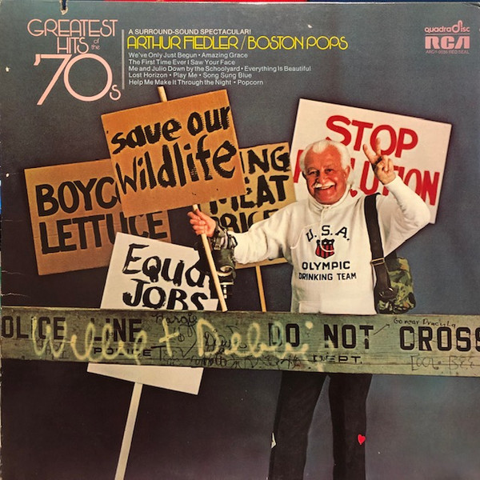

# Greatest Hits of the 70's

By **Arthur Fiedler**

## Album Data

- **Catalog:** Beets
- **Format:** Digital, Album
- **Album:** Greatest Hits of the 70's
- **Artist:** Arthur Fiedler
- **Albumartist:** Arthur Fiedler
- **Genre:** Orchestra
- **MusicBrainz Album Artist ID:** 
- **MusicBrainz Album ID:** 
- **MusicBrainz Release Group ID:** 
- **Year:** 0000
- **Catalog #:** 
- **Label:** 
- **Total Tracks:** 00

## Album Tracks

### Track 01 - Slaughter on Tenth Avenue

- **Artist:** Arthur Fiedler
- **Format:** AAC
- **Genre:** Orchestra
- **Length:** 8:53
- **MusicBrainz Track ID:** 
- **Title:** Slaughter on Tenth Avenue
- **Track:** 01
- **Year:** 0000

### Track 02 - Mack the Knife

- **Artist:** Arthur Fiedler
- **Format:** AAC
- **Genre:** Orchestra
- **Length:** 3:08
- **MusicBrainz Track ID:** 
- **Title:** Mack the Knife
- **Track:** 02
- **Year:** 0000

### Track 03 - Theme from Peter Gunn

- **Artist:** Arthur Fiedler
- **Format:** AAC
- **Genre:** Orchestra
- **Length:** 1:56
- **MusicBrainz Track ID:** 
- **Title:** Theme from Peter Gunn
- **Track:** 03
- **Year:** 0000

### Track 04 - West Side Story Medley

- **Artist:** Arthur Fiedler
- **Format:** AAC
- **Genre:** Orchestra
- **Length:** 8:56
- **MusicBrainz Track ID:** 
- **Title:** West Side Story Medley
- **Track:** 04
- **Year:** 0000

### Track 05 - Hey Look Me Over

- **Artist:** Arthur Fiedler
- **Format:** AAC
- **Genre:** Orchestra
- **Length:** 1:56
- **MusicBrainz Track ID:** 
- **Title:** Hey Look Me Over
- **Track:** 05
- **Year:** 0000

### Track 06 - Never on Sunday

- **Artist:** Arthur Fiedler
- **Format:** AAC
- **Genre:** Orchestra
- **Length:** 3:04
- **MusicBrainz Track ID:** 
- **Title:** Never on Sunday
- **Track:** 06
- **Year:** 0000

### Track 07 - Theme from Exodus

- **Artist:** Arthur Fiedler
- **Format:** AAC
- **Genre:** Orchestra
- **Length:** 3:41
- **MusicBrainz Track ID:** 
- **Title:** Theme from Exodus
- **Track:** 07
- **Year:** 0000

### Track 08 - Them from The Apartment

- **Artist:** Arthur Fiedler
- **Format:** AAC
- **Genre:** Orchestra
- **Length:** 4:38
- **MusicBrainz Track ID:** 
- **Title:** Them from The Apartment
- **Track:** 08
- **Year:** 0000

### Track 09 - Parade of the Charioteers

- **Artist:** Arthur Fiedler
- **Format:** AAC
- **Genre:** Orchestra
- **Length:** 3:47
- **MusicBrainz Track ID:** 
- **Title:** Parade of the Charioteers
- **Track:** 09
- **Year:** 0000

### Track 10 - Fancy Free Three Dances

- **Artist:** Arthur Fiedler
- **Format:** AAC
- **Genre:** Orchestra
- **Length:** 6:37
- **MusicBrainz Track ID:** 
- **Title:** Fancy Free Three Dances
- **Track:** 10
- **Year:** 0000

## See also

- [Slaughter On Tenth Avenue](Slaughter_On_Tenth_Avenue.md)
