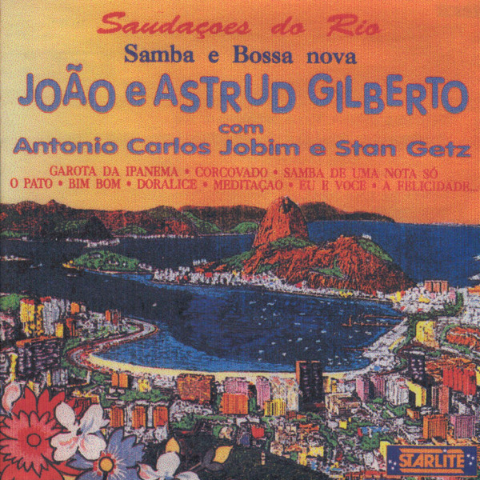

# Samba E Bossa Nova

By **Astrud & Joao Gilberto**

## Album Data

- **Catalog:** Beets
- **Format:** Digital, Album
- **Album:** Samba E Bossa Nova
- **Artist:** Astrud & Joao Gilberto
- **Albumartist:** Astrud & Joao Gilberto
- **Genre:** Bossa Nova
- **MusicBrainz Album Artist ID:** 
- **MusicBrainz Album ID:** 
- **MusicBrainz Release Group ID:** 
- **Year:** 0000
- **Catalog #:** 
- **Label:** 
- **Total Tracks:** 15

## Album Tracks

### Track 01 - Samba De Uma Nota So

- **Artist:** Astrud & Joao Gilberto
- **Format:** ALAC
- **Genre:** Bossa Nova
- **Length:** 3:22
- **MusicBrainz Track ID:** 
- **Title:** Samba De Uma Nota So
- **Track:** 01
- **Year:** 0000

### Track 02 - Meditacao

- **Artist:** Astrud & Joao Gilberto
- **Format:** ALAC
- **Genre:** Bossa Nova
- **Length:** 4:02
- **MusicBrainz Track ID:** 
- **Title:** Meditacao
- **Track:** 02
- **Year:** 0000

### Track 03 - It Might As Well Be Spring

- **Artist:** Astrud & Joao Gilberto
- **Format:** ALAC
- **Genre:** Bossa Nova
- **Length:** 4:37
- **MusicBrainz Track ID:** 
- **Title:** It Might As Well Be Spring
- **Track:** 03
- **Year:** 0000

### Track 04 - (O)Pato

- **Artist:** Astrud & Joao Gilberto
- **Format:** ALAC
- **Genre:** Bossa Nova
- **Length:** 2:25
- **MusicBrainz Track ID:** 
- **Title:** (O)Pato
- **Track:** 04
- **Year:** 0000

### Track 05 - Corcovado

- **Artist:** Astrud & Joao Gilberto
- **Format:** ALAC
- **Genre:** Bossa Nova
- **Length:** 5:39
- **MusicBrainz Track ID:** 
- **Title:** Corcovado
- **Track:** 05
- **Year:** 0000

### Track 06 - Um Abraco No Bonfa

- **Artist:** Astrud & Joao Gilberto
- **Format:** ALAC
- **Genre:** Bossa Nova
- **Length:** 2:53
- **MusicBrainz Track ID:** 
- **Title:** Um Abraco No Bonfa
- **Track:** 06
- **Year:** 0000

### Track 07 - Bim Bom

- **Artist:** Astrud & Joao Gilberto
- **Format:** ALAC
- **Genre:** Bossa Nova
- **Length:** 2:09
- **MusicBrainz Track ID:** 
- **Title:** Bim Bom
- **Track:** 07
- **Year:** 0000

### Track 08 - Eu E Voce

- **Artist:** Astrud & Joao Gilberto
- **Format:** ALAC
- **Genre:** Bossa Nova
- **Length:** 3:30
- **MusicBrainz Track ID:** 
- **Title:** Eu E Voce
- **Track:** 08
- **Year:** 0000

### Track 09 - Doralice

- **Artist:** Astrud & Joao Gilberto
- **Format:** ALAC
- **Genre:** Bossa Nova
- **Length:** 1:26
- **MusicBrainz Track ID:** 
- **Title:** Doralice
- **Track:** 09
- **Year:** 0000

### Track 10 - Garota Da Ipanema

- **Artist:** Astrud & Joao Gilberto
- **Format:** ALAC
- **Genre:** Bossa Nova
- **Length:** 6:32
- **MusicBrainz Track ID:** 
- **Title:** Garota Da Ipanema
- **Track:** 10
- **Year:** 0000

### Track 11 - Samba De Minha Terra

- **Artist:** Astrud & Joao Gilberto
- **Format:** ALAC
- **Genre:** Bossa Nova
- **Length:** 3:09
- **MusicBrainz Track ID:** 
- **Title:** Samba De Minha Terra
- **Track:** 11
- **Year:** 0000

### Track 12 - The Telephone Song

- **Artist:** Astrud & Joao Gilberto
- **Format:** ALAC
- **Genre:** Bossa Nova
- **Length:** 1:58
- **MusicBrainz Track ID:** 
- **Title:** The Telephone Song
- **Track:** 12
- **Year:** 0000

### Track 13 - Rosa Moreno

- **Artist:** Astrud & Joao Gilberto
- **Format:** ALAC
- **Genre:** Bossa Nova
- **Length:** 4:06
- **MusicBrainz Track ID:** 
- **Title:** Rosa Moreno
- **Track:** 13
- **Year:** 0000

### Track 14 - Only Trust Your Heart

- **Artist:** Astrud & Joao Gilberto
- **Format:** ALAC
- **Genre:** Bossa Nova
- **Length:** 4:30
- **MusicBrainz Track ID:** 
- **Title:** Only Trust Your Heart
- **Track:** 14
- **Year:** 0000

### Track 15 - (A Felicidade)Adieu Tristesse

- **Artist:** Astrud & Joao Gilberto
- **Format:** ALAC
- **Genre:** Bossa Nova
- **Length:** 2:45
- **MusicBrainz Track ID:** 
- **Title:** (A Felicidade)Adieu Tristesse
- **Track:** 15
- **Year:** 0000

