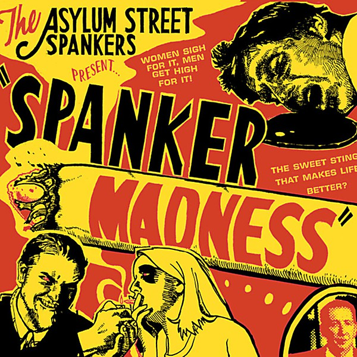

# Spanker Madness

By **Asylum Street Spankers**

## Album Data

- **Catalog:** Beets
- **Format:** Digital, Album
- **Album:** Spanker Madness
- **Artist:** Asylum Street Spankers
- **Albumartist:** Asylum Street Spankers
- **Genre:** Swing
- **MusicBrainz Album Artist ID:** [https](https://musicbrainz.org/artist/https)
- **MusicBrainz Album ID:** [https](https://musicbrainz.org/release/https)
- **MusicBrainz Release Group ID:** 
- **Year:** 2000
- **Catalog #:** 
- **Label:** Yellow Dog Records
- **Total Tracks:** 13

## Album Tracks

### Track 01 - High as You Can Be

- **Artist:** Asylum Street Spankers
- **Format:** ALAC
- **Genre:** Swing
- **Length:** 5:12
- **MusicBrainz Track ID:** [https](https://musicbrainz.org/recording/https)
- **Title:** High as You Can Be
- **Track:** 01
- **Year:** 2000

### Track 02 - Beer

- **Artist:** Asylum Street Spankers
- **Format:** ALAC
- **Genre:** Bluegrass
- **Length:** 3:25
- **MusicBrainz Track ID:** [https](https://musicbrainz.org/recording/https)
- **Title:** Beer
- **Track:** 02
- **Year:** 2000

### Track 03 - Blade of Grass

- **Artist:** Asylum Street Spankers
- **Format:** ALAC
- **Genre:** Swing
- **Length:** 3:35
- **MusicBrainz Track ID:** [https](https://musicbrainz.org/recording/https)
- **Title:** Blade of Grass
- **Track:** 03
- **Year:** 2000

### Track 04 - Take the Heat

- **Artist:** Asylum Street Spankers
- **Format:** ALAC
- **Genre:** Swing
- **Length:** 3:18
- **MusicBrainz Track ID:** [https](https://musicbrainz.org/recording/https)
- **Title:** Take the Heat
- **Track:** 04
- **Year:** 2000

### Track 05 - Winning the War on Drugs

- **Artist:** Asylum Street Spankers
- **Format:** ALAC
- **Genre:** Swing
- **Length:** 3:08
- **MusicBrainz Track ID:** [https](https://musicbrainz.org/recording/https)
- **Title:** Winning the War on Drugs
- **Track:** 05
- **Year:** 2000

### Track 06 - Wake and Bake

- **Artist:** Asylum Street Spankers
- **Format:** ALAC
- **Genre:** Americana
- **Length:** 1:58
- **MusicBrainz Track ID:** [https](https://musicbrainz.org/recording/https)
- **Title:** Wake and Bake
- **Track:** 06
- **Year:** 2000

### Track 07 - interlude

- **Artist:** Asylum Street Spankers
- **Format:** ALAC
- **Genre:** Swing
- **Length:** 0:23
- **MusicBrainz Track ID:** [https](https://musicbrainz.org/recording/https)
- **Title:** interlude
- **Track:** 07
- **Year:** 2000

### Track 08 - Knock Myself Out

- **Artist:** Asylum Street Spankers
- **Format:** ALAC
- **Genre:** Nu Jazz
- **Length:** 2:47
- **MusicBrainz Track ID:** [https](https://musicbrainz.org/recording/https)
- **Title:** Knock Myself Out
- **Track:** 08
- **Year:** 2000

### Track 09 - Amsterdam

- **Artist:** Asylum Street Spankers
- **Format:** ALAC
- **Genre:** Swing
- **Length:** 5:02
- **MusicBrainz Track ID:** [https](https://musicbrainz.org/recording/https)
- **Title:** Amsterdam
- **Track:** 09
- **Year:** 2000

### Track 10 - Pakalolo Baby

- **Artist:** Asylum Street Spankers
- **Format:** ALAC
- **Genre:** Americana
- **Length:** 2:38
- **MusicBrainz Track ID:** [https](https://musicbrainz.org/recording/https)
- **Title:** Pakalolo Baby
- **Track:** 10
- **Year:** 2000

### Track 11 - Gettin' High

- **Artist:** Asylum Street Spankers
- **Format:** ALAC
- **Genre:** Swing
- **Length:** 2:41
- **MusicBrainz Track ID:** [https](https://musicbrainz.org/recording/https)
- **Title:** Gettin' High
- **Track:** 11
- **Year:** 2000

### Track 12 - It's Dry Down Here

- **Artist:** Asylum Street Spankers
- **Format:** ALAC
- **Genre:** Swing
- **Length:** 4:35
- **MusicBrainz Track ID:** [https](https://musicbrainz.org/recording/https)
- **Title:** It's Dry Down Here
- **Track:** 12
- **Year:** 2000

### Track 13 - Orion

- **Artist:** Asylum Street Spankers
- **Format:** ALAC
- **Genre:** Swing
- **Length:** 3:19
- **MusicBrainz Track ID:** [https](https://musicbrainz.org/recording/https)
- **Title:** Orion
- **Track:** 13
- **Year:** 2000

