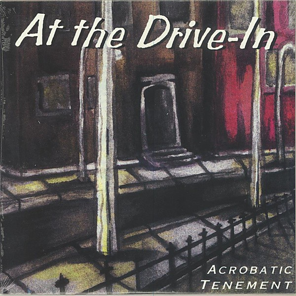

# Acrobatic Tenement

By **At the Drive‐In**

## Album Data

- **Catalog:** Beets
- **Format:** Digital, Album
- **Album:** Acrobatic Tenement
- **Artist:** At The Drive‐in
- **Albumartist:** At the Drive‐In
- **Genre:** Emo
- **MusicBrainz Album Artist ID:** [7e13cd1c-0300-4d03-bd8e-5f86dd99d74f](https://musicbrainz.org/artist/7e13cd1c-0300-4d03-bd8e-5f86dd99d74f)
- **MusicBrainz Album ID:** [4cf29508-c80a-448b-ac1d-029cd09f6963](https://musicbrainz.org/release/4cf29508-c80a-448b-ac1d-029cd09f6963)
- **MusicBrainz Release Group ID:** [bee4fcbb-9e54-3d62-a72c-06b9f97fa487](https://musicbrainz.org/release-group/bee4fcbb-9e54-3d62-a72c-06b9f97fa487)
- **Year:** 2013
- **Catalog #:** 
- **Label:** 
- **Total Tracks:** 11

## Album Tracks

### Track 01 - Alpha Centauri

- **Artist:** At the Drive‐In
- **Format:** AAC
- **Genre:** Screamo
- **Length:** 3:13
- **MusicBrainz Track ID:** [09be7a72-ff11-4b80-9667-608586bb5729](https://musicbrainz.org/recording/09be7a72-ff11-4b80-9667-608586bb5729)
- **Title:** Alpha Centauri
- **Track:** 01
- **Year:** 1998

### Track 02 - Chanbara

- **Artist:** At the Drive‐In
- **Format:** AAC
- **Genre:** Emo
- **Length:** 2:57
- **MusicBrainz Track ID:** [fe86ffb4-ad0d-4ada-9409-98a0b0134c9c](https://musicbrainz.org/recording/fe86ffb4-ad0d-4ada-9409-98a0b0134c9c)
- **Title:** Chanbara
- **Track:** 02
- **Year:** 1998

### Track 03 - Hulahoop Wounds

- **Artist:** At the Drive‐In
- **Format:** AAC
- **Genre:** Screamo
- **Length:** 3:24
- **MusicBrainz Track ID:** [819104d6-5cea-4967-8583-c71b5ba9935c](https://musicbrainz.org/recording/819104d6-5cea-4967-8583-c71b5ba9935c)
- **Title:** Hulahoop Wounds
- **Track:** 03
- **Year:** 1998

### Track 04 - Napoleon Solo

- **Artist:** At the Drive‐In
- **Format:** AAC
- **Genre:** Emo
- **Length:** 4:48
- **MusicBrainz Track ID:** [6bf6f666-eb77-4199-b64b-1991c552ce1b](https://musicbrainz.org/recording/6bf6f666-eb77-4199-b64b-1991c552ce1b)
- **Title:** Napoleon Solo
- **Track:** 04
- **Year:** 1998

### Track 05 - Pickpocket

- **Artist:** At the Drive‐In
- **Format:** AAC
- **Genre:** Emo
- **Length:** 2:38
- **MusicBrainz Track ID:** [6ba65916-67a8-4f7b-99ec-9a0f3ae8721d](https://musicbrainz.org/recording/6ba65916-67a8-4f7b-99ec-9a0f3ae8721d)
- **Title:** Pickpocket
- **Track:** 05
- **Year:** 1998

### Track 06 - For Now..We Toast

- **Artist:** At the Drive‐In
- **Format:** AAC
- **Genre:** Post-Hardcore
- **Length:** 3:02
- **MusicBrainz Track ID:** [8640a921-606a-4b64-9fef-049f4b0e89bc](https://musicbrainz.org/recording/8640a921-606a-4b64-9fef-049f4b0e89bc)
- **Title:** For Now..We Toast
- **Track:** 06
- **Year:** 1998

### Track 07 - A Devil Among the Tailors

- **Artist:** At the Drive‐In
- **Format:** AAC
- **Genre:** Post-Hardcore
- **Length:** 3:12
- **MusicBrainz Track ID:** [97ad55b6-1af0-44c2-b731-cde832adff82](https://musicbrainz.org/recording/97ad55b6-1af0-44c2-b731-cde832adff82)
- **Title:** A Devil Among the Tailors
- **Track:** 07
- **Year:** 1998

### Track 08 - Shaking Hand Incision

- **Artist:** At the Drive‐In
- **Format:** AAC
- **Genre:** Emo
- **Length:** 3:36
- **MusicBrainz Track ID:** [b70eb46f-7f36-4bd2-8e13-013365cde530](https://musicbrainz.org/recording/b70eb46f-7f36-4bd2-8e13-013365cde530)
- **Title:** Shaking Hand Incision
- **Track:** 08
- **Year:** 1998

### Track 09 - Lopsided

- **Artist:** At the Drive‐In
- **Format:** AAC
- **Genre:** Emo
- **Length:** 4:40
- **MusicBrainz Track ID:** [402f450f-8a3b-462b-89c8-3f6c0a0e1602](https://musicbrainz.org/recording/402f450f-8a3b-462b-89c8-3f6c0a0e1602)
- **Title:** Lopsided
- **Track:** 09
- **Year:** 1998

### Track 10 - Hourglass

- **Artist:** At the Drive‐In
- **Format:** AAC
- **Genre:** Screamo
- **Length:** 3:25
- **MusicBrainz Track ID:** [fac249d2-404a-44fe-a2d9-ac3531944f65](https://musicbrainz.org/recording/fac249d2-404a-44fe-a2d9-ac3531944f65)
- **Title:** Hourglass
- **Track:** 10
- **Year:** 1998

### Track 11 - Transatlantic Foe

- **Artist:** At the Drive‐In
- **Format:** AAC
- **Genre:** Post-Hardcore
- **Length:** 3:37
- **MusicBrainz Track ID:** [ad7b88f7-ee70-41f4-bac9-99c084ce34b5](https://musicbrainz.org/recording/ad7b88f7-ee70-41f4-bac9-99c084ce34b5)
- **Title:** Transatlantic Foe
- **Track:** 11
- **Year:** 1998

## See also

- [In/Casino/Out](In-Casino-Out.md)
- [Relationship of Command](Relationship_of_Command.md)
- [This Station Is Non‐Operational](This_Station_Is_Non‐Operational.md)
- [Vaya](Vaya.md)
