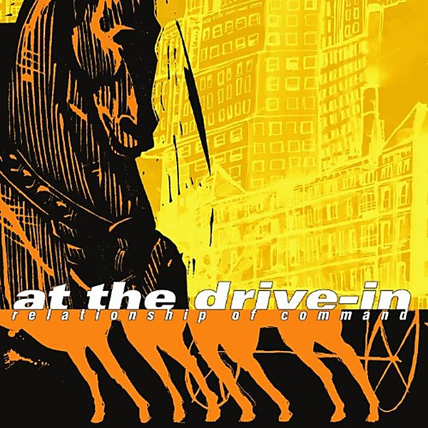

# Relationship of Command

By **At the Drive‐In**

## Album Data

- **Catalog:** Beets
- **Format:** Digital, Album
- **Album:** Relationship of Command
- **Artist:** At The Drive‐in
- **Albumartist:** At the Drive‐In
- **Genre:** Emo
- **MusicBrainz Album Artist ID:** [7e13cd1c-0300-4d03-bd8e-5f86dd99d74f](https://musicbrainz.org/artist/7e13cd1c-0300-4d03-bd8e-5f86dd99d74f)
- **MusicBrainz Album ID:** [1ea4753b-b3e2-44a8-afa5-48f99c08a314](https://musicbrainz.org/release/1ea4753b-b3e2-44a8-afa5-48f99c08a314)
- **MusicBrainz Release Group ID:** [b7f5ed97-bb72-31fb-acd8-4bad86d95a58](https://musicbrainz.org/release-group/b7f5ed97-bb72-31fb-acd8-4bad86d95a58)
- **Year:** 2000
- **Catalog #:** VVR1032462
- **Label:** V2
- **Total Tracks:** 18

## Album Tracks

### Track 01 - Fahrenheit

- **Artist:** At the Drive‐In
- **Format:** AAC
- **Genre:** Screamo
- **Length:** 2:25
- **MusicBrainz Track ID:** [a923bb30-0095-4f73-ad19-9fb5be418779](https://musicbrainz.org/recording/a923bb30-0095-4f73-ad19-9fb5be418779)
- **Title:** Fahrenheit
- **Track:** 01
- **Year:** 2005

### Track 02 - Picket Fence Cartel

- **Artist:** At the Drive‐In
- **Format:** AAC
- **Genre:** Screamo
- **Length:** 2:29
- **MusicBrainz Track ID:** [3a9a302b-f314-425a-a5c6-cb7519c5ded1](https://musicbrainz.org/recording/3a9a302b-f314-425a-a5c6-cb7519c5ded1)
- **Title:** Picket Fence Cartel
- **Track:** 02
- **Year:** 2005

### Track 04 - Lopsided

- **Artist:** At the Drive‐In
- **Format:** AAC
- **Genre:** Emo
- **Length:** 4:40
- **MusicBrainz Track ID:** [402f450f-8a3b-462b-89c8-3f6c0a0e1602](https://musicbrainz.org/recording/402f450f-8a3b-462b-89c8-3f6c0a0e1602)
- **Title:** Lopsided
- **Track:** 04
- **Year:** 2005

### Track 05 - Napoleon Solo

- **Artist:** At the Drive‐In
- **Format:** AAC
- **Genre:** Emo
- **Length:** 4:48
- **MusicBrainz Track ID:** [6bf6f666-eb77-4199-b64b-1991c552ce1b](https://musicbrainz.org/recording/6bf6f666-eb77-4199-b64b-1991c552ce1b)
- **Title:** Napoleon Solo
- **Track:** 05
- **Year:** 2005

### Track 06 - Pickpocket

- **Artist:** At the Drive‐In
- **Format:** AAC
- **Genre:** Emo
- **Length:** 2:38
- **MusicBrainz Track ID:** [6ba65916-67a8-4f7b-99ec-9a0f3ae8721d](https://musicbrainz.org/recording/6ba65916-67a8-4f7b-99ec-9a0f3ae8721d)
- **Title:** Pickpocket
- **Track:** 06
- **Year:** 2005

### Track 07 - Metronome Arthritis

- **Artist:** At the Drive‐In
- **Format:** AAC
- **Genre:** Emo
- **Length:** 4:00
- **MusicBrainz Track ID:** [9e84b62c-d8c5-44e7-9990-52566bb5844a](https://musicbrainz.org/recording/9e84b62c-d8c5-44e7-9990-52566bb5844a)
- **Title:** Metronome Arthritis
- **Track:** 07
- **Year:** 2005

### Track 08 - 198d

- **Artist:** At the Drive‐In
- **Format:** AAC
- **Genre:** Emo
- **Length:** 4:03
- **MusicBrainz Track ID:** [14e162eb-64e5-4865-8c31-e9f0b0d5d3d7](https://musicbrainz.org/recording/14e162eb-64e5-4865-8c31-e9f0b0d5d3d7)
- **Title:** 198d
- **Track:** 08
- **Year:** 2005

### Track 09 - One Armed Scissor

- **Artist:** At the Drive‐In
- **Format:** AAC
- **Genre:** Emo
- **Length:** 3:45
- **MusicBrainz Track ID:** [f74786be-637e-4a86-a7b3-0a3d3e4f0786](https://musicbrainz.org/recording/f74786be-637e-4a86-a7b3-0a3d3e4f0786)
- **Title:** One Armed Scissor
- **Track:** 09
- **Year:** 2005

### Track 10 - Enfilade

- **Artist:** At the Drive‐In
- **Format:** AAC
- **Genre:** Emo
- **Length:** 5:01
- **MusicBrainz Track ID:** [943fc966-c5fa-41e7-8f50-b43b57303d4b](https://musicbrainz.org/recording/943fc966-c5fa-41e7-8f50-b43b57303d4b)
- **Title:** Enfilade
- **Track:** 10
- **Year:** 2005

### Track 11 - Non‐Zero Possibility

- **Artist:** At the Drive‐In
- **Format:** AAC
- **Genre:** Emo
- **Length:** 5:33
- **MusicBrainz Track ID:** [1aede624-445a-4595-88cc-c6cce1721074](https://musicbrainz.org/recording/1aede624-445a-4595-88cc-c6cce1721074)
- **Title:** Non‐Zero Possibility
- **Track:** 11
- **Year:** 2005

### Track 12 - Incetardis

- **Artist:** At the Drive‐In
- **Format:** AAC
- **Genre:** Emo
- **Length:** 3:26
- **MusicBrainz Track ID:** [c62cff6a-9962-48b6-9464-5dd2854b2d37](https://musicbrainz.org/recording/c62cff6a-9962-48b6-9464-5dd2854b2d37)
- **Title:** Incetardis
- **Track:** 12
- **Year:** 2005

### Track 13 - Doorman’s Placebo

- **Artist:** At the Drive‐In
- **Format:** AAC
- **Genre:** Emo
- **Length:** 5:32
- **MusicBrainz Track ID:** [7b9d52ca-3dcb-4424-8a1c-4e7f582ec27e](https://musicbrainz.org/recording/7b9d52ca-3dcb-4424-8a1c-4e7f582ec27e)
- **Title:** Doorman’s Placebo
- **Track:** 13
- **Year:** 2005

### Track 14 - Autorelocator

- **Artist:** At the Drive‐In
- **Format:** AAC
- **Genre:** Emo
- **Length:** 4:59
- **MusicBrainz Track ID:** [a9906d21-26ad-4f08-a1a0-dfaa0cdf4979](https://musicbrainz.org/recording/a9906d21-26ad-4f08-a1a0-dfaa0cdf4979)
- **Title:** Autorelocator
- **Track:** 14
- **Year:** 2005

### Track 15 - Rascuache

- **Artist:** At the Drive‐In
- **Format:** AAC
- **Genre:** Post-Hardcore
- **Length:** 3:24
- **MusicBrainz Track ID:** [2abcbe6a-c304-42ad-a0d0-9862a40b53a3](https://musicbrainz.org/recording/2abcbe6a-c304-42ad-a0d0-9862a40b53a3)
- **Title:** Rascuache
- **Track:** 15
- **Year:** 2005

### Track 16 - This Night Has Opened My Eyes

- **Artist:** At the Drive‐In
- **Format:** AAC
- **Genre:** Post-Hardcore
- **Length:** 3:58
- **MusicBrainz Track ID:** [cf3fa1c9-595e-4604-a90b-c76f90f5242e](https://musicbrainz.org/recording/cf3fa1c9-595e-4604-a90b-c76f90f5242e)
- **Title:** This Night Has Opened My Eyes
- **Track:** 16
- **Year:** 2005

### Track 17 - Initiation

- **Artist:** At the Drive‐In
- **Format:** AAC
- **Genre:** Emo
- **Length:** 3:33
- **MusicBrainz Track ID:** [6d776f67-fc5e-47f2-b758-d8512b88d93b](https://musicbrainz.org/recording/6d776f67-fc5e-47f2-b758-d8512b88d93b)
- **Title:** Initiation
- **Track:** 17
- **Year:** 2005

### Track 18 - Take Up Thy Stethoscope and Walk

- **Artist:** At the Drive‐In
- **Format:** AAC
- **Genre:** Indie Rock
- **Length:** 5:03
- **MusicBrainz Track ID:** [31a92e05-7431-41ec-89fb-08aab09985b3](https://musicbrainz.org/recording/31a92e05-7431-41ec-89fb-08aab09985b3)
- **Title:** Take Up Thy Stethoscope and Walk
- **Track:** 18
- **Year:** 2005

## See also

- [Acrobatic Tenement](Acrobatic_Tenement.md)
- [In/Casino/Out](In-Casino-Out.md)
- [This Station Is Non‐Operational](This_Station_Is_Non‐Operational.md)
- [Vaya](Vaya.md)
