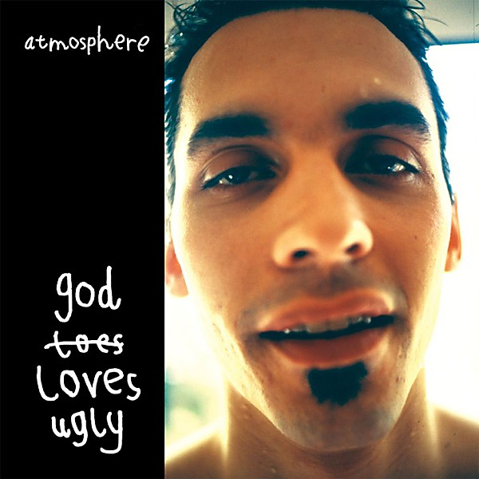

# God Loves Ugly

By **Atmosphere**

## Album Data

- **Catalog:** Beets
- **Format:** Digital, Album
- **Album:** God Loves Ugly
- **Artist:** Atmosphere
- **Albumartist:** Atmosphere
- **Genre:** Hip Hop
- **MusicBrainz Album Artist ID:** [ef954679-5ee7-4016-acef-7ac71f2fa3d8](https://musicbrainz.org/artist/ef954679-5ee7-4016-acef-7ac71f2fa3d8)
- **MusicBrainz Album ID:** [a4dd0a2c-085e-4797-b8a1-d9fd7c19a2b4](https://musicbrainz.org/release/a4dd0a2c-085e-4797-b8a1-d9fd7c19a2b4)
- **MusicBrainz Release Group ID:** [37d5cc05-af2e-3dea-bfab-e325b2533104](https://musicbrainz.org/release-group/37d5cc05-af2e-3dea-bfab-e325b2533104)
- **Year:** 2002
- **Catalog #:** 
- **Label:** Rhymesayers Entertainment
- **Total Tracks:** 31

## Album Tracks

### Track 01 - Sep Seven Game Show Theme

- **Artist:** Atmosphere
- **Format:** AAC
- **Genre:** Indie Rock
- **Length:** 4:09
- **MusicBrainz Track ID:** [13c6b71d-883c-4211-ab57-2ef95057fee3](https://musicbrainz.org/recording/13c6b71d-883c-4211-ab57-2ef95057fee3)
- **Title:** Sep Seven Game Show Theme
- **Track:** 01
- **Year:** 2005

### Track 02 - Round and Round

- **Artist:** Atmosphere
- **Format:** AAC
- **Genre:** Hip Hop
- **Length:** 3:42
- **MusicBrainz Track ID:** [8d452ef0-874b-4075-af33-ce3ddb2f18c7](https://musicbrainz.org/recording/8d452ef0-874b-4075-af33-ce3ddb2f18c7)
- **Title:** Round and Round
- **Track:** 02
- **Year:** 2005

### Track 04 - Choking on the Wishbone

- **Artist:** Atmosphere
- **Format:** AAC
- **Genre:** Hip Hop
- **Length:** 4:10
- **MusicBrainz Track ID:** [f7cc10ba-1920-4c08-bd5e-41eb3fe6d79b](https://musicbrainz.org/recording/f7cc10ba-1920-4c08-bd5e-41eb3fe6d79b)
- **Title:** Choking on the Wishbone
- **Track:** 04
- **Year:** 2005

### Track 05 - The Jackpot / Swept Away

- **Artist:** Atmosphere
- **Format:** AAC
- **Genre:** Hip Hop
- **Length:** 5:35
- **MusicBrainz Track ID:** [86d11bd9-f73d-423e-beb7-6c8dd0551913](https://musicbrainz.org/recording/86d11bd9-f73d-423e-beb7-6c8dd0551913)
- **Title:** The Jackpot / Swept Away
- **Track:** 05
- **Year:** 2005

### Track 06 - @ It Again

- **Artist:** Atmosphere
- **Format:** AAC
- **Genre:** Hip Hop
- **Length:** 2:07
- **MusicBrainz Track ID:** [2f848897-d008-491e-9773-d9389086835c](https://musicbrainz.org/recording/2f848897-d008-491e-9773-d9389086835c)
- **Title:** @ It Again
- **Track:** 06
- **Year:** 2005

### Track 07 - Lyle Lovette

- **Artist:** Atmosphere
- **Format:** AAC
- **Genre:** Hip Hop
- **Length:** 1:27
- **MusicBrainz Track ID:** [3897bdca-f549-4b16-8def-a903e998e236](https://musicbrainz.org/recording/3897bdca-f549-4b16-8def-a903e998e236)
- **Title:** Lyle Lovette
- **Track:** 07
- **Year:** 2005

### Track 09 - Higher Living

- **Artist:** Atmosphere
- **Format:** AAC
- **Genre:** Hip Hop
- **Length:** 4:32
- **MusicBrainz Track ID:** [39956004-98ca-490f-9cef-c600c8cdf8da](https://musicbrainz.org/recording/39956004-98ca-490f-9cef-c600c8cdf8da)
- **Title:** Higher Living
- **Track:** 09
- **Year:** 2005

### Track 10 - To the Break of Sean

- **Artist:** Atmosphere
- **Format:** AAC
- **Genre:** Hip Hop
- **Length:** 3:22
- **MusicBrainz Track ID:** [a3350cf7-6d7c-4da5-aaa5-25a01f9f5689](https://musicbrainz.org/recording/a3350cf7-6d7c-4da5-aaa5-25a01f9f5689)
- **Title:** To the Break of Sean
- **Track:** 10
- **Year:** 2005

### Track 11 - Deer Wolf

- **Artist:** Atmosphere
- **Format:** AAC
- **Genre:** Hip Hop
- **Length:** 3:42
- **MusicBrainz Track ID:** [4d3318d0-f90e-4792-9df5-4198f5c18b03](https://musicbrainz.org/recording/4d3318d0-f90e-4792-9df5-4198f5c18b03)
- **Title:** Deer Wolf
- **Track:** 11
- **Year:** 2005

### Track 12 - Molly Cool

- **Artist:** Atmosphere
- **Format:** AAC
- **Genre:** Hip Hop
- **Length:** 4:49
- **MusicBrainz Track ID:** [a6810680-846a-4e2b-8d1a-83f1048cc7bb](https://musicbrainz.org/recording/a6810680-846a-4e2b-8d1a-83f1048cc7bb)
- **Title:** Molly Cool
- **Track:** 12
- **Year:** 2005

### Track 14 - Anterlude

- **Artist:** Atmosphere
- **Format:** AAC
- **Genre:** Hip Hop
- **Length:** 0:37
- **MusicBrainz Track ID:** [65bd798d-f726-4d2f-88da-d92654c1d8d7](https://musicbrainz.org/recording/65bd798d-f726-4d2f-88da-d92654c1d8d7)
- **Title:** Anterlude
- **Track:** 14
- **Year:** 2005

### Track 15 - Advanced Communications

- **Artist:** Atmosphere
- **Format:** AAC
- **Genre:** Hip Hop
- **Length:** 2:55
- **MusicBrainz Track ID:** [03499cb9-7bba-42ae-b494-db2bc4088586](https://musicbrainz.org/recording/03499cb9-7bba-42ae-b494-db2bc4088586)
- **Title:** Advanced Communications
- **Track:** 15
- **Year:** 2005

### Track 17 - 3.2 Red Dog

- **Artist:** Atmosphere
- **Format:** AAC
- **Genre:** Hip Hop
- **Length:** 2:07
- **MusicBrainz Track ID:** [482c6938-85c2-470c-aa6a-5f4fe7a9fd17](https://musicbrainz.org/recording/482c6938-85c2-470c-aa6a-5f4fe7a9fd17)
- **Title:** 3.2 Red Dog
- **Track:** 17
- **Year:** 2005

### Track 18 - The Abusing of the Rib

- **Artist:** Atmosphere
- **Format:** AAC
- **Genre:** Downtempo
- **Length:** 3:36
- **MusicBrainz Track ID:** [8123b116-e474-4f17-acaa-6528c7d5f56f](https://musicbrainz.org/recording/8123b116-e474-4f17-acaa-6528c7d5f56f)
- **Title:** The Abusing of the Rib
- **Track:** 18
- **Year:** 2005

### Track 19 - Write Now (Multiples No. 4)

- **Artist:** Atmosphere
- **Format:** AAC
- **Genre:** Hip Hop
- **Length:** 1:59
- **MusicBrainz Track ID:** [27830cb1-01a8-4ce0-b5e9-5d2fb35b579f](https://musicbrainz.org/recording/27830cb1-01a8-4ce0-b5e9-5d2fb35b579f)
- **Title:** Write Now (Multiples No. 4)
- **Track:** 19
- **Year:** 2005

### Track 20 - I Wish Those Cats @ Phobia Would Give Me Some Free Shoes

- **Artist:** Atmosphere
- **Format:** AAC
- **Genre:** Hip Hop
- **Length:** 3:45
- **MusicBrainz Track ID:** [be848f09-4f25-448a-9c8d-82316a71aa67](https://musicbrainz.org/recording/be848f09-4f25-448a-9c8d-82316a71aa67)
- **Title:** I Wish Those Cats @ Phobia Would Give Me Some Free Shoes
- **Track:** 20
- **Year:** 2005

### Track 21 - Heart

- **Artist:** Atmosphere
- **Format:** AAC
- **Genre:** Hip Hop
- **Length:** 4:05
- **MusicBrainz Track ID:** [3bfddeb6-b881-4b96-9f8a-b8253e6a4e34](https://musicbrainz.org/recording/3bfddeb6-b881-4b96-9f8a-b8253e6a4e34)
- **Title:** Heart
- **Track:** 21
- **Year:** 2005

### Track 23 - Travel (remix)

- **Artist:** Atmosphere
- **Format:** MP3
- **Genre:** Hip Hop
- **Length:** 4:12
- **MusicBrainz Track ID:** [87aa28ef-a93e-43d2-8879-efd90bd4330a](https://musicbrainz.org/recording/87aa28ef-a93e-43d2-8879-efd90bd4330a)
- **Title:** Travel (remix)
- **Track:** 23
- **Year:** 2005

### Track 24 - 7th St. Entry

- **Artist:** Atmosphere
- **Format:** MP3
- **Genre:** Hip Hop
- **Length:** 2:59
- **MusicBrainz Track ID:** [ede4cecb-4a60-4c11-a7c8-01bd36d68b68](https://musicbrainz.org/recording/ede4cecb-4a60-4c11-a7c8-01bd36d68b68)
- **Title:** 7th St. Entry
- **Track:** 24
- **Year:** 2005

### Track 26 - Multiples Reprise (remix)

- **Artist:** Atmosphere
- **Format:** MP3
- **Genre:** Hip Hop
- **Length:** 5:38
- **MusicBrainz Track ID:** [9985ca19-cb88-4346-b29d-189c82b1a323](https://musicbrainz.org/recording/9985ca19-cb88-4346-b29d-189c82b1a323)
- **Title:** Multiples Reprise (remix)
- **Track:** 26
- **Year:** 2005

### Track 31 - Substance Abuse

- **Artist:** Atmosphere feat. Extreme
- **Format:** MP3
- **Genre:** Hip Hop
- **Length:** 4:43
- **MusicBrainz Track ID:** [3f192085-1dd8-4b02-8d7f-aae6e31b14c3](https://musicbrainz.org/recording/3f192085-1dd8-4b02-8d7f-aae6e31b14c3)
- **Title:** Substance Abuse
- **Track:** 31
- **Year:** 2005

### Track 08 - The Stick Up

- **Artist:** Atmosphere feat. Eyedea
- **Format:** AAC
- **Genre:** Hip Hop
- **Length:** 4:10
- **MusicBrainz Track ID:** [4ed24cff-1fcb-4db7-ba9d-1b1b85c35f7a](https://musicbrainz.org/recording/4ed24cff-1fcb-4db7-ba9d-1b1b85c35f7a)
- **Title:** The Stick Up
- **Track:** 08
- **Year:** 2005

### Track 03 - Tracksmart

- **Artist:** Atmosphere feat. Mr. Gene Pool
- **Format:** AAC
- **Genre:** Hip Hop
- **Length:** 4:10
- **MusicBrainz Track ID:** [bac2cdde-a6f2-4ba3-b2dd-fedfc550056f](https://musicbrainz.org/recording/bac2cdde-a6f2-4ba3-b2dd-fedfc550056f)
- **Title:** Tracksmart
- **Track:** 03
- **Year:** 2005

### Track 13 - Dungeons and Dragons

- **Artist:** Atmosphere feat. Musab
- **Format:** AAC
- **Genre:** Hip Hop
- **Length:** 4:46
- **MusicBrainz Track ID:** [78f403a5-4afb-4726-9250-612c33aaaca1](https://musicbrainz.org/recording/78f403a5-4afb-4726-9250-612c33aaaca1)
- **Title:** Dungeons and Dragons
- **Track:** 13
- **Year:** 2005

### Track 30 - Dubs

- **Artist:** Beyond & Slug
- **Format:** MP3
- **Genre:** Hip Hop
- **Length:** 3:33
- **MusicBrainz Track ID:** [ab7f4ac1-dd24-438f-b3c7-8bf97489fc49](https://musicbrainz.org/recording/ab7f4ac1-dd24-438f-b3c7-8bf97489fc49)
- **Title:** Dubs
- **Track:** 30
- **Year:** 2005

### Track 22 - Industrial Warfare

- **Artist:** The Dynospectrum
- **Format:** MP3
- **Genre:** Hip Hop
- **Length:** 4:05
- **MusicBrainz Track ID:** [ac23f153-dd7b-40db-ab25-3a4e82b363ad](https://musicbrainz.org/recording/ac23f153-dd7b-40db-ab25-3a4e82b363ad)
- **Title:** Industrial Warfare
- **Track:** 22
- **Year:** 2005

### Track 28 - Fuck the Bullshit

- **Artist:** The Dynospectrum
- **Format:** MP3
- **Genre:** Hip Hop
- **Length:** 3:59
- **MusicBrainz Track ID:** [e4906c66-3736-4aa2-91ca-6a16f5eedecc](https://musicbrainz.org/recording/e4906c66-3736-4aa2-91ca-6a16f5eedecc)
- **Title:** Fuck the Bullshit
- **Track:** 28
- **Year:** 2005

### Track 29 - Struggle Song

- **Artist:** The Dynospectrum
- **Format:** MP3
- **Genre:** Hip Hop
- **Length:** 3:39
- **MusicBrainz Track ID:** [39f4d512-f256-4f09-a763-a45ecfbb106b](https://musicbrainz.org/recording/39f4d512-f256-4f09-a763-a45ecfbb106b)
- **Title:** Struggle Song
- **Track:** 29
- **Year:** 2005

### Track 27 - Funny Colors in My Mushroom Trails

- **Artist:** Sess & Slug
- **Format:** MP3
- **Genre:** Hip Hop
- **Length:** 3:59
- **MusicBrainz Track ID:** [7e8f0f11-2a53-4fc8-8ce7-d7ea3ea89469](https://musicbrainz.org/recording/7e8f0f11-2a53-4fc8-8ce7-d7ea3ea89469)
- **Title:** Funny Colors in My Mushroom Trails
- **Track:** 27
- **Year:** 2005

## See also

- [Headshots](Headshots.md)
- [New, Unreleased & B-Sides Vol. 2](New__Unreleased_and_B-Sides_Vol_2.md)
- [Overcast!](Overcast!.md)
- [Sad Clown Bad Dub II](Sad_Clown_Bad_Dub_II.md)
- [Sad Clown Bad Summer Number 9](Sad_Clown_Bad_Summer_Number_9.md)
- [Seven's Travels](Sevens_Travels.md)
- [To All My Friends, Blood Makes the Blade Holy - The Atmosphere EP's](To_All_My_Friends__Blood_Makes_the_Blade_Holy_-_The_Atmosphere_EPs.md)
- [When Life Gives You Lemons, You Paint That Shit Gold](When_Life_Gives_You_Lemons__You_Paint_That_Shit_Gold.md)
- [You Can't Imagine How Much Fun We're Having Disc 1](You_Cant_Imagine_How_Much_Fun_Were_Having_Disc_1.md)
- [Roon: Southsiders (Édition Studio Masters)](../../Roon/Atmosphere/Southsiders_Édition_Studio_Masters.md)
- [Roon: When Life Gives You Lemons, You Paint That Shit Gold](../../Roon/Atmosphere/When_Life_Gives_You_Lemons__You_Paint_That_Shit_Gold.md)
